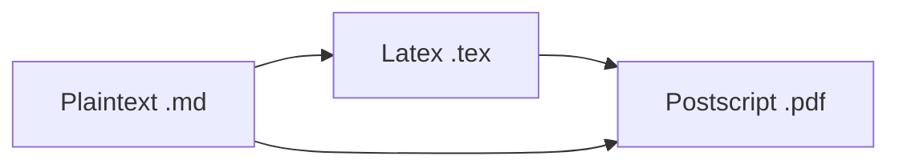

# Writting scietific articles with markdown and Pandoc

## Introduction

[Markdown](https://daringfireball.net/projects/markdown/) is a lightweight markup language with plain text formatting syntax. Markdown was initially designed for creating content for websites (HTML), but we can also create other document formats such as PDF and EPUB using converters like [Pandoc](https://pandoc.org/). We can also use Markdown to write scientific pa per with ()the support of *LaTeX*  but without We can also use Markdown to write *LaTeX* documents more easily compared to using pure LaTeX. 

Using markdown we can write stunning looking documents more easily compared to using pure LaTeX. Since Markdown files are text files, they need to be converted to a separate output document, 

Markdown is not the best choice for documents requiring lots of small customizations in styles, fonts, colors, or outlooks. On the other hand, Markdown excels at creating documents that need little customization or have premade styles or templates available like bibliography files and styles, which is basically the nightmare of writing magazine articles from different publishers, even from the same one.

# How to write academic papers in Markdown

If you are tired of dealing with silly LaTeX syntax you should try markdown. Essentially the workflow to write papers in academia is the same as the other final documents in markdown. 

In latex a the figure environment looks like this:

```tex
\begin{figure}[h!]
  \centering
  \includegraphics{something.png}
  \caption{My caption. \label{fig:delphi}}
\end{figure}
```

You write:

```md
[
```

Sure, there’s still “syntax” to be learned the uninitiated. Still, it’s a heck of a lot less, and it makes reading source files (`.md` instead of `.tex`) much, *much* easier. 

The left part - where you do the work - is simply hideous, and usually riddled with layout-specific syntax. Don’t get me wrong, I love the collaborative plus-side of Overleaf, but it’s still raw LaTeX. As a Java developer, I do not write `.class` files either: I write the `.java` ones and compile the latter.

### The toolchain

This is the setup:



<center><small>The pandoc toolchain.</small></center>

Simple enough, and the [Pandoc User Guide](https://pandoc.org/MANUAL.html) helps you in understanding the specifics when converting from Markdown to Tex.   

The most challenging part of writing academic papers in Markdown is not the conversion process but the annoying details you have to get right when adhering to a layout/template of a conference or journal. Of course, you always can use scripts or automated to do that, but it s and advanced used and we won't talk  about it in this guide. An example of command line use of pandoc is:

```make
pandoc -f markdown+smart delphi_report.pd.md --include-in-header=delphi_report_preamble.tex  --template=$(templatedir)/acm-pandoc-conf.tex --filter panflute --natbib --variable --biblio-style=$(csldir)/ACM-Reference-Format --bibliography=delphi.bib -t latex > delphi.tex xelatex delphi.tex bibtex delphi
```

### Templates

To be more efficient, you’ll need templates. Pandoc specific templatea and a LaTeX-specific templates are possible. The latter is usually up for grabs at your favorite conference/journal submission website. For instance, if you pretend to write a Wiley Book, you should use a `.tex` file starting with:

```tex
%% Run LaTeX on this file several times to get Table of Contents,
%% cross-references, and citations.

\documentclass[11pt]{book}
\usepackage{Editor-AuthoringTemplate}
\usepackage{chapterbib}
\usepackage[sectionbib,authoryear]{natbib}% for name-date citation comment the below line
%\usepackage[sectionbib,numbers]{natbib}% for numbered citation comment the above line

%%********************************************************************%%
%%       The below macro controls the numbering of section heads      %%
%% 0= no section numbers, 1= section, 2= subsection, 3= subsubsection %%
\setcounter{secnumdepth}{3}
%%********************************************************************%%

%%**********************************************************************%%
%%  The below macro controls the number of section heads displayed in   %%
%%			Table of Contents?				%%
%% 0= chapter, 1= section, 2= subsection, 3= subsubsection titles.	%%
\setcounter{tocdepth}{2}
%%**********************************************************************%%

%%\includeonly{fm}

\makeindex% for index generation
```

Meaning you’ll need to have the file Editor-AuthoringTemplate.cls` LaTeX class accessible in your  computer. These files are automatically included by your `Latex` processor selecting the correct starting template. 

What is new, is the Pandoc template, called `Editor-AuthoringTemplate.latex` in the above Makefile. This file adheres to Pandoc-specific syntax and allows you to fill in variables that are defined in the Frontmatter of Markdown files. The file will contain something like this:

```tex
\documentclass[sigconf,anonymous=$anonymous$]{acmart}

% use packages, specific commands, etc

$if(title)$
  \title{$title$}
$endif$
$if(subtitle)$
  \subtitle{$subtitle$}
$endif$

\maketitle
\bibliographystyle{ACM-Reference-Format}

$body$


$if(bibliography)$
  \balance
  \bibliography{$bibliography$}
$endif$
\end{document}
\endinput
```

I published the full template as a [GitHub gist](https://gist.github.com/wgroeneveld/b6e2751c6da2a7bac73f668ddff5c3d0), in case anyone would like to reuse it.

Now, every `$var` sign will be auto-replaced with the corresponding key in your `.md` file. For example:

```md
---
title: "The Document Title"
author: [Example Author, Another Author]
date: "2017-02-20"
keywords: [Markdown, Example]
...

Here is the actual document text...

# INTRODUCTION

Lorem ipsum dolor sit amet, consectetur adipiscing elit, sed do eiusmod tempor incididunt ut labore et dolore magna aliqua. Ut enim ad minim veniam, quis nostrud exercitation ullamco laboris nisi ut aliquip ex ea commodo consequat. Duis aute irure dolor in reprehenderit in voluptate velit esse cillum dolore eu fugiat nulla pariatur. Excepteur sint occaecat cupidatat non proident, sunt in culpa qui officia deserunt mollit anim id est laborum.
```

### Post-processing

Pandoc is not capable of doing some kind of things like to convert a figure into a double-column one, or the other way around: `\begin{figure}` to `\begin{figure*}` or something similar. But, of course, another way to do simple find and replace post-processing things is to just further transform the `.tex` output yourself using `sed` or whatever. This works, but is cumbersome, as sometimes you want to select specific blocks without resorting to artisan regular expressions that take hours to create.

For tables, you’d write the following Markdown:

```md
blaaleft        blaright
----------   -----------
something              9
something             10

Table:  Demonstration of simple table syntax.
```

Pandoc by default generates something like this:

```tex
\begin{longtable}[]{@{}lr@{}}
\caption{Demonstration of simple table syntax.}\tabularnewline
\toprule
blaaleft & blaright\tabularnewline
\midrule
\endfirsthead
\toprule
blaaleft & blaright\tabularnewline
\midrule
\endhead
something & 9\tabularnewline
something & 10\tabularnewline
\bottomrule
\end{longtable}
```

With a filter, you can transfor the `longtable` into a `table` . Filters are `python`or `json` scripts. 

## Creating Documents

### Structure of a markdown article

The best practice is to use  [_Markdown Templates_](https://github.com/jaantollander/Markdown-Templates) whuch are structured as follows:

```plaintext
<name>/
├─ build/
├─ <filename.md>
├─ <bibliography.bib>
└─ Makefile
```

where _<filename.md>_ is the name of the markdown file itself, _<bibliography.bib>_ the name of the [bibtext ](http://www.bibtex.org/)bibliography file, which must be refered in the document just as in Latex.

The `Makefile` contains commands for converting the Markdown file into the desired document format using Pandoc. Pandoc creates the output files to the `build/` directory, which Makefile automatically creates if it does not exist.

### Makefile

We define the build directory and the filename at the beginning of `Makefile` as follows.

```makefile
BUILDDIR=build
FILENAME=<filename>
```

Then, we define the command to create the document.

```makefile
<command>:
    mkdir $(BUILDDIR) -p  # Creates the BUILDDIR if it doesn't already exist.
    pandoc $(FILENAME).md \
    --filter pandoc-citeproc \
    --from=markdown+tex_math_single_backslash+tex_math_dollars \
    # ...
```

The option `--from=markdown` tells that input file is a Markdown file. Markdown extensions `+tex_math_single_backslash` and `+tex_math_dollars` enable Pandoc to parse equations. 

Pandoc-citeproc enables us to use citations in Markdown. Pandoc installation includes it by default. We need to enable it by using the option `--filter pandoc-citeproc`.

We can execute the Makefile command in the terminal as follows.

```c
make <command>
```

### Front Matter

We can include document-specific metadata and functionality for the converter in the Front Matter at the top of a `<filename>.md` file. We write the front matter in YAML between two triple-minus lines `---` as follows.

```yaml
---
title: "Title"
date: \today
author: "Author"
bibliography: "bibliography.bib"
link-citations: true
urlcolor: "blue"
csl: "https://raw.githubusercontent.com/citation-style-language/styles/master/harvard-anglia-ruskin-university.csl"
---
```

The `title`, `date`, and `author` variables specify information for creating the title. The `bibliography` variable specifies the location of the bibliography file, `link-citations` toggles links to citations on and off, `urlcolor` defines the link color, and the `csl` variable defines the [Citation Style Language](http://citationstyles.org/). We can find examples of citation styles from [Zotero styles](https://www.zotero.org/styles) and use them by either downloading them or referring directly to the URL of the raw CLS file in [citation styles](https://github.com/citation-style-language/styles) repository.

### Layout

We can change the layout of a PDF document by including a LaTeX preamble using a Pandoc command or the Front matter. For example, if we want to create an ebook friendly PDF output, we can use the layout described in [“Effort to make latex ebook friendly”](https://tex.stackexchange.com/a/16388/229156) as follows.

------

We can include `--include-in-header=<layout>.tex` option in the Makefile with `<layout>.tex` file:

```latex
\usepackage[papersize={4.5in,6in},margin=0.5cm]{geometry}
\setlength{\parskip}{2pt}
\newcommand\textbreak{%
  \begin{center}%
  \decothreeleft \aldineleft \decosix \aldineright \decothreeright%
  \end{center}}
\pagestyle{empty}
```

------

Alternatively, we can include the `header-includes` variable in the front matter:

```yaml
header-includes: |
    \usepackage[papersize={4.5in,6in},margin=0.5cm]{geometry}
    \setlength{\parskip}{2pt}
    \newcommand\textbreak{%
    \begin{center}%
    \decothreeleft \aldineleft \decosix \aldineright \decothreeright%
    \end{center}}
    \pagestyle{empty}
```

## Syntax

### Basic Syntax

[John Gruber’s original spec](https://daringfireball.net/projects/markdown/syntax) and [Markdown Cheatsheet](https://github.com/adam-p/markdown-here/wiki/Markdown-Cheatsheet) in GitHub demonstrate the basic Markdown syntax. We recommend reading at least them to understand the basics. In addition to Markdown understanding, basics on HTML can be useful for creating web content if using inline HTML.

### Code Blocks

Regular Markdown supports code blocks but does not highlight their syntax. However, converters such as Pandoc will add syntax highlighting for code block as long as we supply the appropriate language for the code block. For example:

~~~plaintext
```python
def foo():
    return "bar"
```
~~~

Displays as:

```python
def foo():
    return "bar"
```

### Equations

We can write inline equations using single dollars `$...$` or backslashed parentheses `\(...\)` and display using double dollars `$$...$$` or backslashed square brackets `\[...\]`. The use of dollar symbols is more common. Optionally, we can add tags `\tag{<tag>}` for numbering equations and labels `\label{<label>}` for referring to equations later in text using `\ref{<label>}`. For example, we can write Cauchy’s integral formula as

```plaintext
$$
f(a)={\frac {1}{2\pi i}}\oint _{\gamma }{\frac {f(z)}{z-a}}\,dz
\tag{1}
\label{1}
$$
```

Mathjax displays the equation as

(1)f(a)=12πi∮γf(z)z−adz.

We can now refer to the equation using syntax `(\ref{1})` which displays as (1). Markdown displays inline equations such as `$a^2+b^2=c^2$` in the same line as the text, a2+b2=c2.

Some markdown parsers do not detect the equation mode for characters that are part of the Markdown syntax, which might interfere with parsing. For example, instead of using the asterisk symbol `*` inside the equation mode, we can use the backslashed ASCII `\*`, latex command `\ast`, or the Unicode version `∗`.

### Unicode Symbols for Equations

We write equations easier by using Unicode characters for mathematical symbols. For example, instead of `\mathbf{x}\in\mathbb{R}^2` we can write `$𝐱∈ℝ^2$` for the same output 𝐱∈ℝ2. You can input Unicode symbols with editor plugins mentioned in the Editors section.

### Colored Equations

Better Explained in their article [Colorized Math Equations](https://betterexplained.com/articles/colorized-math-equations/) shows how to use colors to improve the way we can describe equations. The article has excellent examples, such as a colorized explanation for the constant e, which they also provide as a [LaTeX document](https://www.overleaf.com/project/5c3e247141897965b7e064d4). We can use it to recreate the output on the web:

To use colors in LaTeX, we must include the color package in the header.

```latex
\usepackage{color}
```

Then, we can define new colors in the body and use them in math mode. For example:

```latex
\definecolor{c1}{RGB}{114,0,172}
\newcommand{\newcolor}{\color{c1}}
$$
\newcolor x^2
$$
```

Overleaf has a helpful article about [Using colors in LaTeX](https://www.overleaf.com/learn/latex/Using_colours_in_LaTeX).

------

When using Mathjax or KaTeX to render equations on the web, we can use the extended [color keywords](https://developer.mozilla.org/en-US/docs/Web/CSS/color_value#Color_keywords) or RBG hex values for the color argument. The commands must be inside math mode.

We can define colors using the `\color` command.

αβαβα−β,∀α,β>0

```latex
$$
\newcommand{\positive}{\color{darkblue}}
\newcommand{\negative}{\color{darkred}}
{\positive α} {\negative -β}, \quad ∀α,β>0
$$
```

Alternatively, we can define the colors using the `\textcolor` command.

αβαβα−β,∀α,β>0

```latex
$$
\newcommand{\positive}[1]{\textcolor{darkblue}{#1}}
\newcommand{\negative}[1]{\textcolor{darkred}{#1}}
\positive{α} \negative{-β}, \quad ∀α,β>0
$$
```

------

We can take into account color blindness by using a colorblind safe palette. We can use [Colorbrewer](https://colorbrewer2.org/), a tool for coloring planar graphs (aka maps), to select different colorblind safe palettes. In Colorbrewer, choose the *colorblind safe* option, select the *color scheme* from *sequential* or *diverging*, the *number of data classes* and HEX or RGB output. Finally, copy the color codes from the bottom left to the LaTeX commands.

### Citations

Let us have the following BibTeX entry stored in `bibliography.bib` file.

```plaintext
@article{key_name,
    author  = {Peter Adams},
    title   = {The title of the work},
    journal = {The name of the journal},
    year    = {1993},
    number  = {2},
    pages   = {201-213},
    month   = {7},
    note    = {An optional note},
    volume  = {4}
}
```

We can refer to this entry in the Markdown document using syntax `@key_name` or `[@key_name]`. Pandoc creates references at the bottom of the document. Remember that most of bibliography software can export bibliography to bibtex format and that the scientific journals have cls styles to be used with Latex and Bibtex, so we can use them with markdown-pandoc too.

### Vector Graphics

Markdown allows inserting vector graphics with the standard syntax.

```markdown

```

Using vector graphics when creating PDFs requires [*Inkscape*](https://inkscape.org/).

To know more read [Jaan Tollander de Balsch](https://jaantollander.com/post/scientific-writing-with-markdown/#introduction) blog.

