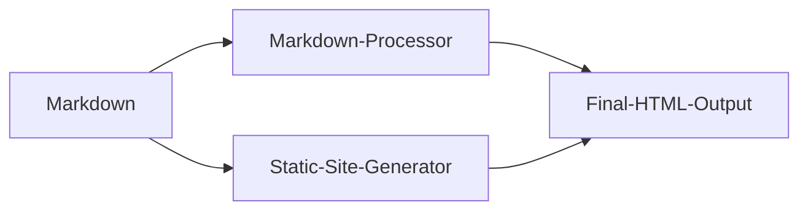
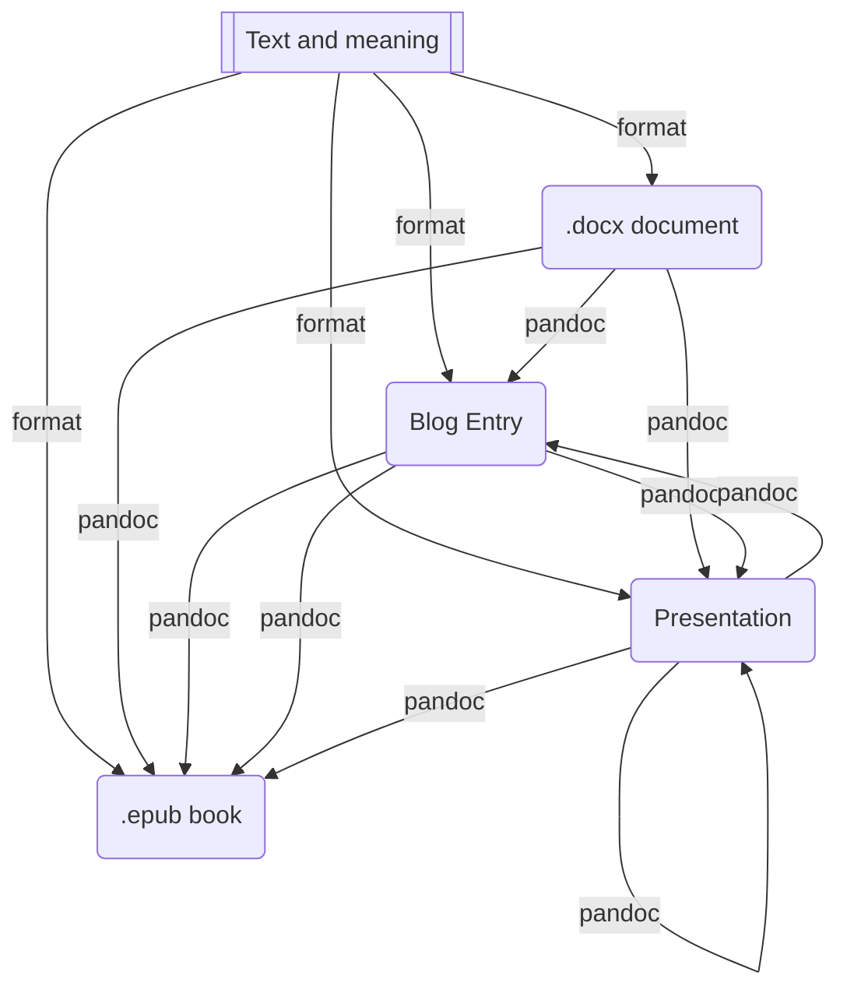

# Introduction to Markdown
Let's take an overview of __Markdown__, how it works, and what you can do with it.

## What is Markdown?
--------------------

Markdown is a lightweight markup language that you can use to add formatting elements to plaintext text documents. Created by [John Gruber](https://daringfireball.net/projects/markdown/) in 2004, Markdown is now one of the world's most popular markup languages. 

Markdown is different to a [WYSIWYG](https://en.wikipedia.org/wiki/WYSIWYG) editor. In those applications (Microsoft Word or Apple Pages) you click buttons to format words and phrases, and the changes are visible immediately. Markdown isn't like that. When you create a Markdown-formatted file, you add Markdown syntax to the text to indicate which words and phrases should look different.


<center><small>Figure 1. Markdown editingo in a plain tex processor (Visual Studio Code).</small></center>

 You can add Markdown formatting elements to a plaintext file using a text editor application. Or you can use one of the many Markdown applications for macOS, Windows, Linux, iOS, and Android operating systems. There are also several web-based applications specifically designed for writing in Markdown. [According to Gruber](https://daringfireball.net/projects/markdown/), Markdown syntax is designed to be readable and unobtrusive, so the text in Markdown files can be read even if it isn't rendered.

> The overriding design goal for Markdown's formatting syntax is to make it as readable as possible. The idea is that a Markdown-formatted document should be publishable as-is, as plain text, without looking like it's been marked up with tags or formatting instructions.

## Why Use Markdown?

You might be wondering why people use Markdown instead of a WYSIWYG editor. Why write with Markdown when you can press buttons in an interface to format your text? As it turns out, there are a couple different reasons why people use Markdown instead of WYSIWYG editors.

- Markdown can be used for everything. 
  - To create [websites](https://www.markdownguide.org/getting-started/#websites)
  - [documents](https://www.markdownguide.org/getting-started/#documents)
  - [notes](https://www.markdownguide.org/getting-started/#notes)
  - [books](https://www.markdownguide.org/getting-started/#books)
  - [presentations](https://www.markdownguide.org/getting-started/#presentations)
  - [email messages](https://www.markdownguide.org/getting-started/#email),
  - and [technical documentation](https://www.markdownguide.org/getting-started/#documentation).
- Markdown is portable. Files containing Markdown-formatted text can be opened using virtually any application. 
- You can import your Markdown files into another Markdown application. As plain text, its not a proprietary file format.
- Markdown is platform independent. You can create Markdown-formatted text on any device running any operating system.
- Markdown is future proof. Even if the application you're using stops working at some point in the future, you'll still be able to read your Markdown-formatted text using a text editing application. This is an important consideration when it comes to books, university theses, and other milestone documents that need to be preserved indefinitely.
- Markdown is everywhere. Websites like [Reddit](https://www.markdownguide.org/tools/reddit/) and GitHub support Markdown, and lots of desktop and web-based applications support it.
  
## How does it work?

When you write in Markdown, the text is stored in a plaintext file that has an `.md` or `.markdown` extension. But then what? How is your Markdown-formatted file converted into HTML or a print-ready document?

The short answer is that you need a _Markdown application_ capable of processing the Markdown file. There are lots of applications available ([see section in this document](#md_editors) from simple scripts to desktop applications that look like Microsoft Word. Despite their visual differences, all of the applications do the same thing. Like [Stackedit](https://stackedit.io/), converts (and deploys) Markdown-formatted text to HTML so it can be displayed in web browsers.

Markdown applications use something called a _Markdown processor_ (also commonly referred to as a “parser” or an “implementation”) to take the Markdown-formatted text and output it to HTML format. At that point, your document can be viewed in a web browser or combined with a style sheet and printed. You can see a visual representation of this process below.

> **Note:** The Markdown application and processor are two separate components. For the sake of brevity, I've combined them into one element ("Markdown App") in the figure below.



To summarize, this is a four-part process:

1.  Create a Markdown file using a text editor or a dedicated Markdown application. The file should have an `.md` or `.markdown` extension.
2.  Open the Markdown file in a Markdown application.
3.  Use the Markdown application to convert the Markdown file to an HTML document.
4.  View the HTML file in a web browser or use the Markdown application to convert it to another file format, like PDF.

The process will vary somewhat depending on the application you use. For example, Dillinger essentially combines steps 1-3 into a single, seamless interface — all you have to do is type in the left pane and the rendered output magically appears in the right pane. But if you use other tools, like a text editor with a static website generator, you'll find that the process is much more visible.

## What's Markdown Good For?

Markdown is a fast and easy way to take notes, create content for a website, and produce print-ready documents. It doesn't take long to learn the Markdown syntax, and once you know how to use it, you can write using Markdown just about everywhere. Most people use Markdown to create content for the web, but Markdown is good for formatting everything from email messages to grocery lists.

Here are some examples of what you can do with Markdown.

### Websites

Markdown was designed for the web, so it should come as no surprise that there are plenty of applications specifically designed for creating website content.

If you're familiar with HTML, CSS, and version control, check out [Hugo](https://gohugo.io), a popular static site generator that takes Markdown files and builds an HTML website. One advantage to this approach is that [GitHub Pages](https://www.markdownguide.org/tools/github-pages/) provides free hosting for hugo-generated websites. There are also [many other static site generators available](https://www.staticgen.com/).

If you'd like to use a content management system (CMS) to power your website, take a look at [Ghost](https://www.markdownguide.org/tools/ghost/). It's a free and open-source blogging platform with a nice Markdown editor. If you're a WordPress user, you'll be happy to know there's [Markdown support](https://en.support.wordpress.com/markdown/) for websites hosted on WordPress.com. Self-hosted WordPress sites can use the [Jetpack plugin](https://jetpack.com/support/markdown/).

In the next link, a detailed list of [static sites generators based on markdown are presented](https://jamstack.org/generators/).

Our choice is [Hugo](https://gohugo.io) but any of them is useful.

### Documents

Markdown doesn't have all the bells and whistles of word processors like Microsoft Word, but it's good enough for creating basic documents like assignments and letters. You can use a Markdown document authoring application to create and export Markdown-formatted documents to PDF or HTML file format. The PDF part is key, because once you have a PDF document, you can do anything with it — print it, email it, or upload it to a website.

Here are some Markdown document authoring applications. Some of them are:

* **General Pourpose Editors:**
  * [Atom](Atom)
  * [GNU Emacs](https://www.gnu.org/software/emacs/)
  * [Remarkable](https://remarkableapp.github.io/)
  * [Haroopad](http://pad.haroopress.com/)
  * [GitBook](https://gitbook.com/)
  * [ReText](https://github.com/retext-project/retext)
  * [UberWriter](http://uberwriter.wolfvollprecht.de/)
  * [Mark My Words](https://github.com/voldyman/MarkMyWords)
  * [Vim-Instant-Markdown Plugin](https://github.com/suan/vim-instant-markdown)
  * [Bracket-MarkdownPreview Plugin](https://github.com/gruehle/MarkdownPreview)
  * [SublimeText-Markdown Plugin]()

*   **Mac:**
    *   [MacDown](https://www.markdownguide.org/tools/macdown/),
    *   [iA Writer](https://www.markdownguide.org/tools/ia-writer/)
    *   [Marked](https://marked2app.com/)
*   **iOS / Android:
    *    [iA Writer](https://www.markdownguide.org/tools/ia-writer/)
*   **Windows:** 
    *   [ghostwriter](https://wereturtle.github.io/ghostwriter/) or 
    *   [Markdown Monster](https://markdownmonster.west-wind.com/)
*   **Linux:**
*   [ReText](https://github.com/retext-project/retext) or [ghostwriter](https://wereturtle.github.io/ghostwriter/)
*   **Web:** 
    *   [Dillinger](https://www.markdownguide.org/tools/dillinger/) 
    *   [StackEdit](https://www.markdownguide.org/tools/stackedit/)
*   **Static Document Generators**
    *   [Docusaurus](https://docusaurus.io/)
    *   [Docsify](https://docsify.js.org/)
    *   [VuePress](https://vuepress.vuejs.org/)
    *   [Slate](https://slatedocs.github.io/slate)
    *   [Docute](https://docute.org/)

Our choice is [Typora](https://typora.io/) not listed below because it keep for most of operating systems versions.

### Notes

In nearly every way, Markdown is the ideal syntax for taking notes. Sadly, [Evernote](https://evernote.com/) and [OneNote](https://www.onenote.com/), two of the most popular note applications, don't currently support Markdown. The good news is that several other note applications _do_ support Markdown:

*   [Simplenote](https://www.markdownguide.org/tools/simplenote/)
*   [Notable](https://www.markdownguide.org/tools/notable/)
*   [Bear](https://www.markdownguide.org/tools/bear/)
*   [Boostnote](https://www.markdownguide.org/tools/boostnote/)
*   [MarkText](https://marktext.app/)
*   [Yosoro](https://github.com/IceEnd/Yosoro)
*   [Uncolored](https://n457.github.io/Uncolored/)
*   [Bootsnote](https://boostnote.io/)

If you can't part with Evernote, check out [Marxico](https://marxi.co/), a subscription-based Markdown editor for Evernote, or use [Markdown Here](https://www.markdownguide.org/tools/markdown-here/) with the Evernote website. Otherwise [Notable](https://www.markdownguide.org/tools/notable/) should be a good choice.

### Books

* If you try to self-publish your book, try [Leanpub](https://leanpub.com/), which uses markdown-formatted files as source of electronic books.
* The GitBook style was borrowed from GitBook, a project launched by Friendcode, Inc. (https://www.gitbook.com) and dedicated to helping authors write books with Markdown.
* If you have used R Markdown before, you should be familiar with the Bootstrap style (http://getbootstrap.com), which is the default style of the HTML output of R Markdown. Like the Bootstrap style, the Tufte style is provided by an output format tufte_html_book(), which is also a special case of html_chapters() using tufte::tufte_html() as the base format.
* To create an EPUB book, you can use the `epub_book()` format. It has some options in common with `rmarkdown::html_document()`.
* MOBI e-books can be read on Amazon’s Kindle devices. Pandoc does not support MOBI output natively, but you may use third-party tools to convert EPUB to MOBI. One possible tool is Calibre. Calibre is open-source and free, and supports conversion among many more formats. For example, you can convert HTML to EPUB, Word documents to MOBI, and so on. The function calibre() in bookdown is a wrapper function of the command-line utility ebook-convert in Calibre.
* The **knitr** package was designed based on the idea of “Literate Programming” (Knuth [1984](https://bookdown.org/yihui/bookdown/knitr.html#ref-knuth1984)), which allows you to intermingle program code with text in a source document. When **knitr** compiles a document, the program code (in code chunks) will be extracted and executed, and the program output will be displayed together with the original text in the output document.

### Presentations

Believe it or not, you can generate presentations from Markdown-formatted files. Creating presentations in Markdown takes a little getting used to, but once you get the hang of it, it's a lot faster and easier than using an application like PowerPoint or Keynote. 

* [Landslide](https://github.com/adamzap/landslide) generates a slideshow using from markdown, ReST, or textile. It builds off of Google's [html5slides](http://code.google.com/p/html5slides/) template.

* [Remark](https://remarkjs.com/) ([GitHub project](https://github.com/gnab/remark)) is a popular browser-based Markdown slideshow tool

* [Cleaver](https://jdan.github.io/cleaver/) ([GitHub project](https://github.com/jdan/cleaver)).

* If you use a Mac and would prefer to use an application check out:

  * [Deckset](https://www.decksetapp.com/) 
  * [Marked](https://marked2app.com/).

* [Marp](https://marp.app/) is a very good alternative due to its integration with some editors like visual studio code, it is a work in progress, but it shows promise. Short for "Markdown Presentation Writer," Marp is an [Electron](https://en.wikipedia.org/wiki/Electron_(software_framework)) app in which you craft slides using a simple two-pane editor: Write in Markdown in the left pane and you get a preview in the right pane.

  Marp supports [GitHub Flavored Markdown](https://guides.github.com/features/mastering-markdown/). If you need a quick tutorial on using GitHub Flavored Markdown to write slides, check out the [sample presentation](https://raw.githubusercontent.com/yhatt/marp/master/example.md). It's a bit more flexible than baseline Markdown.

### Email

If you send a lot of email and you're tired of the formatting controls available on most email provider websites, you'll be happy to learn there's an easy way to write email messages using Markdown. 

* [Markdown Here](http://markdown-here.com/) (MDH) is a simple browser extension that can be installed in browsers such as Chrome, Firefox, Safari and Opera.
* R Markdown, with the **blastula** package can render an Rmd document to the email body and send the email. 
* 

### Collaboration

Collaboration and team messaging applications are a popular way of communicating with coworkers and friends at work and home. These applications don't utilize all of Markdown's features, but the features they do provide are fairly useful. For example, the ability to bold and italicize text without using the WYSIWYG interface is pretty handy. Some examples:

* [Slack](https://www.markdownguide.org/tools/slack/)
* [Discord](https://www.markdownguide.org/tools/discord/)
* [Mattermost](https://www.markdownguide.org/tools/mattermost/)
* [HackMD](https://hackmd.io/)
* [Collaborative MarkDown Editor](https://github.com/mortenterhart/collaborative-markdown-editor)
* [Socrates.io](http://socrates.io/)
* [StackEdit](https://stackedit.io/app#)
* [Draft](https://draftin.com/)
* [Quiver](http://happenapps.com/#quiver)
* [FirePad](https://firepad.io/)

### Technical Documentation

Markdown is a natural fit for technical documentation. Companies like GitHub are increasingly switching to Markdown for their documentation — check out their [blog post](https://github.com/blog/1939-how-github-uses-github-to-document-github) about how they migrated their Markdown-formatted documentation to [Jekyll](https://www.markdownguide.org/tools/jekyll/). If you write documentation for a product or service, take a look at these handy tools:

* [Read the Docs](https://readthedocs.org/) can generate a documentation website from your open source Markdown files. Just connect your GitHub repository to their service and push — Read the Docs does the rest. They also have a [service for commercial entities](https://readthedocs.com/).

* [MkDocs](https://www.markdownguide.org/tools/mkdocs/) is a fast and simple static site generator that's geared towards building project documentation. Documentation source files are written in Markdown and configured with a single YAML configuration file. MkDocs has several [built in themes](https://www.mkdocs.org/user-guide/styling-your-docs/), including a port of the [Read the Docs](https://readthedocs.org/) documentation theme for use with MkDocs. One of the newest themes is [MkDocs Material](https://squidfunk.github.io/mkdocs-material/).

* [Docusaurus](https://www.markdownguide.org/tools/docusaurus/) is a static site generator designed exclusively for creating documentation websites. It supports translations, search, and versioning.

* [VuePress](https://vuepress.vuejs.org/) is a static site generator powered by [Vue](https://vuejs.org/) and optimized for writing technical documentation.

* [Jekyll](https://www.markdownguide.org/tools/jekyll/) was mentioned earlier in the section on websites, but it's also a good option for generating a documentation website from Markdown files. If you go this route, be sure to check out the [Jekyll documentation theme](https://idratherbewriting.com/documentation-theme-jekyll/).

* You probably know [pandoc](https://pandoc.org/) as a magic wand for converting between various markup languages. What you might not know is that pandoc can take a file formatted with Markdown and create attractive HTML slides that work with the [Slidy](https://www.w3.org/Talks/Tools/Slidy2/Overview.html#(1)), [Slideous](http://goessner.net/articles/slideous/), [DZSlides](http://paulrouget.com/dzslides/), [S5](https://meyerweb.com/eric/tools/s5/), and [Reveal.js](https://revealjs.com/#/) presentation frameworks. If you prefer [LaTeX](https://www.latex-project.org/), you can also output PDF slides using the [Beamer package](https://en.wikipedia.org/wiki/Beamer_(LaTeX)). You'll need to [use specific formatting](https://pandoc.org/MANUAL.html#producing-slide-shows-with-pandoc) for your slides, but you can add some [variables](https://pandoc.org/MANUAL.html#variables-for-slides) to control how they behave. You can also change the look and feel of your slides, add pauses between slides, and include speaker notes. Of course, you must have the supporting files for your preferred presentation framework installed on your computer. Pandoc spits out only the raw slide file.

* [Hacker Slides](https://github.com/jacksingleton/hacker-slides) is an application for [Sandstorm](https://sandstorm.io/) and [Sandstorm Oasis](https://oasis.sandstorm.io/) that mates Markdown and the [Reveal.js](https://revealjs.com/#/) slide framework. The slides are simple, but they can be visually striking. 

  Craft your slide deck in a two-pane editor in your browser—type in Markdown on the left and see it rendered on the right. When you're ready to present, you can do it from within Sandstorm or get a link that you can share with others to present remotely.

Flavors of Markdown
-----------------------------------------------------------------------------------------

One of the most confusing aspects of using Markdown is that practically every Markdown application implements a slightly different version of Markdown. These variants of Markdown are commonly referred to as _flavors_. It's your job to master whatever flavor of Markdown your application has implemented.

To wrap your head around the concept of Markdown flavors, it might help to think of them as language dialects. People in Ciudad Juárez speak Spanish just like the people in Barcelona, but there are substantial differences between the dialects used in both cities. The same is true for people using different Markdown applications. 

Practically speaking, this means you never know exactly what a company means when they say they support “Markdown.” Are they talking about only the [basic syntax elements](https://www.markdownguide.org/basic-syntax/), or all of the basic and [extended syntax elements](https://www.markdownguide.org/extended-syntax/) combined, or some arbitrary combination of syntax elements? You won't know until you read the documentation or start using the application.

If you're just starting out, the best advice I can give you is to pick a Markdown application with good Markdown support. That'll go a long way towards maintaining the portability of your Markdown files. You might want to store and use your Markdown files in other applications, and to do that you need to start with an application that provides good support. You can use the [tools directory](https://www.markdownguide.org/tools/) to find an application that fits the bill.

Additional Resources
-------------------------------------------------------------------------------------------

There are lots of resources you can use to learn Markdown. Here are some other introductory resources:

*   [John Gruber's Markdown documentation](https://daringfireball.net/projects/markdown/). The original guide written by the creator of Markdown.
*   [Markdown Tutorial](https://www.markdowntutorial.com/). An open source website that allows you to try Markdown in your web browser.
*   [Awesome Markdown](https://github.com/mundimark/awesome-markdown). A list of Markdown tools and learning resources.
*   [Typesetting Markdown](https://dave.autonoma.ca/blog/2019/05/22/typesetting-markdown-part-1). A multi-part series that describes an ecosystem for typesetting Markdown documents using [pandoc](https://pandoc.org/) and [ConTeXt](https://www.contextgarden.net/).
*   [La guía definitiva de markdown](https://www.markdownguide.org/tools/)(spanish).

##### the next level.

Learn Markdown in 60 pages. Designed for both novices and experts, _The Markdown Guide_ book is a comprehensive reference that has everything you need to get started and master Markdown syntax.

[Get the Book](https://www.markdownguide.org/book/)

###### To learn more Markdown

At the [GitHub repository](https://github.com/mattcone/markdown-guide) and then enter your email address below to receive new Markdown tutorials via email. No spam!

Stay updated

*   [What is Markdown?](https://www.markdownguide.org/getting-started/#what-is-markdown)
*   [Why Use Markdown?](https://www.markdownguide.org/getting-started/#why-use-markdown)
*   [Kicking the Tires](https://www.markdownguide.org/getting-started/#kicking-the-tires)
*   [How Does it Work?](https://www.markdownguide.org/getting-started/#how-does-it-work)
*   [What's Markdown Good For?](https://www.markdownguide.org/getting-started/#whats-markdown-good-for)
    *   [Websites](https://www.markdownguide.org/getting-started/#websites)
    *   [Documents](https://www.markdownguide.org/getting-started/#documents)
    *   [Notes](https://www.markdownguide.org/getting-started/#notes)
    *   [Books](https://www.markdownguide.org/getting-started/#books)
    *   [Presentations](https://www.markdownguide.org/getting-started/#presentations)
    *   [Email](https://www.markdownguide.org/getting-started/#email)
    *   [Collaboration](https://www.markdownguide.org/getting-started/#collaboration)
    *   [Documentation](https://www.markdownguide.org/getting-started/#documentation)
*   [Flavors of Markdown](https://www.markdownguide.org/getting-started/#flavors-of-markdown)
*   [Additional Resources](https://www.markdownguide.org/getting-started/#additional-resources)

[About](https://www.markdownguide.org/about/)     [Contact](https://www.markdownguide.org/contact/)     [GitHub](https://github.com/mattcone/markdown-guide)     [API](https://www.markdownguide.org/api/v1/)     [Privacy Policy](https://app.termly.io/document/privacy-policy/1ca2b712-96e3-46bf-a8f1-d0035d389e7d)

© 2021. A [Matt Cone](https://www.mattcone.com/) project. [CC BY-SA 4.0](https://creativecommons.org/licenses/by-sa/4.0/). Made with 🌶️ in [New Mexico](https://www.newmexico.org/).

anchors.options = { placement: 'right', }; anchors.add('h1, h2, h3, h4, h5').remove('.no-anchor'); docsearch({ apiKey: '0125ba824e95b21d36ae268518067391', indexName: 'markdownguide', inputSelector: '#search-input', debug: false // Set debug to true if you want to inspect the dropdown });


[Markdown Editors](#mdeditors) 

### Markdown Editors for Mac

Here are some of the best Markdown editors for Mac users:

1. [Byword](https://apps.apple.com/us/app/byword/id420212497?mt=12)
2. [Ulysses](https://apps.apple.com/app/ulysses/id1225570693?l=en&mt=12)
3. [MacDown](https://macdown.uranusjr.com/)

### Markdown Editors for Windows

1. [Caret](https://caret.io/)
2. [ghostwriter](https://wereturtle.github.io/ghostwriter/)
3. [Typora](https://typora.io/#windows) 

### Markdown Editors for Linux

1. [Remarkable](https://remarkableapp.github.io/linux.html)
2. [Haroopad](http://pad.haroopress.com/user.html#download)
3. [UberWriter](http://uberwriter.github.io/uberwriter/#5)

### Online Markdown Editors

1\. [HackMD](https://hackmd.io/)

## Markdown Cheat Sheet

[The Markdown Cheat Sheet](https://www.markdownguide.org) provides a quick overview of all the Markdown syntax elements. It can't cover every edge case, so if you need more information about any of these elements, refer to the reference guides for [basic syntax](https://www.markdownguide.org/basic-syntax) and [extended syntax](https://www.markdownguide.org/extended-syntax).

### Basic Syntax

These are the elements outlined in John Gruber's original design document. All Markdown applications support these elements.

### Heading

# H1

## H2

### H3

### Bold

**bold text**

### Italic

*italicized text*

### Blockquote

> blockquote

### Ordered List

1. First item
2. Second item
3. Third item

### Unordered List

- First item
- Second item
- Third item

### Code

`code`

### Horizontal Rule

---

### Link

[title](https://www.example.com)

### Image


### Extended Syntax

These elements extend the basic syntax by adding additional features. Not all Markdown applications support these elements.

### Table

| Syntax    | Description |
| --------- | ----------- |
| Header    | Title       |
| Paragraph | Text        |

### Fenced Code Block

```
{
  "firstName": "Anxo",
  "lastName": "Sánchez",
  "age": 60
}
```

### Footnote

Here's a sentence with a footnote. [^1]

[^1]: This is the footnote.

### Heading ID

### My Great Heading {#custom-id}

### Definition List

term
: definition

### Strikethrough

~~The world is flat.~~

### Task List

- [x] Write the press release
- [ ] Update the website
- [ ] Contact the media

# Basic Syntax

The Markdown elements outlined in John Gruber's design document. Nearly all Markdown applications support the basic syntax outlined in John Gruber’s original design document. There are minor variations and discrepancies between Markdown processors, those are noted inline wherever possible.

## Headings

To create a heading, add number signs (`#`) in front of a word or phrase. The number of number signs you use should correspond to the heading level. For example, to create a heading level three (`<h3>`), use three number signs (e.g., `### My Header`).

| Markdown               | HTML                       | Rendered Output                          |
| ---------------------- | -------------------------- | ---------------------------------------- |
| # Heading level 1      | `<h1>Heading level 1</h1>` | <font size="7">Heading<br>level 1</font> |
| ## Heading level 2     | `<h2>Heading level 2</h2>` | <font size="6">Heading<br>level 2</font> |
| ### Heading level 3    | `<h3>Heading level 3</h3>` | <font size="5">Heading<br>level 3</font> |
| #### Heading level 4   | `<h4>Heading level 4</h4>` | <font size="4">Heading level 4</font>    |
| ##### Heading level 5  | `<h5>Heading level 5</h5>` | <font size="3">Heading level 5</font>    |
| ###### Heading level 6 | `<h6>Heading level 6</h6>` | Heading level 6                          |

### Alternate Syntax

Alternatively, on the line below the text, add any number of `==` characters for heading level 1 or `--` characters for heading level 2.


| Markdown                                   | HTML                       | Rendered Output                           |
| ------------------------------------------ | -------------------------- | ----------------------------------------- |
| Heading level 1<br>==============          | `<h1>Heading level 1</h1>` | <font size ="8">Heading<br>level 1</font> |
| Heading level 2<br/>---------------------- | `<h2>Heading level 2</h2>` | <font size ="6">Heading<br>level 2</font> |


### Heading Best Practices

Markdown applications don't agree on how to handle a missing space between the number signs (#) and the heading name. For compatibility, always put a space between the number signs and the heading name.

| ✅ Do this             | ❌ Don't do this      |
| --------------------- | -------------------- |
| `#` This is a Heading | `#`This is a Heading |

## Paragraphs

To create paragraphs, use a blank line to separate one or more lines of text.

| Markdown                                                     | HTML                                                         | Rendered Output                                              |
| ------------------------------------------------------------ | ------------------------------------------------------------ | ------------------------------------------------------------ |
| I really like using Markdown.<br>I think I'll use it to format all of my documents from now on. | `<p>`I really like using Markdown.`</p>` <br/>`<p>`I think I'll use it to format all of my documents from now on.`</p>` | I really like using Markdown.<br/>I think I'll use it to format all of my documents from now on. |

### Paragraph Best Practices

Unless the paragraph is in a list, don’t indent paragraphs with spaces or tabs.

| ✅ Do this                                                    | ❌ Don't do this                                              |
| ------------------------------------------------------------ | ------------------------------------------------------------ |
| Don't put tabs or spaces in front of your paragraphs.<br><br>Keep lines left-aligned like this. | This can result in unexpected formatting problems.<br><br>     Don't add tabs or spaces in front of paragraphs. |

## Line Breaks

To create a line break (`<br>`), end a line with two or more spaces, and then type return.

| Markdown                                                | HTML                                                         | Rendered Output                                         |
| ------------------------------------------------------- | ------------------------------------------------------------ | ------------------------------------------------------- |
| This is the first line.<br>And this is the second line. | `<p>`This is the first line.<br>And this is the second line.`</p>` | This is the first line.<br>And this is the second line. |

### Line Break Best Practices

You can use two or more spaces (commonly referred to as “trailing whitespace”) for line breaks in nearly every Markdown application, but it’s controversial. It’s hard to see trailing whitespace in an editor, and many people accidentally or intentionally put two spaces after every sentence. For this reason, you may want to use something other than trailing whitespace for line breaks. Fortunately, there is another option supported by nearly every Markdown application: the `<br>` HTML tag. For compatibility, use trailing white space or the `<br>` HTML tag at the end of the line.

There are two other options not recommended using. CommonMark and a few other lightweight markup languages let you type a backslash (`\`) at the end of the line, but not all Markdown applications support this, so it isn't a great option from a compatibility perspective. And at least a couple lightweight markup languages don't require anything at the end of the line — just type return and they'll create a line break.

| ✅ Do this                                                    | ❌ Don't do this                                              |
| ------------------------------------------------------------ | ------------------------------------------------------------ |
| First line with two spaces after.<br> And the next line.<br><br>First line with the HTML tag after.`<br>`<br>And the next line. | First line with a backslash after.`\`<br>And the next line.<br><br>First line with nothing after.<br>And the next line. |

## Emphasis

You can add emphasis by making text bold or italic.

### Bold

To bold text, add two asterisks or underscores before and after a word or phrase. To bold the middle of a word for emphasis, add two asterisks without spaces around the letters.

| Markdown                        | HTML                                        | Rendered Output            |
| ------------------------------- | ------------------------------------------- | -------------------------- |
| I just like `**`bold text`**`.  | I just like `<strong>`bold text`</strong>`. | I just love **bold text**. |
| I just like  `__`bold text`__`. | I just like `<strong>`bold text`</strong>`. | I just love **bold text**. |
| Love`**`is`**`bold              | Love`<strong>`is`</strong>`bold             | Love**is**bold             |

#### Bold Best Practices

Markdown applications don’t agree on how to handle underscores in the middle of a word. For compatibility, use asterisks to bold the middle of a word for emphasis.

| ✅ Do this        | ❌ Don't do this  |
| ---------------- | ---------------- |
| `Love**is**bold` | `Love__is__bold` |

### Italic

To italicize text, add one asterisk or underscore before and after a word or phrase. To italicize the middle of a word for emphasis, add one asterisk without spaces around the letters.

| Markdown                                        | HTML                                                   | Rendered Output                             |
| ----------------------------------------------- | ------------------------------------------------------ | ------------------------------------------- |
| Italicized text is the `*`Equation of State`*`  | Italicized text is the `<em>`Equation of State`</em>.` | Italicized text is the *Equation of State*  |
| Italicized text is the `_`Equation of State`_`. | Italicized text is the `<em>`Equation of State`</em>.` | Italicized text is the *Equation of State*. |
| Equation `*`of`*` State                         | Equation `<em>`of`</em>` State                         | Equation *of* State                         |

#### Italic Best Practices

Markdown applications don’t agree on how to handle underscores in the middle of a word. For compatibility, use asterisks to italicize the middle of a word for emphasis.

| ✅ Do this             | ❌ Don't do this   |
| --------------------- | ----------------- |
| Equation`*`of`*`State | Equation_of_State |

### Bold and Italic

To emphasize text with bold and italics at the same time, add three asterisks or underscores before and after a word or phrase. To bold and italicize the middle of a word for emphasis, add three asterisks without spaces around the letters.

| Markdown                                    | HTML                                                         | Rendered Output                       |
| ------------------------------------------- | ------------------------------------------------------------ | ------------------------------------- |
| This text is `***`really important`***`.    | This text is `<strong><em>`really important`</em></strong>`. | This text is **really important**.    |
| This text is `___`really important`___`.    | This text is `<strong><em>`rreally important`</em></strong>`. | This text is **really important**.    |
| This text is `__*`really important`*__`.    | This text is `<strong><em>`really important`</em></strong>`. | This text is **really important**.    |
| This text is `**_`really important`_**`.    | This text is `<strong><em>`really important`</em></strong>`. | This text is **really important**.    |
| This is really`***`very`***`important text. | This is really`<strong><em>`very`</em></strong>`important text. | This is really**very**important text. |

#### Bold and Italic Best Practices

Markdown applications don’t agree on how to handle underscores in the middle of a word. For compatibility, use asterisks to bold and italicize the middle of a word for emphasis.

| ✅ Do this                                   | ❌ Don't do this                             |
| ------------------------------------------- | ------------------------------------------- |
| This is really`***`very`***`important text. | This is really`___`very`___`important text. |

## Blockquotes

To create a blockquote, add a `>` in front of a paragraph.

```
> Esse metuenda quicquam mulcebunt legunt tu tamen.
```

The rendered output looks like this:

> Esse metuenda quicquam mulcebunt legunt tu tamen.

### Blockquotes with Multiple Paragraphs

Blockquotes can contain multiple paragraphs. Add a `>` on the blank lines between the paragraphs.

```
> Dorothy followed her through many of the beautiful rooms in her castle.
>
> Lorem markdownum spumantiaque esse messes, suam ingens de Ithaco spumis tuorum,
> submisit quae trahit in soceri?. Et illi coloribus Numidasque hoc tu ponit
> medullas.
```

The rendered output looks like this:

> Dorothy followed her through many of the beautiful rooms in her castle.
>
> Lorem markdownum spumantiaque esse messes, suam ingens de Ithaco spumis tuorum, submisit quae trahit in soceri?. Et illi coloribus Numidasque hoc tu ponit medullas.

### Nested Blockquotes

Blockquotes can be nested. Add a `>>` in front of the paragraph you want to nest.

```
> Et requies forsitan manus peragentem leves dat.
>
>> Omnes inde saepe corpore Meleagron eadem Apollineae.
```

The rendered output looks like this:

> ```
> Et requies forsitan manus peragentem leves dat.
> ```
>
> > ```
> > Omnes inde saepe corpore Meleagron eadem Apollineae.
> > ```

### Blockquotes with Other Elements

Blockquotes can contain other Markdown formatted elements. Not all elements can be used — you’ll need to experiment to see which ones work.

```
#### Lorem markdownum, depositoque lucoque dentibus iuvenale, sede flammis, memores.
> Incana ture quae hunc, volvitur artem.
> Porrexit alii; ora undis aestu, o positaeque forte constitit aurum, mortales 
> leves ipse. Tori praesuta, robora.

- Apertas ista umbra semina: fronti si patrio Othrys quos. 
- Apertum Phlegyis neque redeunt mutavit praestanti, oculos agitante et petitur remansit
 equosque quae *tempora ut fuerit* __non carmine__. 
```

The rendered output looks like this:

> #### Lorem markdownum, depositoque lucoque dentibus iuvenale, sede flammis, memores.
>
> Incana ture quae hunc, volvitur artem.
> Porrexit alii; ora undis aestu, o positaeque forte constitit aurum, mortales leves ipse. Tori praesuta, robora.
>
> - Apertas ista umbra semina: fronti si patrio Othrys quos. 
> - Apertum Phlegyis neque redeunt mutavit praestanti, oculos agitante et petitur remansit
>   equosque quae *tempora ut fuerit* __non carmine__. 

### Lists

You can organize items into ordered and unordered lists.

### Ordered Lists

To create an ordered list, add line items with numbers followed by periods. The numbers don’t have to be in numerical order, but the list should start with the number one.

| Markdown                                                     | HTML                                                         | Rendered Output                                              |
| ------------------------------------------------------------ | ------------------------------------------------------------ | ------------------------------------------------------------ |
| 1. First item<br>2. Second item<br>3. Third item<br>4. Fourth item | <ol><br><li>First item</li><br><li>Second item</li><br><li>Third item</li><br><li>Fourth item</li><br></ol> | 1. First item<br/>2. Second item<br/>3. Third item<br/>4. Fourth item |
| 1. First item<br>1. Second item<br>1. Third item<br>1. Fourth item | <ol><br><li>First item</li><br><li>Second item</li><br><li>Third item</li><br><li>Fourth item</li><br></ol> | 1. First item<br/>1. Second item<br/>1. Third item<br/>1. Fourth item |
| 1. First item<br/>8. Second item<br/>3. Third item<br/>5. Fourth item | <ol><br/><li>First item</li><br/><li>Second item</li><br/><li>Third item</li><br/><li>Fourth item</li><br/></ol>` | 1. First item<br/>8. Second item<br/>3. Third item<br/>5. Fourth item |
| 1. First item<br>2. Second item<br/>3. Third item <br/>    1. Indented item<br/>     2. Indented item<br/>4. Fourth item | <ol><br><li>First item</li><br/><li>Second item</li><br/><li>Third item<ol><br/><li>Indented item</li><br/><li>Indented item</li><br/></ol><br/></li><br/><li>Fourth item</li><br/></ol>` | 1. First item<br/>2. Second item<br/>3. Third item <br/>    1. Indented item<br/>     2. Indented item<br/>4. Fourth item |

#### Ordered List Best Practices

CommonMark and a few other lightweight markup languages let you use a parenthesis (`)`) as a delimiter (e.g., `1) First item`), but not all Markdown applications support this, so it isn’t a great option from a compatibility perspective. For compatibility, use periods only.

| ✅ Do this                        | ❌ Don't do this                  |
| -------------------------------- | -------------------------------- |
| 1. First item<br/>2. Second item | 1) First item<br/>2) Second item |

### Unordered Lists

To create an unordered list, add dashes (`-`), asterisks (`*`), or plus signs (`+`) in front of line items. Indent one or more items to create a nested list. `&#9658` U+00BA

| Markdown                                                     | HTML                                                         | Rendered Output                                              |
| ------------------------------------------------------------ | ------------------------------------------------------------ | ------------------------------------------------------------ |
| - First item <br/>- Second item <br/>- Third item <br/>- Fourth item | <ul><br/><li>First item</li><br/><li>Second item</li><br/><li>Third item</li><br/><li>Fourth item</li><br/></ul> | *  First item<br/>* Second item<br/>* Third item<br/>* Fourth item |
| First item*<br/>*Second item<br/>Third item<br/>Fourth item  | <ul><br/><li>First item</li><br/><li>Second item</li><br/><li>Third item</li><br/><li>Fourth item</li><br/></ul> | * First item<br/>* Second item<br/>* Third item<br/>* Fourth item |
| + First item<br>+ Second item<br/>+ Third item<br/>+ Fourth item | <ul><br/><li>First item</li><br/><li>Second item</li><br/><li>Third item</li><br/><li>Fourth item</li><br/></ul>` | *  First item<br/>* Second item<br/>* Third item<br/>* Fourth item |
| - First item<br/>- Second item<br/>- Third item<br/>    - Indented item<br>    - Indented item<br/>- Fourth item | <ul><br/><li>First item</li><br/><li>Second item</li><br/><li>Third item<ul><br><li>    Indented item</li><br/><li>    Indented item</li><br/></ul><br/></li><br/><li>Fourth item</li><br/></ul> | * First item<br/>* Second item<br/>* Third item<br/>    * Intended item<br>    * Intended item<br>* Fourth item |

#### Unordered List Best Practices

Markdown applications don’t agree on how to handle different delimiters in the same list. For compatibility, don’t mix and match delimiters in the same list — pick one and stick with it.

| ✅ Do this                                                    | ❌ Don't do this                                              |
| ------------------------------------------------------------ | ------------------------------------------------------------ |
| - First item-<br> Second item<br/>- Third item<br/>- Fourth item | + First item<br/>* Second item<br/>- Third item<br/>+ Fourth item |

### Adding Elements in Lists

To add another element in a list while preserving the continuity of the list, indent the element four spaces or one tab, as shown in the following examples.

#### Paragraphs

```
*   This is the first list item.
*   Here's the second list item.

    I need to add another paragraph below the second list item.

*   And here's the third list item.
```

The rendered output looks like this:

- This is the first list item.

- Here’s the second list item.

  I need to add another paragraph below the second list item.

- And here’s the third list item.

#### Blockquotes

```
*   This is the first list item.
*   Here's the second list item.

    > A blockquote would look great below the second list item.

*   And here's the third list item.
```

The rendered output looks like this:

- This is the first list item.

- Here’s the second list item.

  > A blockquote would look great below the second list item.

- And here’s the third list item.

#### Code Blocks

Code blocks are normally indented four spaces or one tab. When they’re in a list, indent them eight spaces or two tabs.

> '''
>
> def greet(name):
> 	"""
> 	This function greets to
> 	the person passed in as
> 	a parameter
> 	"""
> 	print("Hello, " + name + ". Good morning!")
>
> greet('Paul')
>
> '''

#### The rendered output looks like this:

```python
def greet(name):
   	"""
   	This function greets to
   	the person passed in as
   	a parameter
   	"""
	print("Hello, " + name + ". Good morning!")

greet('Paul')`
```

#### Images

```
1. Markdown code for presenting the University of Vigo Logo svg file.
2. Open the file containing the Linux mascot or tyhe url (right button copy image link
   in the web browser).
3. Markdown code to inclde the image.

   
```

The rendered output looks like this:

1. Markdown code for presenting the University of Vigo Logo svg file.

2. Open the file containing the Linux mascot or tyhe url (right button copy image link
   in the web browser).

3. Markdown code to inclde the image.

   


#### Lists

You can nest an unordered list in an ordered list, or vice versa.

```
1. First item
2. Second item
3. Third item
    - Indented item
    - Indented item
4. Fourth item
```

The rendered output looks like this:

1. First item
2. Second item
3. Third item
   - Indented item
   - Indented item
4. Fourth item

## Code

To denote a word or phrase as code, enclose it in backticks (```).

| Markdown                                        | HTML                                               | Rendered Output                   |
| ----------------------------------------------- | -------------------------------------------------- | --------------------------------- |
| At the command prompt, type `` ` `` nano`` ` `` | At the command prompt, type `<code>`nano`</code>`. | At the command prompt, type nano. |

### Escaping Backticks

If the word or phrase you want to denote as code includes one or more backticks, you can escape it by enclosing the word or phrase in double backticks (``).

| Markdown                                          | HTML                                                         | Rendered Output                               |
| ------------------------------------------------- | ------------------------------------------------------------ | --------------------------------------------- |
| ``Use `` ` ``code`` ` `` in your Markdown file.`` | `<code>`Use `` ` ``code`` ` `` in your Markdown file.<`/code>` | Use `` ` ``code`` ` `` in your Markdown file. |

### Code Blocks

To create code blocks, indent every line of the block by at least four spaces or one tab.

```
    <html>
      <head>
      </head>
    </html>
```

The rendered output looks like this:

```
<html>
  <head>
  </head>
</html>
```

 **Note:** To create code blocks without indenting lines, use fenced code blocks.

```
​```
{
  "firstName": "John",
  "lastName": "Smith",
  "age": 25
}
​```
```

The rendered output looks like this:

```
{
  "firstName": "John",
  "lastName": "Smith",
  "age": 25
}
```


## Horizontal Rules

To create a horizontal rule, use three or more asterisks (`***`), dashes (`---`), or underscores (`___`) on a line by themselves.

```
***

---

_________________
```

The rendered output of all three looks identical:

------

### Horizontal Rule Best Practices

For compatibility, put blank lines before and after horizontal rules.

| ✅ Do this                                                    | ❌ Don't do this                                              |
| ------------------------------------------------------------ | ------------------------------------------------------------ |
| Try to put a blank line before...<br>---<br>...and after a horizontal rule. | Without blank lines, this would be a heading.<br>---<br>Don't do this! |

## Links

To create a link, enclose the link text in brackets (e.g., [Universidade de Vigo]) and then follow it immediately with the URL in parentheses (e.g., (https://uvigo.gal)).

```
My favorite University is [Universidade de Vigo](https://uvigo.gal).
```

The rendered output looks like this:

My favorite University is [Universidade de Vigo](https://uvigo.gal).

### Adding Titles

You can optionally add a title for a link. This will appear as a tooltip when the user hovers over the link. To add a title, enclose it in parentheses after the URL.

```
My favorite search engine is [Duck Duck Go](https://duckduckgo.com "The best search engine for privacy").
```

The rendered output looks like this:

My favorite search engine is [Duck Duck Go](https://duckduckgo.com/).

### URLs and Email Addresses

To quickly turn a URL or email address into a link, enclose it in angle brackets.

```
<informacion@uvigo.es>
```

The rendered output looks like this:

[http://eqea.uvigo.gal](https://eqea.uvigo.gal/)
[Informació Universidade de Vigo](mailto:informacion@uvigo.es)

### Formatting Links

To emphasize links, add asterisks before and after the brackets and parentheses. 

To denote links as code, add backticks in the brackets.

```
I love supporting the **[Celta de Vigo](https://rccelta.es)**.
See the section on [`code`](#code).
```

The rendered output looks like this:

I love supporting the **[Celta de Vigo](https://rccelta.es)**.
See the section on [`code`](#code).

### Reference-style Links

Reference-style links are a special kind of link that make URLs easier to display and read in Markdown. Reference-style links are constructed in two parts: the part you keep inline with your text and the part you store somewhere else in the file to keep the text easy to read.

#### Formatting the First Part of the Link

The first part of a reference-style link is formatted with two sets of brackets. The first set of brackets surrounds the text that should appear linked. The second set of brackets displays a label used to point to the link you’re storing elsewhere in your document.

Although not required, you can include a space between the first and second set of brackets. The label in the second set of brackets is not case sensitive and can include letters, numbers, spaces, or punctuation.

This means the following example formats are roughly equivalent for the first part of the link:

- `[A. Sánchez][1]`
- [A. Sánchez]  [1]

#### Formatting the Second Part of the Link

The second part of a reference-style link is formatted with the following attributes:

1. The label, in brackets, followed immediately by a colon and at least one space (e.g., `[label]: `).
2. The URL for the link, which you can optionally enclose in angle brackets.
3. The optional title for the link, which you can enclose in double quotes, single quotes, or parentheses.

This means the following example formats are all roughly equivalent for the second part of the link:

- `[1]: https://https://en.wikipedia.org/wiki/Vigo`
- `[1]: https://https://en.wikipedia.org/wiki/Vigo "Vigo City"`
- `[1]: https://en.wikipedia.org/wiki/Vigo 'Vigo City'`
- `[1]: https://en.wikipedia.org/wiki/Vigo (Vigo City)`
- `[1]: <https://en.wikipedia.org/wiki/Vigo> "Vigo City"`
- `[1]: <https://en.wikipedia.org/wiki/Vigo> 'Vigo City'`
- `[1]: <https://en.wikipedia.org/wiki/Vigo> (Vigo City)`

You can place this second part of the link anywhere in your Markdown document. Some people place them immediately after the paragraph in which they appear while other people place them at the end of the document (like endnotes or footnotes).

#### An Example Putting the Parts Together

Say you add a URL as a [standard URL link](https://www.markdownguide.org/basic-syntax/#links) to a paragraph and it looks like this in Markdown:

Vigo (/ˈviːɡoʊ/, Galician: [ˈbiɣʊ], locally [ˈbiħʊ], Spanish: [ˈbiɣo]) is an industrial city and municipality in the province of Pontevedra, within the autonomous community of Galicia, Spain. Located in the northwest of the Iberian Peninsula, it sits on the southern shore of an inlet of the Atlantic Ocean, the Ria de Vigo, the southernmost of the so-called Rías Baixas.
[Vigo City at Wikipedia](https<https://en.wikipedia.org/wiki/Vigo> (Vigo City).

```

```

Though it may point to interesting additional information, the URL as displayed really doesn’t add much to the existing raw text other than making it harder to read. To fix that, you could format the URL like this instead:

```
In a hole in the ground there lived a hobbit. Not a nasty, dirty, wet hole, filled with the ends
of worms and an oozy smell, nor yet a dry, bare, sandy hole with nothing in it to sit down on or to
eat: it was a [hobbit-hole][1], and that means comfort.

[1]: <https://en.wikipedia.org/wiki/Hobbit#Lifestyle> "Hobbit lifestyles"
```

In both instances above, the rendered output would be identical:

> In a hole in the ground there lived a hobbit. Not a nasty, dirty, wet hole, filled with the ends of worms and an oozy smell, nor yet a dry, bare, sandy hole with nothing in it to sit down on or to eat: it was a [hobbit-hole](https://en.wikipedia.org/wiki/Hobbit#Lifestyle), and that means comfort.

and the HTML for the link would be:

```
<a href="https://en.wikipedia.org/wiki/Hobbit#Lifestyle" title="Hobbit lifestyles">hobbit-hole</a>
```

### Link Best Practices

Markdown applications don’t agree on how to handle spaces in the middle of a URL. For compatibility, try to URL encode any spaces with `%20`.

| ✅ Do this                                           | ❌ Don't do this                                 |
| --------------------------------------------------- | ----------------------------------------------- |
| `[link](https://www.example.com/my%20great%20page)` | `[link](https://www.example.com/my great page)` |

## Images

To add an image, add an exclamation mark (`!`), followed by alt text in brackets, and the path or URL to the image asset in parentheses. You can optionally add a title after the URL in the parentheses.

```

```

The rendered output looks like this:


### Linking Images

To add a link to an image, enclose the Markdown for the image in brackets, and then add the link in parentheses.

```

```

The rendered output looks like this:


## Escaping Characters

To display a literal character that would otherwise be used to format text in a Markdown document, add a backslash (`\`) in front of the character.

```
\* Without the backslash, this would be a bullet in an unordered list.
```

The rendered output looks like this:

\* Without the backslash, this would be a bullet in an unordered list.

### Characters You Can Escape

You can use a backslash to escape the following characters.

| Character | Name                                                         |
| --------- | ------------------------------------------------------------ |
| \         | backslash                                                    |
| `         | backtick (see also [escaping backticks in code](https://www.markdownguide.org/basic-syntax/#escaping-backticks)) |
| *         | asterisk                                                     |
| _         | underscore                                                   |
| { }       | curly braces                                                 |
| [ ]       | brackets                                                     |
| < >       | angle brackets                                               |
| ( )       | parentheses                                                  |
| #         | pound sign                                                   |
| +         | plus sign                                                    |
| -         | minus sign (hyphen)                                          |
| .         | dot                                                          |
| !         | exclamation mark                                             |
| \|        | pipe (see also [escaping pipe in tables](https://www.markdownguide.org/extended-syntax/#escaping-pipe-characters-in-tables)) |

## HTML

Many Markdown applications allow you to use HTML tags in Markdown-formatted text. This is helpful if you prefer certain HTML tags to Markdown syntax. For example, some people find it easier to use HTML tags for images. Using HTML is also helpful when you need to change the attributes of an element, like specifying the color of text or changing the width of an image.

To use HTML, place the tags in the text of your Markdown-formatted file.

```
This **word** is bold. This <em>word</em> is italic.
```

The rendered output looks like this:

This **word** is bold. This *word* is italic.

### HTML Best Practices

For security reasons, not all Markdown applications support HTML in Markdown documents. When in doubt, check your Markdown application’s documentation. Some applications support only a subset of HTML tags.

Use blank lines to separate block-level HTML elements like `<div>`, `<table>`, `<pre>`, and `<p>` from the surrounding content. Try not to indent the tags with tabs or spaces — that can interfere with the formatting.

You can’t use Markdown syntax inside block-level HTML tags. For example, `<p>italic and **bold**</p>` won’t work.

# Organize Writing with Markdown

If you use yor computer to write blog articles, documentation for work, emails, books that will never be published. But all of this writing on the computer presents some problems. For one, how do you keep all those documents organized? Should you write them all in Microsoft Word? What about notebook apps likes Evernote or OneNote?. How should we organize, version, and format our written documents so they will be the most useful for us in the long run?

## Formatting

The main problem creating teaching documents is that you often don't know for sure what final form your writing will end up in. For example, teachers often solve probles in the classroom and make presentations with nice diagrams which, lately, could be used in a lecture document, in pdf. But in many cases, take that diagram to the original pdf document its is not easy. In the case of writting blogs or creating moodle questionaries or so, should be again useful that diagram but, in too many case we don't do that beacuse of we don't remeber where was it, or need to chase fonsts and sizes, etc. Most of us use Microsoft Powerpoint to make slides, Microsoft Word to make documents (which after editing save as PDF format), Inkscape for Illustrations ando so. It also depends of the first use the creation software, for example when you write a blog you uses wordpress or blogger to make a draft, but if you need a presentation you normally use Powerpoint as the first program. After that the format conversion is so ugly that you'll probably make the diiagram again before try to reuse it.  You realize that what you need is to separate content and formatting.

The problem goes worst when you consider that most writing doesn't you make is based in your past job. We all have frequently adapted lectures notes into presentations, laboratory annotations into articles (think about bibliography references), and papers into PowerPoint presentations. The proccess of that adaptation from one format to another is an arduous work, removing all of the formatting and then reformatting it for a different document type one time and another. But, in my opinion the worst thing is when I question myself about where is or which is the master copy of my really needed document?. Markdown is a better way to do the things.

## The Way of Working

The best way to separate contetn and format is to use plain text as default format. The advantages when you are:

-  the text can be written in almost any (old or new) computer with a simple text editor.
-  You don't waste your time fomatting (which in Word is represents a lot of time choosing font, adding headings, and selecting margins an styles.
-  You are more focussed in the meaning of the text than in its format or appearance.
-  You can eliminate the clutter of having thousands of formatted Word documents dusting your computer desktop
-  You can remove the decision of having to decide the form of the document before writing it, which can promote the creation of a "master documents" repository (format-agnostic)

The documetnformatting should be the very last step of the process, not the first. One of the final stages in publishing a book is typesetting. The manuscript needs to go through several rounds of editing, revisions, and rewriting before they even consider what font it will use and the style of the chapter headings. The same thing should be for our personal writing of anu kind of document: content first, formatting last, like can be seen in this flux diagram:



By separating content from formatting we turn writing into a two-stage process. This gives us greater agility in how we deploy that written content later on.

## Implementation

We are telling you a posibble markdown authoring perpective, but we higly recommennd you to investigate abroad the vaste markdown application ecosystem to choose yoyr preffeared configuration.

As we said before, Markdown is a formatting syntax which allows you to write documents in plain-text and later render them with basic formatting. From a Markdown document, you can output your writing as HTML, PDF, DOCX, etc.

We can use to edit markdown any plain tex editor, like Notepad, or a specialized software (mainly with widgets to do the live more easy).

If you are used to write programming code (like me) you robably want to use your every-day editor, in my case [visual studio code]()  

### Begin Your Writing in Markdown

What Markdown adds to your plain-text writing is some simple syntax to indicate what different elements in your document are. For example, you can mark something as a level-one heading by using a hashtag. Level two headings begin with two hashtags and so forth. Bullet lists just need to begin with a hyphen or asterisk. To see all of the options check out this comprehensive [Markdown cheatsheet](https://github.com/adam-p/markdown-here/wiki/Markdown-Cheatsheet).

Here’s a screenshot of an early draft of this article done in Markdown using Ulysses.

When you finally render your document, the Markdown app formats those headings, lists, and boldface according to whatever rules you’ve asked it to apply in the target document type. More on rendering Markdown in point three. But before we render, we need to get organized. Markdown can help with this too.

### 2 – Use a Markdown Editor to Organize

Since Markdown documents are plain-text you could just store them in folders on your computer. But I much prefer to use a Markdown editor to organize my documents.

This is Ulysses. The left column contains all the folders and subfolders I use to organize my writing and ideas.

I use [Ulysses](https://ulysses.app/) for this since I like its infinite folder structure. But there are tons of other Markdown editors which also have organizational abilities. And most of these sync across your devices. So, you can jot stuff down from your phone.

- [Drafts](https://getdrafts.com/) is a great lightweight option.
- [iA Writer](https://ia.net/writer) works in Windows, Mac, iOS, and Android.
- [Bear](https://bear.app/) is a beautiful option for the Apple ecosystem
- And [Caret](https://caret.io/) is another good cross-platform option.

There are also lots of online Markdown editors like [Dillinger](https://dillinger.io/). Or [HackMD](https://hackmd.io/) which allow you to work on Markdown documents collaboratively *a la* Google Docs.

[Dillinger](https://dillinger.io/) is a free online Markdown editor you can use to output Markdown in a variety of formats. It also lets you preview the results, so it’s a good way to learn Markdown.

Another benefit of organizing your writing this way is that your Markdown editor can act like a notebook, similar to how people use Evernote or Microsoft OneNote. For me, that means when I have an idea, I just open up Ulysses and start typing. And if I want to find an old written document, I know it’s somewhere in Ulysses. Using a Markdown editor keeps your writing organized and efficient.

So, now you’re writing your master documents in Markdown and you’re organizing them with a Markdown editor, but what do you do when it’s time to output that writing to a specific format and apply styling?

### 3 – Render the Markdown and Finish Formatting

The final step with any Markdown document is rendering it to its final format. Often for me, that means publishing my blog articles as HTML. The Markdown editor does all the work of converting my headings, links, and images to HTML formatting and sticking that into a post on WordPress.

The is the example from above rendered to four different formats and document types using temples I’ve setup. You can get pretty fancy with this. For example, in seminary, I used an academic papers template to render my markdown as a .docx file with the correct font, heading styles, and even footnotes.

But if I wanted to use that blog post as a handout for a Bible study, I go back to my Markdown document in my markdown editor and I output it as a .docx file. It does all the simple formatting for me and any additional formatting I complete in Microsoft Word.

Markdown files are plain text, but you’ll need a Markdown editor to render those files to different formats.

## Conclusion

That’s the beauty of Markdown, it gives you a better way to organize, version, and format your written documents.

Another side benefit of being familiar with markdown is that even though it’s been around since 2004, it keeps showing up in new places. WordPress, for example, which I use to host this blog, recently added the ability to use markdown in the text editor. All of Atlassian’s products use it natively and GitHub has used it for years on their platform. Don’t be surprised if you see it show up in even more places.

Because of its simplicity and benefits, Markdown isn’t going anywhere any time soon. So, why not learn it and take advantage of those benefits now?


## Appendix Markdown CheatSheet

# Markdown Cheat Sheet

Thanks for visiting [The Markdown Guide](https://www.markdownguide.org)!

This Markdown cheat sheet provides a quick overview of all the Markdown syntax elements. It can’t cover every edge case, so if you need more information about any of these elements, refer to the reference guides for [basic syntax](https://www.markdownguide.org/basic-syntax) and [extended syntax](https://www.markdownguide.org/extended-syntax).

## Basic Syntax

These are the elements outlined in John Gruber’s original design document. All Markdown applications support these elements.

### Heading

# H1

## H2

### H3

### Bold

**bold text**

### Italic

*italicized text*

### Blockquote

> blockquote

### Ordered List

1. First item
2. Second item
3. Third item

### Unordered List

- First item
- Second item
- Third item

### Code

`code`

### Horizontal Rule

---

### Link

[title](https://www.example.com)

### Image


## Extended Syntax

These elements extend the basic syntax by adding additional features. Not all Markdown applications support these elements.

### Table

| Syntax    | Description |
| --------- | ----------- |
| Header    | Title       |
| Paragraph | Text        |

### Fenced Code Block

```
{
  "firstName": "John",
  "lastName": "Smith",
  "age": 25
}
```

### Footnote

Here's a sentence with a footnote. [^1]

[^1]: This is the footnote.

### Heading ID

### My Great Heading {#custom-id}

### Definition List

term
: definition

### Strikethrough

~~The world is flat.~~

### Task List

- [x] Write the press release
- [ ] Update the website
- [ ] Contact the media