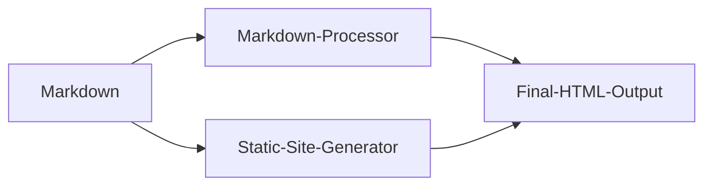

# Introduction to Markdown
Let's take an overview of __Markdown__, how it works, and what you can do with it.

## What is Markdown?
--------------------

Markdown is a lightweight markup language that you can use to add formatting elements to plaintext text documents. Created by [John Gruber](https://daringfireball.net/projects/markdown/) in 2004, Markdown is now one of the world's most popular markup languages. 

Markdown is different to a [WYSIWYG](https://en.wikipedia.org/wiki/WYSIWYG) editor. In those applications (Microsoft Word or Apple Pages) you click buttons to format words and phrases, and the changes are visible immediately. Markdown isn't like that. When you create a Markdown-formatted file, you add Markdown syntax to the text to indicate which words and phrases should look different.


<center><small>Figure 1. Markdown editingo in a plain tex processor (Visual Studio Code).</small></center>

 You can add Markdown formatting elements to a plaintext file using a text editor application. Or you can use one of the many Markdown applications for macOS, Windows, Linux, iOS, and Android operating systems. There are also several web-based applications specifically designed for writing in Markdown. [According to Gruber](https://daringfireball.net/projects/markdown/), Markdown syntax is designed to be readable and unobtrusive, so the text in Markdown files can be read even if it isn't rendered.

> The overriding design goal for Markdown's formatting syntax is to make it as readable as possible. The idea is that a Markdown-formatted document should be publishable as-is, as plain text, without looking like it's been marked up with tags or formatting instructions.

## Why Use Markdown?

You might be wondering why people use Markdown instead of a WYSIWYG editor. Why write with Markdown when you can press buttons in an interface to format your text? As it turns out, there are a couple different reasons why people use Markdown instead of WYSIWYG editors.

- Markdown can be used for everything. 
  - To create [websites](https://www.markdownguide.org/getting-started/#websites)
  - [documents](https://www.markdownguide.org/getting-started/#documents)
  - [notes](https://www.markdownguide.org/getting-started/#notes)
  - [books](https://www.markdownguide.org/getting-started/#books)
  - [presentations](https://www.markdownguide.org/getting-started/#presentations)
  - [email messages](https://www.markdownguide.org/getting-started/#email),
  - and [technical documentation](https://www.markdownguide.org/getting-started/#documentation).
- Markdown is portable. Files containing Markdown-formatted text can be opened using virtually any application. 
- You can import your Markdown files into another Markdown application. As plain text, its not a proprietary file format.
- Markdown is platform independent. You can create Markdown-formatted text on any device running any operating system.
- Markdown is future proof. Even if the application you're using stops working at some point in the future, you'll still be able to read your Markdown-formatted text using a text editing application. This is an important consideration when it comes to books, university theses, and other milestone documents that need to be preserved indefinitely.
- Markdown is everywhere. Websites like [Reddit](https://www.markdownguide.org/tools/reddit/) and GitHub support Markdown, and lots of desktop and web-based applications support it.
  
## How does it work?

When you write in Markdown, the text is stored in a plaintext file that has an `.md` or `.markdown` extension. But then what? How is your Markdown-formatted file converted into HTML or a print-ready document?

The short answer is that you need a _Markdown application_ capable of processing the Markdown file. There are lots of applications available ([see section in this document](#md_editors) from simple scripts to desktop applications that look like Microsoft Word. Despite their visual differences, all of the applications do the same thing. Like [Stackedit](https://stackedit.io/), converts (and deploys) Markdown-formatted text to HTML so it can be displayed in web browsers.

Markdown applications use something called a _Markdown processor_ (also commonly referred to as a “parser” or an “implementation”) to take the Markdown-formatted text and output it to HTML format. At that point, your document can be viewed in a web browser or combined with a style sheet and printed. You can see a visual representation of this process below.

> **Note:** The Markdown application and processor are two separate components. For the sake of brevity, I've combined them into one element ("Markdown App") in the figure below.



To summarize, this is a four-part process:

1.  Create a Markdown file using a text editor or a dedicated Markdown application. The file should have an `.md` or `.markdown` extension.
2.  Open the Markdown file in a Markdown application.
3.  Use the Markdown application to convert the Markdown file to an HTML document.
4.  View the HTML file in a web browser or use the Markdown application to convert it to another file format, like PDF.

The process will vary somewhat depending on the application you use. For example, Dillinger essentially combines steps 1-3 into a single, seamless interface — all you have to do is type in the left pane and the rendered output magically appears in the right pane. But if you use other tools, like a text editor with a static website generator, you'll find that the process is much more visible.

## What's Markdown Good For?

Markdown is a fast and easy way to take notes, create content for a website, and produce print-ready documents. It doesn't take long to learn the Markdown syntax, and once you know how to use it, you can write using Markdown just about everywhere. Most people use Markdown to create content for the web, but Markdown is good for formatting everything from email messages to grocery lists.

Here are some examples of what you can do with Markdown.

### Websites

Markdown was designed for the web, so it should come as no surprise that there are plenty of applications specifically designed for creating website content.

If you're familiar with HTML, CSS, and version control, check out [Hugo](https://gohugo.io), a popular static site generator that takes Markdown files and builds an HTML website. One advantage to this approach is that [GitHub Pages](https://www.markdownguide.org/tools/github-pages/) provides free hosting for hugo-generated websites. There are also [many other static site generators available](https://www.staticgen.com/).

If you'd like to use a content management system (CMS) to power your website, take a look at [Ghost](https://www.markdownguide.org/tools/ghost/). It's a free and open-source blogging platform with a nice Markdown editor. If you're a WordPress user, you'll be happy to know there's [Markdown support](https://en.support.wordpress.com/markdown/) for websites hosted on WordPress.com. Self-hosted WordPress sites can use the [Jetpack plugin](https://jetpack.com/support/markdown/).

In the next link, a detailed list of [static sites generators based on markdown are presented](https://jamstack.org/generators/).

Our choice is [Hugo](https://gohugo.io) but any of them is useful.

### Documents

Markdown doesn't have all the bells and whistles of word processors like Microsoft Word, but it's good enough for creating basic documents like assignments and letters. You can use a Markdown document authoring application to create and export Markdown-formatted documents to PDF or HTML file format. The PDF part is key, because once you have a PDF document, you can do anything with it — print it, email it, or upload it to a website.

Here are some Markdown document authoring applications. Some of them are:

* **General Pourpose Editors:**
  * [Atom](Atom)
  * [GNU Emacs](https://www.gnu.org/software/emacs/)
  * [Remarkable](https://remarkableapp.github.io/)
  * [Haroopad](http://pad.haroopress.com/)
  * [GitBook](https://gitbook.com/)
  * [ReText](https://github.com/retext-project/retext)
  * [UberWriter](http://uberwriter.wolfvollprecht.de/)
  * [Mark My Words](https://github.com/voldyman/MarkMyWords)
  * [Vim-Instant-Markdown Plugin](https://github.com/suan/vim-instant-markdown)
  * [Bracket-MarkdownPreview Plugin](https://github.com/gruehle/MarkdownPreview)
  * [SublimeText-Markdown Plugin]()

*   **Mac:**
    *   [MacDown](https://www.markdownguide.org/tools/macdown/),
    *   [iA Writer](https://www.markdownguide.org/tools/ia-writer/)
    *   [Marked](https://marked2app.com/)
*   **iOS / Android:
    *    [iA Writer](https://www.markdownguide.org/tools/ia-writer/)
*   **Windows:** 
    *   [ghostwriter](https://wereturtle.github.io/ghostwriter/) or 
    *   [Markdown Monster](https://markdownmonster.west-wind.com/)
*   **Linux:**
*   [ReText](https://github.com/retext-project/retext) or [ghostwriter](https://wereturtle.github.io/ghostwriter/)
*   **Web:** 
    *   [Dillinger](https://www.markdownguide.org/tools/dillinger/) 
    *   [StackEdit](https://www.markdownguide.org/tools/stackedit/)
*   **Static Document Generators**
    *   [Docusaurus](https://docusaurus.io/)
    *   [Docsify](https://docsify.js.org/)
    *   [VuePress](https://vuepress.vuejs.org/)
    *   [Slate](https://slatedocs.github.io/slate)
    *   [Docute](https://docute.org/)

Our choice is [Typora](https://typora.io/) not listed below because it keep for most of operating systems versions.

### Notes

In nearly every way, Markdown is the ideal syntax for taking notes. Sadly, [Evernote](https://evernote.com/) and [OneNote](https://www.onenote.com/), two of the most popular note applications, don't currently support Markdown. The good news is that several other note applications _do_ support Markdown:

*   [Simplenote](https://www.markdownguide.org/tools/simplenote/)
*   [Notable](https://www.markdownguide.org/tools/notable/)
*   [Bear](https://www.markdownguide.org/tools/bear/)
*   [Boostnote](https://www.markdownguide.org/tools/boostnote/)
*   [MarkText](https://marktext.app/)
*   [Yosoro](https://github.com/IceEnd/Yosoro)
*   [Uncolored](https://n457.github.io/Uncolored/)
*   [Bootsnote](https://boostnote.io/)

If you can't part with Evernote, check out [Marxico](https://marxi.co/), a subscription-based Markdown editor for Evernote, or use [Markdown Here](https://www.markdownguide.org/tools/markdown-here/) with the Evernote website. Otherwise [Notable](https://www.markdownguide.org/tools/notable/) should be a good choice.

### Books

* If you try to self-publish your book, try [Leanpub](https://leanpub.com/), which uses markdown-formatted files as source of electronic books.
* The GitBook style was borrowed from GitBook, a project launched by Friendcode, Inc. (https://www.gitbook.com) and dedicated to helping authors write books with Markdown.
* If you have used R Markdown before, you should be familiar with the Bootstrap style (http://getbootstrap.com), which is the default style of the HTML output of R Markdown. Like the Bootstrap style, the Tufte style is provided by an output format tufte_html_book(), which is also a special case of html_chapters() using tufte::tufte_html() as the base format.
* To create an EPUB book, you can use the `epub_book()` format. It has some options in common with `rmarkdown::html_document()`.
* MOBI e-books can be read on Amazon’s Kindle devices. Pandoc does not support MOBI output natively, but you may use third-party tools to convert EPUB to MOBI. One possible tool is Calibre. Calibre is open-source and free, and supports conversion among many more formats. For example, you can convert HTML to EPUB, Word documents to MOBI, and so on. The function calibre() in bookdown is a wrapper function of the command-line utility ebook-convert in Calibre.
* The **knitr** package was designed based on the idea of “Literate Programming” (Knuth [1984](https://bookdown.org/yihui/bookdown/knitr.html#ref-knuth1984)), which allows you to intermingle program code with text in a source document. When **knitr** compiles a document, the program code (in code chunks) will be extracted and executed, and the program output will be displayed together with the original text in the output document.

### Presentations

Believe it or not, you can generate presentations from Markdown-formatted files. Creating presentations in Markdown takes a little getting used to, but once you get the hang of it, it's a lot faster and easier than using an application like PowerPoint or Keynote. 

* [Landslide](https://github.com/adamzap/landslide) generates a slideshow using from markdown, ReST, or textile. It builds off of Google's [html5slides](http://code.google.com/p/html5slides/) template.

* [Remark](https://remarkjs.com/) ([GitHub project](https://github.com/gnab/remark)) is a popular browser-based Markdown slideshow tool

* [Cleaver](https://jdan.github.io/cleaver/) ([GitHub project](https://github.com/jdan/cleaver)).

* If you use a Mac and would prefer to use an application check out:

  * [Deckset](https://www.decksetapp.com/) 
  * [Marked](https://marked2app.com/).

* [Marp](https://marp.app/) is a very good alternative due to its integration with some editors like visual studio code, it is a work in progress, but it shows promise. Short for "Markdown Presentation Writer," Marp is an [Electron](https://en.wikipedia.org/wiki/Electron_(software_framework)) app in which you craft slides using a simple two-pane editor: Write in Markdown in the left pane and you get a preview in the right pane.

  Marp supports [GitHub Flavored Markdown](https://guides.github.com/features/mastering-markdown/). If you need a quick tutorial on using GitHub Flavored Markdown to write slides, check out the [sample presentation](https://raw.githubusercontent.com/yhatt/marp/master/example.md). It's a bit more flexible than baseline Markdown.

### Email

If you send a lot of email and you're tired of the formatting controls available on most email provider websites, you'll be happy to learn there's an easy way to write email messages using Markdown. 

* [Markdown Here](http://markdown-here.com/) (MDH) is a simple browser extension that can be installed in browsers such as Chrome, Firefox, Safari and Opera.
* R Markdown, with the **blastula** package can render an Rmd document to the email body and send the email. 
* 

### Collaboration

Collaboration and team messaging applications are a popular way of communicating with coworkers and friends at work and home. These applications don't utilize all of Markdown's features, but the features they do provide are fairly useful. For example, the ability to bold and italicize text without using the WYSIWYG interface is pretty handy. Some examples:

* [Slack](https://www.markdownguide.org/tools/slack/)
* [Discord](https://www.markdownguide.org/tools/discord/)
* [Mattermost](https://www.markdownguide.org/tools/mattermost/)
* [HackMD](https://hackmd.io/)
* [Collaborative MarkDown Editor](https://github.com/mortenterhart/collaborative-markdown-editor)
* [Socrates.io](http://socrates.io/)
* [StackEdit](https://stackedit.io/app#)
* [Draft](https://draftin.com/)
* [Quiver](http://happenapps.com/#quiver)
* [FirePad](https://firepad.io/)

### Technical Documentation

Markdown is a natural fit for technical documentation. Companies like GitHub are increasingly switching to Markdown for their documentation — check out their [blog post](https://github.com/blog/1939-how-github-uses-github-to-document-github) about how they migrated their Markdown-formatted documentation to [Jekyll](https://www.markdownguide.org/tools/jekyll/). If you write documentation for a product or service, take a look at these handy tools:

* [Read the Docs](https://readthedocs.org/) can generate a documentation website from your open source Markdown files. Just connect your GitHub repository to their service and push — Read the Docs does the rest. They also have a [service for commercial entities](https://readthedocs.com/).

* [MkDocs](https://www.markdownguide.org/tools/mkdocs/) is a fast and simple static site generator that's geared towards building project documentation. Documentation source files are written in Markdown and configured with a single YAML configuration file. MkDocs has several [built in themes](https://www.mkdocs.org/user-guide/styling-your-docs/), including a port of the [Read the Docs](https://readthedocs.org/) documentation theme for use with MkDocs. One of the newest themes is [MkDocs Material](https://squidfunk.github.io/mkdocs-material/).

* [Docusaurus](https://www.markdownguide.org/tools/docusaurus/) is a static site generator designed exclusively for creating documentation websites. It supports translations, search, and versioning.

* [VuePress](https://vuepress.vuejs.org/) is a static site generator powered by [Vue](https://vuejs.org/) and optimized for writing technical documentation.

* [Jekyll](https://www.markdownguide.org/tools/jekyll/) was mentioned earlier in the section on websites, but it's also a good option for generating a documentation website from Markdown files. If you go this route, be sure to check out the [Jekyll documentation theme](https://idratherbewriting.com/documentation-theme-jekyll/).

* You probably know [pandoc](https://pandoc.org/) as a magic wand for converting between various markup languages. What you might not know is that pandoc can take a file formatted with Markdown and create attractive HTML slides that work with the [Slidy](https://www.w3.org/Talks/Tools/Slidy2/Overview.html#(1)), [Slideous](http://goessner.net/articles/slideous/), [DZSlides](http://paulrouget.com/dzslides/), [S5](https://meyerweb.com/eric/tools/s5/), and [Reveal.js](https://revealjs.com/#/) presentation frameworks. If you prefer [LaTeX](https://www.latex-project.org/), you can also output PDF slides using the [Beamer package](https://en.wikipedia.org/wiki/Beamer_(LaTeX)). You'll need to [use specific formatting](https://pandoc.org/MANUAL.html#producing-slide-shows-with-pandoc) for your slides, but you can add some [variables](https://pandoc.org/MANUAL.html#variables-for-slides) to control how they behave. You can also change the look and feel of your slides, add pauses between slides, and include speaker notes. Of course, you must have the supporting files for your preferred presentation framework installed on your computer. Pandoc spits out only the raw slide file.

* [Hacker Slides](https://github.com/jacksingleton/hacker-slides) is an application for [Sandstorm](https://sandstorm.io/) and [Sandstorm Oasis](https://oasis.sandstorm.io/) that mates Markdown and the [Reveal.js](https://revealjs.com/#/) slide framework. The slides are simple, but they can be visually striking. 

  Craft your slide deck in a two-pane editor in your browser—type in Markdown on the left and see it rendered on the right. When you're ready to present, you can do it from within Sandstorm or get a link that you can share with others to present remotely.

Flavors of Markdown
-----------------------------------------------------------------------------------------

One of the most confusing aspects of using Markdown is that practically every Markdown application implements a slightly different version of Markdown. These variants of Markdown are commonly referred to as _flavors_. It's your job to master whatever flavor of Markdown your application has implemented.

To wrap your head around the concept of Markdown flavors, it might help to think of them as language dialects. People in Ciudad Juárez speak Spanish just like the people in Barcelona, but there are substantial differences between the dialects used in both cities. The same is true for people using different Markdown applications. 

Practically speaking, this means you never know exactly what a company means when they say they support “Markdown.” Are they talking about only the [basic syntax elements](https://www.markdownguide.org/basic-syntax/), or all of the basic and [extended syntax elements](https://www.markdownguide.org/extended-syntax/) combined, or some arbitrary combination of syntax elements? You won't know until you read the documentation or start using the application.

If you're just starting out, the best advice I can give you is to pick a Markdown application with good Markdown support. That'll go a long way towards maintaining the portability of your Markdown files. You might want to store and use your Markdown files in other applications, and to do that you need to start with an application that provides good support. You can use the [tools directory](https://www.markdownguide.org/tools/) to find an application that fits the bill.

Additional Resources
-------------------------------------------------------------------------------------------

There are lots of resources you can use to learn Markdown. Here are some other introductory resources:

*   [John Gruber's Markdown documentation](https://daringfireball.net/projects/markdown/). The original guide written by the creator of Markdown.
*   [Markdown Tutorial](https://www.markdowntutorial.com/). An open source website that allows you to try Markdown in your web browser.
*   [Awesome Markdown](https://github.com/mundimark/awesome-markdown). A list of Markdown tools and learning resources.
*   [Typesetting Markdown](https://dave.autonoma.ca/blog/2019/05/22/typesetting-markdown-part-1). A multi-part series that describes an ecosystem for typesetting Markdown documents using [pandoc](https://pandoc.org/) and [ConTeXt](https://www.contextgarden.net/).
*   [La guía definitiva de markdown](https://www.markdownguide.org/tools/)(spanish).

##### the next level.

Learn Markdown in 60 pages. Designed for both novices and experts, _The Markdown Guide_ book is a comprehensive reference that has everything you need to get started and master Markdown syntax.

[Get the Book](https://www.markdownguide.org/book/)

###### To learn more Markdown

At the [GitHub repository](https://github.com/mattcone/markdown-guide) and then enter your email address below to receive new Markdown tutorials via email. No spam!

Stay updated

*   [What is Markdown?](https://www.markdownguide.org/getting-started/#what-is-markdown)
*   [Why Use Markdown?](https://www.markdownguide.org/getting-started/#why-use-markdown)
*   [Kicking the Tires](https://www.markdownguide.org/getting-started/#kicking-the-tires)
*   [How Does it Work?](https://www.markdownguide.org/getting-started/#how-does-it-work)
*   [What's Markdown Good For?](https://www.markdownguide.org/getting-started/#whats-markdown-good-for)
    *   [Websites](https://www.markdownguide.org/getting-started/#websites)
    *   [Documents](https://www.markdownguide.org/getting-started/#documents)
    *   [Notes](https://www.markdownguide.org/getting-started/#notes)
    *   [Books](https://www.markdownguide.org/getting-started/#books)
    *   [Presentations](https://www.markdownguide.org/getting-started/#presentations)
    *   [Email](https://www.markdownguide.org/getting-started/#email)
    *   [Collaboration](https://www.markdownguide.org/getting-started/#collaboration)
    *   [Documentation](https://www.markdownguide.org/getting-started/#documentation)
*   [Flavors of Markdown](https://www.markdownguide.org/getting-started/#flavors-of-markdown)
*   [Additional Resources](https://www.markdownguide.org/getting-started/#additional-resources)

[About](https://www.markdownguide.org/about/)     [Contact](https://www.markdownguide.org/contact/)     [GitHub](https://github.com/mattcone/markdown-guide)     [API](https://www.markdownguide.org/api/v1/)     [Privacy Policy](https://app.termly.io/document/privacy-policy/1ca2b712-96e3-46bf-a8f1-d0035d389e7d)

© 2021. A [Matt Cone](https://www.mattcone.com/) project. [CC BY-SA 4.0](https://creativecommons.org/licenses/by-sa/4.0/). Made with 🌶️ in [New Mexico](https://www.newmexico.org/).

anchors.options = { placement: 'right', }; anchors.add('h1, h2, h3, h4, h5').remove('.no-anchor'); docsearch({ apiKey: '0125ba824e95b21d36ae268518067391', indexName: 'markdownguide', inputSelector: '#search-input', debug: false // Set debug to true if you want to inspect the dropdown });


[Markdown Editors](#mdeditors) 

### Markdown Editors for Mac

Here are some of the best Markdown editors for Mac users:

1. [Byword](https://apps.apple.com/us/app/byword/id420212497?mt=12)
2. [Ulysses](https://apps.apple.com/app/ulysses/id1225570693?l=en&mt=12)
3. [MacDown](https://macdown.uranusjr.com/)

### Markdown Editors for Windows

1. [Caret](https://caret.io/)
2. [ghostwriter](https://wereturtle.github.io/ghostwriter/)
3. [Typora](https://typora.io/#windows) 

### Markdown Editors for Linux

1. [Remarkable](https://remarkableapp.github.io/linux.html)
2. [Haroopad](http://pad.haroopress.com/user.html#download)
3. [UberWriter](http://uberwriter.github.io/uberwriter/#5)

### Online Markdown Editors

1\. [HackMD](https://hackmd.io/)

## Markdown Cheat Sheet

[The Markdown Cheat Sheet](https://www.markdownguide.org) provides a quick overview of all the Markdown syntax elements. It can't cover every edge case, so if you need more information about any of these elements, refer to the reference guides for [basic syntax](https://www.markdownguide.org/basic-syntax) and [extended syntax](https://www.markdownguide.org/extended-syntax).

### Basic Syntax

These are the elements outlined in John Gruber's original design document. All Markdown applications support these elements.

### Heading

# H1

## H2

### H3

### Bold

**bold text**

### Italic

*italicized text*

### Blockquote

> blockquote

### Ordered List

1. First item
2. Second item
3. Third item

### Unordered List

- First item
- Second item
- Third item

### Code

`code`

### Horizontal Rule

---

### Link

[title](https://www.example.com)

### Image


### Extended Syntax

These elements extend the basic syntax by adding additional features. Not all Markdown applications support these elements.

### Table

| Syntax    | Description |
| --------- | ----------- |
| Header    | Title       |
| Paragraph | Text        |

### Fenced Code Block

```
{
  "firstName": "Anxo",
  "lastName": "Sánchez",
  "age": 60
}
```

### Footnote

Here's a sentence with a footnote. [^1]

[^1]: This is the footnote.

### Heading ID

### My Great Heading {#custom-id}

### Definition List

term
: definition

### Strikethrough

~~The world is flat.~~

### Task List

- [x] Write the press release
- [ ] Update the website
- [ ] Contact the media