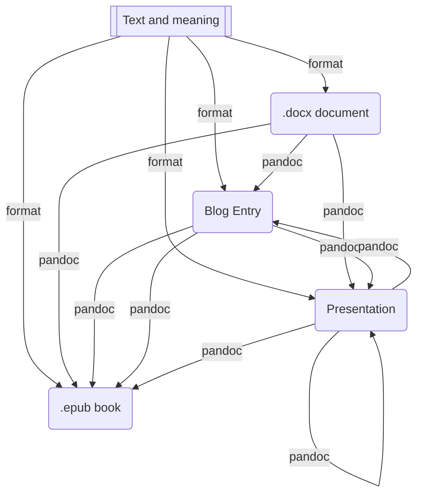

# Organize Writing with Markdown

If you use yor computer to write blog articles, documentation for work, emails, books that will never be published. But all of this writing on the computer presents some problems. For one, how do you keep all those documents organized? Should you write them all in Microsoft Word? What about notebook apps likes Evernote or OneNote?. How should we organize, version, and format our written documents so they will be the most useful for us in the long run?

## Formatting

The main problem creating teaching documents is that you often don't know for sure what final form your writing will end up in. For example, teachers often solve probles in the classroom and make presentations with nice diagrams which, lately, could be used in a lecture document, in pdf. But in many cases, take that diagram to the original pdf document its is not easy. In the case of writting blogs or creating moodle questionaries or so, should be again useful that diagram but, in too many case we don't do that beacuse of we don't remeber where was it, or need to chase fonsts and sizes, etc. Most of us use Microsoft Powerpoint to make slides, Microsoft Word to make documents (which after editing save as PDF format), Inkscape for Illustrations ando so. It also depends of the first use the creation software, for example when you write a blog you uses wordpress or blogger to make a draft, but if you need a presentation you normally use Powerpoint as the first program. After that the format conversion is so ugly that you'll probably make the diiagram again before try to reuse it.  You realize that what you need is to separate content and formatting.

The problem goes worst when you consider that most writing doesn't you make is based in your past job. We all have frequently adapted lectures notes into presentations, laboratory annotations into articles (think about bibliography references), and papers into PowerPoint presentations. The proccess of that adaptation from one format to another is an arduous work, removing all of the formatting and then reformatting it for a different document type one time and another. But, in my opinion the worst thing is when I question myself about where is or which is the master copy of my really needed document?. Markdown is a better way to do the things.

## The Way of Working

The best way to separate contetn and format is to use plain text as default format. The advantages when you are:

-  the text can be written in almost any (old or new) computer with a simple text editor.
- You don't waste your time fomatting (which in Word is represents a lot of time choosing font, adding headings, and selecting margins an styles.
- You are more focussed in the meaning of the text than in its format or appearance.
- You can eliminate the clutter of having thousands of formatted Word documents dusting your computer desktop
- You can remove the decision of having to decide the form of the document before writing it, which can promote the creation of a "master documents" repository (format-agnostic)

The documetnformatting should be the very last step of the process, not the first. One of the final stages in publishing a book is typesetting. The manuscript needs to go through several rounds of editing, revisions, and rewriting before they even consider what font it will use and the style of the chapter headings. The same thing should be for our personal writing of anu kind of document: content first, formatting last, like can be seen in this flux diagram:

By separating content from formatting we turn writing into a two-stage process. This gives us greater agility in how we deploy that written content later on.

## Implementation

We are telling you a posibble markdown authoring perpective, but we higly recommennd you to investigate abroad the vaste markdown application ecosystem to choose yoyr preffeared configuration.

As we said before, Markdown is a formatting syntax which allows you to write documents in plain-text and later render them with basic formatting. From a Markdown document, you can output your writing as HTML, PDF, DOCX, etc.

We can use to edit markdown any plain tex editor, like Notepad, or a specialized software (mainly with widgets to do the live more easy).

If you are used to write programming code (like me) you robably want to use your every-day editor, in my case [visual studio code]()  

### Begin Your Writing in Markdown

What Markdown adds to your plain-text writing is some simple syntax to indicate what different elements in your document are. For example, you can mark something as a level-one heading by using a hashtag. Level two headings begin with two hashtags and so forth. Bullet lists just need to begin with a hyphen or asterisk. To see all of the options check out this comprehensive [Markdown cheatsheet](https://github.com/adam-p/markdown-here/wiki/Markdown-Cheatsheet).

Here’s a screenshot of an early draft of this article done in Markdown using Ulysses.

When you finally render your document, the Markdown app formats those headings, lists, and boldface according to whatever rules you’ve asked it to apply in the target document type. More on rendering Markdown in point three. But before we render, we need to get organized. Markdown can help with this too.

### 2 – Use a Markdown Editor to Organize

Since Markdown documents are plain-text you could just store them in folders on your computer. But I much prefer to use a Markdown editor to organize my documents.

This is Ulysses. The left column contains all the folders and subfolders I use to organize my writing and ideas.

I use [Ulysses](https://ulysses.app/) for this since I like its infinite folder structure. But there are tons of other Markdown editors which also have organizational abilities. And most of these sync across your devices. So, you can jot stuff down from your phone.

- [Drafts](https://getdrafts.com/) is a great lightweight option.
- [iA Writer](https://ia.net/writer) works in Windows, Mac, iOS, and Android.
- [Bear](https://bear.app/) is a beautiful option for the Apple ecosystem
- And [Caret](https://caret.io/) is another good cross-platform option.

There are also lots of online Markdown editors like [Dillinger](https://dillinger.io/). Or [HackMD](https://hackmd.io/) which allow you to work on Markdown documents collaboratively *a la* Google Docs.

[Dillinger](https://dillinger.io/) is a free online Markdown editor you can use to output Markdown in a variety of formats. It also lets you preview the results, so it’s a good way to learn Markdown.

Another benefit of organizing your writing this way is that your Markdown editor can act like a notebook, similar to how people use Evernote or Microsoft OneNote. For me, that means when I have an idea, I just open up Ulysses and start typing. And if I want to find an old written document, I know it’s somewhere in Ulysses. Using a Markdown editor keeps your writing organized and efficient.

So, now you’re writing your master documents in Markdown and you’re organizing them with a Markdown editor, but what do you do when it’s time to output that writing to a specific format and apply styling?

### 3 – Render the Markdown and Finish Formatting

The final step with any Markdown document is rendering it to its final format. Often for me, that means publishing my blog articles as HTML. The Markdown editor does all the work of converting my headings, links, and images to HTML formatting and sticking that into a post on WordPress.

The is the example from above rendered to four different formats and document types using temples I’ve setup. You can get pretty fancy with this. For example, in seminary, I used an academic papers template to render my markdown as a .docx file with the correct font, heading styles, and even footnotes.

But if I wanted to use that blog post as a handout for a Bible study, I go back to my Markdown document in my markdown editor and I output it as a .docx file. It does all the simple formatting for me and any additional formatting I complete in Microsoft Word.

Markdown files are plain text, but you’ll need a Markdown editor to render those files to different formats.

## Conclusion

That’s the beauty of Markdown, it gives you a better way to organize, version, and format your written documents.

Another side benefit of being familiar with markdown is that even though it’s been around since 2004, it keeps showing up in new places. WordPress, for example, which I use to host this blog, recently added the ability to use markdown in the text editor. All of Atlassian’s products use it natively and GitHub has used it for years on their platform. Don’t be surprised if you see it show up in even more places.

Because of its simplicity and benefits, Markdown isn’t going anywhere any time soon. So, why not learn it and take advantage of those benefits now?