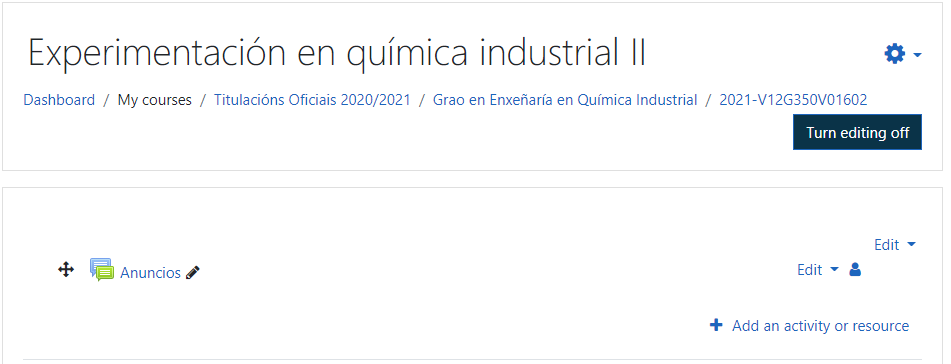
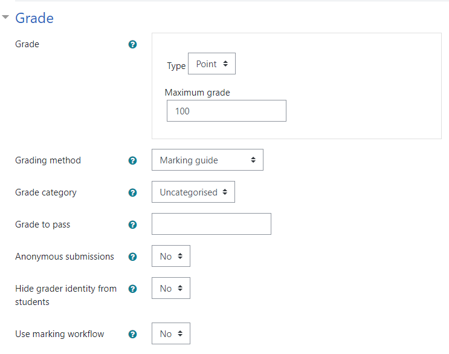

# Adding Graded Activities

Adding an activity means toggle **Turn editing on** within the course. All graded activities are added through the **Add an activity or resource text** available within each section of the course (figure 6). 

<center><figure>
    
    <figcaption><small>Figure 6. Adding graded activities.</small><figcaption>
<figure>

Assignments are the most feature-rich of all the graded activities and have many
options available in order to customize how assessments can be graded. They can
be used to:

* Provide assessment information for students
* Store grades
* Provide feedback. 
* Receive students homework electronically:
  * files submission
  * online text
* Review the assessment offline.

## Adding assignments

There are many options within the assignments with lots of useful features and options. 

### Creating an assignment with a scale

To create an assignment with a scale steps are:

| Step | Operation                                                    |
| ---- | :----------------------------------------------------------- |
| 1.   | Turn editing on                                              |
| 2.   | Add an activity or resource (click on).                      |
| 3.   | Assignment ... Add.                                          |
| 4.   | Say a name to the _Assignment name box_.                     |
| 5.   | Provide details _in the description box_.                    |
| 6.   | Answer the questions related to the sections:<br>    Availability Feedback types<br/>    Submission settings<br/>    Group submission settings<br/>    Notifications |
| 7.   | Finally complete the rest of item.                           |

Some useful information:

* Allow submissions from section is relevant when the assignment will be submitted electronically, and if students won't be able to submit their work until the date and time indicated here strictly or not.
* Due date indicates when the assignment needs to be submitted by. 
  * If students submit their assignment after the date and time indicated here, the system tracks and or notify the teacher.
  * Cut off date section enables teachers to set an posterior period extension.

 <center><figure>
    
    <figcaption><small>Figure 7. Grade options.</small><figcaption>
<figure>

#### Grade options

1. Type[^5]:
   1. None
   2. **Scale**
   3. Point
2. Grading method
   1. Simple direct grading
   2. Marking Guide
   3. Rubric
3. Grade category[^7]
4. Grade to pass[^8]
5. Anonymous submission (No/Yes)
6. Hide grade identity from students (No/Yes)
7. Using marking workflows (no/Yes)[^9]

> <span style="color:blue">Observe the _File submissions checkbox_. If its not checked, students can not to submit their
> assignment<br>There are bunch of additiona options like maximum number of uploaded files, _maximum submission size_, _feedback options_, etc. <br></span>

#### Offline grading

Offline grading offers a downloadable .csv file containsing the information about the assignment. Can be used to add grades and feedback while working offline.

> This an useful option in countries with a reduced bandwith or limited web acces because of, even dalaying the grading, the result is almost the same that online grading

#### Submission settings

This section, is related to how students will submit their assignment and how they will reattempt submission (if required).

* Default option is No
* Yes means that students can upload their assignment (teacher  see it as  a draft).
* Require that students accept the submission if you want they need to agree to when they submit their files.
* Submission statements can be changed by a site administrators
* Attempts reopened can be:
  * Never
  * Manually
  * Until pass

The last option works when a pass grade is set within the Gradebook. 

>  Don't forget to click on **Save and return to course**.

### Creating an online assignment with a number grade

To create a number grade assignment the sequence is this:

| Step | Operation                                                    |
| ---- | :----------------------------------------------------------- |
| 1.   | Turn editing on                                              |
| 2.   | Add an activity or resource (click on).                      |
| 3.   | Assignment ... Add.                                          |
| 4.   | Say a name to the _Assignment name box_.                     |
| 5.   | In _*Submission types_ mark _online text_ to allow students write directly in moodle.<br/>Set a maximum word limit by clicking on the tick if you want adding a number in the textbox. |
| 5.   | Provide details _to feedback types_.<br>No/Yes if you want add comments as inline text |
| 6.   | Answer the questions related to the sections:<br>    Availability Feedback types<br/>    Submission settings<br/>    Group submission settings<br/>    Notifications |
| 7.   | Finally complete the rest of item.                           |
| 8.   | Save and return                                              |

## Creating an assignment including outcomes

The next assignment that we will create will add some of the Outcomes created in
*Chapter 2* , *Customizing Grades* :

1. Enable editing by clicking on **Turn editing on.**
2. Click on **Add an activity or resource**.
3. Click on **Assignment** and then click on **Add**.
4. In the **Assignment name** box, type in the name of the assignment
   (such as Task 3).
5. In the **Description** box, provide the assignment details.
6. In the **Submission types** box, ensure that **Online text** and **File submissions**
   are selected. Set **Maximum number of uploaded files** to **2**.

*Adding Graded Activities*

1. In the **Submission settings** section, ensure that the options for **Require**
   **students to click submit button** and **Require that students accept the**
   **submission statement** are amended to **Yes**. Change **Attempts reopened**
   to **Manually**.
2. Within the **Grades** section, navigate to **Grade** | **Type** | **Point** and **Maximum**
   **points** is set to 100.
3. In the **Outcomes** section, choose the outcomes as **Evidence provided** and
   **Criteria 1 met**.
4. Scroll to the bottom of the screen and click on **Save and return to course**.

### Alternative grading methods

Within the **Grade** section, there are three types of grading methods, and so far,
we have only used the default **Simple direct grading** option. However, there are
two other types of grading methods: **Marking guide** and **Rubric**.

The simple direct grading option enables us to choose the grade options (such as
number or a scale), and the teacher adds the grade that is awarded to the student.
The alternative grading methods use a very different grading process. The teacher
does not select the final overall grade but grades individual criteria instead, and the
score for each of these is added together to create the final grade. When creating an
assignment that uses **Marking guide** or **Rubric** , we need to identify the criteria that
will be used to assess the assignment.

#### The marking guide method

The marking guide's grading method allows us to add criteria and identify a top grade
for each piece of criteria. When grading the assignment, the teacher will choose the
grade to be awarded and can also add specific feedback. We will be setting up three
criteria, two with a top mark of 5 and one with a top mark of 10.

If the student is graded with the top marks for each of the three criteria, they will
receive the maximum grade of twenty. Let's add this together:

1. Click on the **Turn editing on** button.
2. Click on **Add an activity or resource**.
3. Click on **Assignment** and then click on **Add**.
4. In the **Assignment name** box, type in the name of the assignment
   (such as Assignment 4).
5. In the **Description box** , provide the assignment details.
6. Within the **Grades** section, navigate to **Grade** | **Type** and set it to **Point**
   and ensure that **Maximum points** is set to 20. Change **Grading method**
   to **Marking guide** using the drop-down list.

```
Please note that the criteria does not need to add up to the
maximum grade given for the assignment, as Moodle will
convert the final grade received for the assignment to a decimal
(by adding together the grade awarded for each criterion and
dividing this by 100). This will be multiplied by the maximum
grade set for the assignment. This is a normalization process that
is explained in much more detail in Chapter 5 , Using Calculations.
```

1. Scroll to the bottom of the screen and click on **Save and display**.
   The next step is to set up the marking guide, where the screen will look like
   the following screenshot:

*Adding Graded Activities*

```
The previous screenshot lets us know that the advanced grading form is not
yet ready and we have a choice between Define a new grading form from
scratch and Create new grading from a template. If no marking guide is
created at this stage, the assignment will make use of the standard direct
grading method when the assignment is assessed.
```

1. Select **Define new grading form from scratch**.

```
If you do not see the screen shown in the previous
screenshot, you can access this setup area when you are
viewing the assignment on the screen. To access it, find
the Administration block, click on Advanced grading
and then click on Define marking guide.
```

1. After opening the grading form, we need to add in a name for the marking
   guide and description. Add some information to these boxes (for the following
   example, we can name the marking guide **Presentation** and the description
   **Present your ideas for a research project** ).

```
Chapter 3
```

1. The next section is the actual **Marking guide** setup area, which has a place to
   add the first criterion. There are three elements for each criterion:
   ° **Description for Students** : This is the information that a student will
   see in order to find out the assignment criteria. This will only be shown
   if the option for students to view the criteria is turned on.
   ° **Description for Markers** : This information will be seen by teachers
   when they are grading the work and will help the teacher identify
   the grade to be awarded to the student.
   ° **Maximum mark** : A teacher can choose the maximum grade possible
   for this criteria. When grading, the teacher can choose any grade from
   zero to this maximum number.
2. Under the **Marking guide** title, click on the **Click to edit** criterion name
   and add the text Planning.
3. Under the **Description for Students** title, click on **Click to edit**. Add the
   this to the box: The presentation has been planned to include an
   initial overview plus as outline of each type of research.
4. Within the **Description for Markers** section, click on the **Click to edit**
   text and add: To gain top marks the overview must be very clear
   including the research question. There needs to be at least
   three types of research. There are five marks possible and
   should be based on 1 point for each item (clear overview,
   research question, three types of research).

*Adding Graded Activities*

1. Finally, click on **Click to edit** under the **Maximum mark** title and add in
   the number 5. We now need to add some more criteria. Click on the **Add**
   **criterion** button and repeat the preceding process for the following criteria:

```
Criterion name Description for students Description for markers Maximum
mark
Presentation The presentation is clearly
and confidently presented
The student presented
confidently with
evidence that he/she
planned and practiced
the presentation.
The student presented
without reading a script.
The presentation aids
were appropriate, clear,
and had the information
required for the project.
10
Questions The questions are answered
at end of the presentation
The maximum points
should be awarded
if students were able
to answer questions
confidently, displaying
understanding of their
project.
Lower points will be
awarded if students
were required to use
their notes to answer
questions or if they
were unable to answer
questions.
5
```

1. The next section to set up a marking guide is the **Frequently used**
   **comments** area where we can add statements that can be used when
   grading the assignment. Click on **Add frequently used comment**
   and type in Confidently presented and Evidence of planning
   and preparation.

1. Finally, we have two marking guide options that can be turned on and
   off using the tick boxes. Keep both of these turned on.
   Your completed marking guide should look like this:
2. Click on **Save marking guide and make it ready**.

*Adding Graded Activities*

```
If we have not completed our marking guide, we can click on
Save as draft and then come back to it via the Advanced grading
link within the assignment administration block.
```

1. The next screen will indicate that the marking guide is now ready for
   use. You can still click on **Edit the Current form definition** or **Delete the**
   **currently defined form** to start a new form or to revert to the simple direct
   grading method. You can also click on **Publish this form as a new template**
   so that it can be used for other assignments and in other courses.

We will look at how to grade work using the marking guide in *Chapter 4* ,
*Assigning Grades*.

#### The rubrics method

The second method of alternative grading is called Rubrics. **Rubrics** allow a set of
criteria to be set up for the assessment along with descriptors that outline the different
levels at which the criteria are met. Each descriptor has a value that enables Moodle to
calculate a final grade for the assessment based on the criteria met. Rubrics are a more
detailed version of the marking guide, and they make the grading process simple for
the teacher and students.

```
Chapter 3
```

When using the Rubric grading method, we will need to create a grading form
in a similar way in order to create the marking guide. We will set up a rubric
assignment together:

1. Click on **Turn editing on** button.
2. Click on **Add an activity or resource**.
3. Click on **Assignment** and then click on **Add**.
4. In the **Assignment name** box, type in the name of the assignment (such as
   Assignment 5).
5. In the **Description** box, provide the assignment details as Core criteria
   of an assignment.
6. Within the **Grades** section navigate to **Grade** | **Type** and set it to **Point**
   and ensure that **Maximum points** is set to 30. Change **Grading method**
   to **Rubric**.
7. Scroll to the bottom of the screen and click on **Save and display**. You will see
   an advanced grading screen like the one shown in the following screenshot:
8. From this screen, we will choose the **Define new grading form from scratch**
   option. However, note that you can also select **Create new grading form**
   **from a template**. This enables you to use grading forms that you have
   already created in this or other courses or use standard (site-wide) forms
   created on the Moodle site.

*Adding Graded Activities*

```
As with the marking guide, if no rubric form is created at this stage,
the simple direct grading method will be used; this means that the
teacher will manually add in the final grade rather than grade the
assignment using the criteria.
```

1. As this is the first form we have created, click on **Define new grading form**
   **from scratch**. The following screenshot will appear:
2. In the **Name** box, type in the name for this set of rubric criteria. For this
   example, we will call it Core assignment criteria. You can also add
   a description to the **Description** box (this is useful when sharing rubrics
   or searching for your own rubrics in order to use them as templates).

We will be completing the rubric criterion and level boxes, but first let's find out how
rubrics are used and what these options are.

```
Chapter 3
```

Within a rubric, there is at least one criterion, and each criterion has specific levels
of grading. The criterion is an element of the assignment that needs to be met. The
levels are the extent to which this criterion has been met. Statements are added and
are used to assess the work, and when grading we can choose the relevant statement
based on the extent to which this criterion has been met. For assignments that have
multiple criteria, the points awarded for each criterion are added together to create
the final grade.

The default setting within a rubric is for one criterion, with three points levels
ranging from zero to two points. Additional criterion as well as additional grading
levels for each criterion can be added (the number of grading levels can also be
removed so that there can be fewer than three grading levels). The points awarded
for each level can also be amended.

We will be setting up three criteria, each with a top grade of 10. If the student is
graded the top marks for each of the three criteria, they will receive the top grade
of 30 (we set 30 as the maximum grade when we added the assignment).

```
As with the marking guide, the criteria does not need to always add
up to the maximum grade given for the assignment, as a normalization
process will convert the grade. This will be explained in Chapter 5 ,
Using Calculations.
```

You can see the criteria we will be using in the following table; we will be using the
same point system for each level in this example:

```
Criterion 0 points 3 points 6 points 10 points
The assignment
should be 1,000
words
The word count
is below 800
words or over
1,200 words
The word count
is between
800 and 1,049
words
The word count
is between
1,050 and 1,200
words
The
assignment is
between 1,000
and 1,050
words
At least 5
quotes should
be used and
be correctly
referenced
No quotes
used or quotes
used but not
referenced
Some quotes
included
but not fully
referenced
5 quotes
included
and partly
referenced
5 or more
quotes
included
and correctly
referenced
The assignment
brief met
(4 elements)
2 or fewer
elements
covered
3 elements
covered
4 elements
covered but
more detail
could be
included
All 4 elements
covered in
detail
```

*Adding Graded Activities*

Let's add these criteria and levels to the course. We will add the first one together:

1. Click on the gray **Click to edit criterion** text to add the criteria detail.
2. Type in the first criterion (The assignment should be 1000 words).
   You can make the text box larger by holding your cursor in the bottom-right
   section of the box and dragging the box to make it bigger.
3. Click on the gray **Click to edit level** text in the box on the right-hand side of
   the criterion we have just added. This is where we need to type the statement
   for the zero points level shown in the preceding table (The word count is
   below 800 words or over 1200 words). Make sure the **points** box reads 0.
4. Click on the next gray **Click to edit level** text in the box (currently, the 1
   points level). Type in the three points level statement from the table.
   Change the points number to 3.
5. Click on the last available level box and add in the six points statement and
   change the number of points to 6.
6. We have now run out of the default number of levels but we still need to add
   the ten points level. Click on the **Add level** button on the right-hand side of
   the current level that we are working on.
7. Add in the level statement for ten points and change the points to 10.
8. Click anywhere on the screen to finalize this text.
9. We now need to add another line for the next criterion. Under the current
   criterion, there is a **Add criterion** button. Click on this and an additional
   row to add another criterion and the level statements and points will appear.
   Use the preceding table to complete this rubric. Once completed, your rubric
   table should look like this:

```
Chapter 3
```

1. Underneath the criteria section of the rubric creation page, there are a
   number of options that show you how the rubric can be used. The text
   explains the options, and these are turned on by adding a tick and turned
   off by removing the tick. Keep them all turned on, as shown in the following
   screenshot:

*Adding Graded Activities*

1. Scroll to the bottom of the screen and click on **Save rubric and make it ready**.
2. The rubric is now ready for use when grading the assignment. We will look
   at how to grade this in the next chapter.
3. If you want to edit your rubric, you will need to use the **Administration** block
   when you are viewing the assignment on the screen. Click on **Advanced**
   **grading** and then choose **Define rubric** , which will take you to the Rubric
   editing screen.

### Adding additional grading directly into the Gradebook

We have looked at how we can add graded activities to a Moodle course so that
they can be awarded a mark and used with the Gradebook. This is the main way in
which we grade an assessment, as the students need to complete something in order
to be graded (such as an assignment, quiz, discussion, or any other Moodle activity).
We can also use the assignment tool to provide feedback on a student's assignment
even if the students do not submit any work online, such as class presentations or
practical work.

However, what if we would like a grade that is not linked to an activity to be added
to the Gradebook? Perhaps students receive an additional grade based on their
attendance in lessons. You might want the grade to be in the Gradebook for the final
course grade but you do not want it to appear as an activity within the Moodle course.
This is where a **Graded item** , added directly into the Moodle Gradebook, can be
useful. The following steps indicate the steps to be followed:

1. From the main course screen, find the **Administration** block and click on
   **Grades** to get to the Gradebook.
2. Go into the **Categories and items** screen (click on the **Categories and items**
   tab on the top of the page if the tabs are available. Otherwise, click on the
   drop-down list and click on **Simple view** under the **categories and items**
   heading).
3. Scroll to the bottom of the screen and click on the **Add** grade item.
   The following screenshot will appear:

```
Chapter 3
```

1. Give the graded item a name (add in the Attendance grade title).

```
There are four Grade types available for graded items:
° Value : This enables a number grade to be awarded. If this is used,
the maximum and minimum grades possible can be set. For this
example, we will keep the default options of Minimum grade
0.00 and Maximum grade 100.00).
° Scale : This allows you to choose a scale that is available within
the course in order to grade this item. If this is chosen, the scale's
drop-down list becomes available to enable us to choose the scale
we would like to use.
° Text : This does not allow any grade to be used, but written feedback
can be added. This will not be used in Gradebook calculations.
° None : This means that no grade is assigned to this item.
```

1. Click on **Save changes** at the bottom of the screen and go back to the main
   course screen.

*Adding Graded Activities*