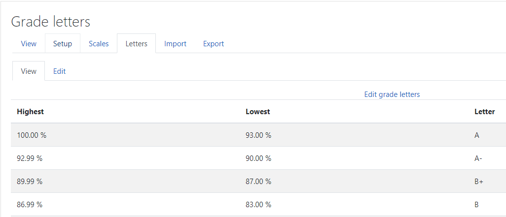
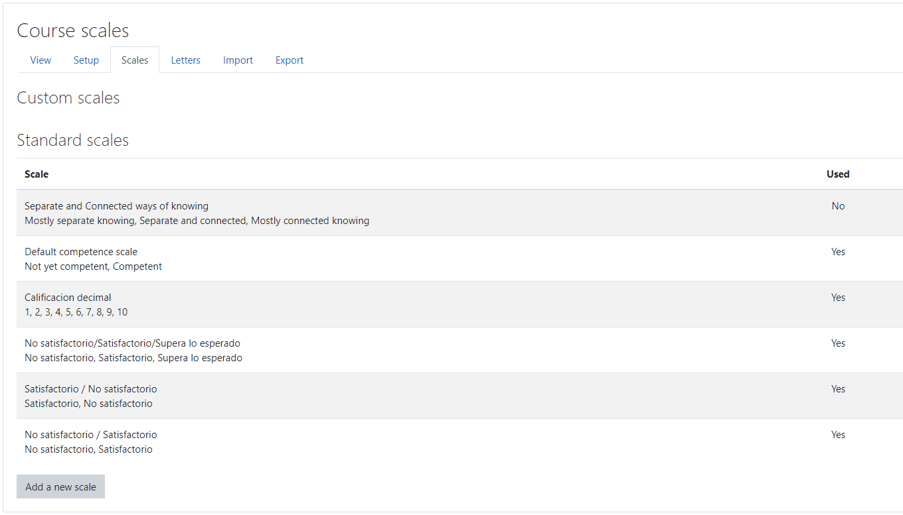

# Customizing Grades

When you create an activity, you will choose how the activity will be scored and added into the course's grades area. Default grading are number grades (0–100) and a preset scale called **Separate and connected ways of knowing**[^1]. 

Some characteristics of gradebook concerning customizing are:

* Different courses can use different grading conventions
* It is possible to customize all the grades
* Letter grades can be customized too
* Scales can be created by teachers within a course.
* Site-wide scales, (Standard scales) , can be created only by an administrator.

## Numeric grades

100 is the default grade for all assessments in Moodle. If you want to grade assignments with scores higher than 100, only the administrators can change the maximum grade possible[^2].

## Letter grades

Some assessments or activities can be graded with a letter (**A**, **B**, etc.). **Letter grades** are number grades shown as letters in the Gradebook. 

To link number to th letters, percentages are used. Figure 3 show a table of conversion to letter grades (moodle default conversio table.

<figure>
    
    <figcaption><small>Figure 2. Letter grades conversiot table.</small><figcaption>
<figure>

### Customizing letter grades

The ability to edit the grade letters to meet specific course needs enables us to present information in the Gradebook to staff and students, which has more meaning than
numbers alone can provide. For example, if our student needs to achieve 60 percent
to pass the assignment, we can customize the letter grades to indicate that anything
graded at 60 percent or more shows the word **Pass** as the grade, and anything below
60 percent shows the word **Fail**. This will make more sense to the student than the
number grade. Let's set up an example and see an alternative use of the letter grades.

### Creating a letter grade that uses words

The letter grades can be customized to link to any percentage. The letters can also be changed into words (e. g. **Aprobado**, **Notable**, **Sobresaliente**, etc.).

In this example, we are going to set up letter grades that enable teachers to grade the assignment below of 50, to pass the subject, and so the assignment will be graded as **SUSPENSO**, teacher has to score the assignments with numbers, but the students will see the word as their grade. But for the final course total, Moodle uses the numbers to calculate the final grade.

We can to customize the letter grades and their the equivalent percentages for the different grade levels.

The following table shows you the final grade linked to the different grade levels and the calculated percentage in Spanish Acedemic Records:

| Grade in Spanish Academic Records |     Definition     | 10-points grading scale |                     Definition                     | Estimated percentage | Estimated ECTS Grade |
| :-------------------------------: | :----------------: | :---------------------: | :------------------------------------------------: | :------------------: | :------------------: |
|                 4                 | Matrícula de Honor |           10            |             Topper in Class or Subject             |      95 to 100%      |          A+          |
|                 3                 |   Sobresaliente    |            9            |                90% Contents assumed                |      90 to 95%       |          A           |
|                 2                 |      Notable       |            7            |                70% Contents assumed                |     70 to 89.9%      |          B           |
|                 1                 |      Aprobado      |            6            |                60% Contents assumed                |     60 to 69.9%      |          C           |
|                 1                 |      Aprobado      |           5.5           |                55% Contents assumed                |     55 to 59.9%      |          D           |
|                 1                 |      Aprobado      |            5            |                50% Contents assumed                |     50 to 54.9%      |          E           |
|                                   |      Suspenso      |                         | Less than 50% contents assumed (60% in many cases) |     49% or below     |         FX-F         |

> The percentage is calculated through this formula:
> Minimum grade divided by maximum grade (in this case 10) and multiplied by 100.
>
> decimal places and require a maximum and minimum percentage per letter grade. The full range needs to extend from **0.00%** to **100.00%**.

## Scales for grade assignments

Scales are a list of words or characters that can be used to grade assignments. Each scale needs at least two choices, but you can have as many words in the scale as you want. You can also use lots of different scales simultaneously:

- Aprobado Suspenso
- Deficiente, Avceptable, Bueno, Escelente
- Revisable or Progresa Adecuadamente

Scale is created prior to the graded activity. When an activity is added to the course you must choose the required scale. Once created a assigned, teacher see the scale options in a drop-down list to select the grade to be awarded. 

>  After a scale has been used, it can no longer be edited.

Scales be used to calculate final grades, but the scores are based on the number of items in the scale rather than a specific score for each element of the scale. However, additional weightings can be used to increase the point value. The use of weightings will be explained later Calculating scores using scales can be confusing and therefore, scales are not always the best option when complex scoring is required. However, for courses that use simple calculations or where there is a point at which a learner will pass, scales can be a useful way to present course grades that will make sense to students.

### Customizing grade scales

Figure 4 show University of Vigo default custimized scales[^3].

<figure>
    
    <figcaption><small>Figure 4. Customized scales.</small><figcaption>
<figure>

## Using Outcomes

Outcomes are extra elements that can be added to a graded activity in order to
be able to grade specific elements that have been completed. Each outcome can be graded with **Scale** , but the teacher must also put in an overall grade for the graded activity. Outcomes can be especially useful for courses that require a competence oriented evaluation of students, like is recommended in Europe after the Higher Education Integration by the [Bolonia Process](https://en.wikipedia.org/wiki/Bologna_Process) [^4]. 

We will set up some outcomes to enable us to assess whether specific criteria is
completed and evidence has been provided. We will make use of the Completion
scale that we have just set up [^5].

To create outcomes that we can use to assess elements of the assignment follows:

- Criteria 1 met
- Criteria 2 met
- Evidence provided

is show as:

> Full name and short name Scale Description Criteria 2 met Completion All elements of criteria 2 have been met Criteria 1 met Completion All elements of criteria 1 have been met

Outcomes can only be deleted before they are added to an assignment. Once it is used in an assignment, the delete option will not be available, but you will still be able to edit. However, if the outcome is removed from all assignments, we will be able to delete the outcome from the course. Later, we'll discuss again the outcomes.
