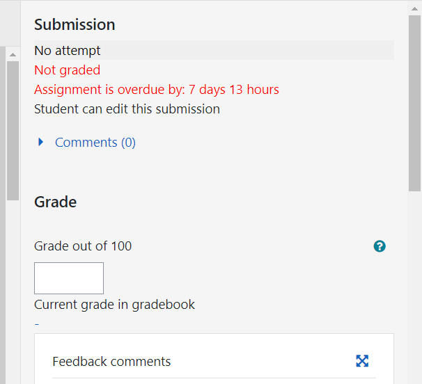

# Moodle GradeBook

If you area moodle user, and teacher, you probably need to make the avaliation of the outcomes. The Gradebook can be a valuable tool that will help you to track the students' progress through assessment and required activities. You wi'll need

- An access to the Gradebook.
- Learn how the Gradebook is presented.
- Know about the information provided by the Gradebook .
- Key features and activities  of the Gradebook .

If you are not very used to gradebook terms, please take a look before to the [glossary section](##Gradebook Glossary of Terms)

## Accessing the Gradebook

All courses in Moodle have a grading area, known as the **Gradebook**. A lot of activities provided by Moodle can be graded. All of these results go to the Gradebook.

Depending on the configuration ant the appearance decided by your moodle administrator, the **Gradebook** can appear or not as a direct acces on the dashboard or the left menu of your moodle course. An example can be seen in the [figure 1]. In thsi case tht gradebook has a direc acces from the left menu.


<center><small>
        Figure 1. Accesing the <bold>GradeBook</bold>.
</small></center>


<center><figure>
    
    <figcaption><small>Figure 1. Accesing the <bold>GradeBook</bold></small>.<figcaption>
<figure>

Selecting the grades from the menu, we access to the main gradebook as we can see  in figure 2.

<center><figure>
    
    <figcaption><small>Figure 2. initiating the gradebook</small>.<figcaption>
<figure>

You can see two rows in the menu:

- Top row: **View**, **Setup**, **Scales**, **Letters**, **Import** and **Export** options.

- Bottom row: **Grade report**, **Grade history**, **Outcomes report**, **Overview report**, **Single view** and **User report**.
  
    
  
- Graded activities automatically appear in the grades area when they are added into the main course.
  
- Left-hand side contains the students' names and some data.
  
- On the far right-hand side of the table is the **Course total** , which is calculated
  based on the grades activities. By default, you can see averages but the it is configurable.
  
- At the bottom you can see a row with **Overall average** as a column, containing the average of all the grades within each assessment type.

The Gradebook captures all the assessment information on one screen. But the overall view can be be overwhelming. Fortunately, moodle is highly configurable to show what uyou need.

Dependeing of your role (teacher, non-editing teacher, or manager, etc.) you can see or not some features. Students will only be able to see their own grades and feedback.

Adventages of storing the grades this way are:

*  information can be easily shared between teachers.
* if a course manager want to know how students were progressing it fast.
* students can see all their progress in one place and can start to manage their own learning.

## Activities that work with the Gradebook

There are a number of Moodle activities that can be graded and, therefore, work with the Gradebook. The activities that will automatically appear in the Gradebook are:

- Assignments
- Quizzes
- Lessons
- The SCORM package
- Workshops

A number of other Moodle activities can also have grades and ratings assigned to
them so that they also appear in the Gradebook. These include:

- Forums
- Glossaries

It is also possible to manually set up a *graded item* within the Gradebook, which is not linked with an activity but allows a grade to be recorded, but this, in some cases, require administration privileges. For further information, read the [moodle docs](https://docs.moodle.org/310/en/Main_page).

## Gradebook Key features

Gradebook contains the score for each graded activity that can be presented in various ways:

- **Numerical grade** : ( by default scored to100 ).
- **Scale** : Customized grading that can be:
  - letters.
  - words.
  - statements.
  - numbers.
- **Letter grade** : linked to percentages (e. g. 100% = A+).

### Organizing grades

With lots of activities that use grades within a course, the Gradebook will have a lot of data on one page. Categories can be created for group activities, and the Gradebook view can be customized according to the user for them to see all or some categories on the screen.

# Customizing Grades

When you create an activity, you will choose how the activity will be scored and added into the course's grades area. Default grading are number grades (0–100) and a preset scale called **Separate and connected ways of knowing**[^1]. 

Some characteristics of gradebook concerning customizing are:

* Different courses can use different grading conventions
* It is possible to customize all the grades
* Letter grades can be customized too
* Scales can be created by teachers within a course.
* Site-wide scales, (Standard scales) , can be created only by an administrator.

### Numeric grades

100 is the default grade for all assessments in Moodle. If you want to grade assignments with scores higher than 100, only the administrators can change the maximum grade possible[^2].

### Letter grades

Some assessments or activities can be graded with a letter (**A**, **B**, etc.). **Letter grades** are number grades shown as letters in the Gradebook. 

To link number to th letters, percentages are used. Figure 3 show a table of conversion to letter grades (moodle default conversio table.

<center><figure>
    
    <figcaption><small>Figure 2. Letter grades conversiot table.</small><figcaption>
<figure>

#### Customizing letter grades

The ability to edit the grade letters to meet specific course needs enables us to present information in the Gradebook to staff and students, which has more meaning than
numbers alone can provide. For example, if our student needs to achieve 60 percent
to pass the assignment, we can customize the letter grades to indicate that anything
graded at 60 percent or more shows the word **Pass** as the grade, and anything below
60 percent shows the word **Fail**. This will make more sense to the student than the
number grade. Let's set up an example and see an alternative use of the letter grades.

#### Creating a letter grade that uses words

The letter grades can be customized to link to any percentage. The letters can also be changed into words (e. g. **Aprobado**, **Notable**, **Sobresaliente**, etc.).

In this example, we are going to set up letter grades that enable teachers to grade the assignment below of 50, to pass the subject, and so the assignment will be graded as **SUSPENSO**, teacher has to score the assignments with numbers, but the students will see the word as their grade. But for the final course total, Moodle uses the numbers to calculate the final grade.

We can to customize the letter grades and their the equivalent percentages for the different grade levels.

The following table shows you the final grade linked to the different grade levels and the calculated percentage in Spanish Acedemic Records:

| Grade in Spanish Academic Records |     Definition     | 10-points grading scale |                     Definition                     | Estimated percentage | Estimated ECTS Grade |
| :-------------------------------: | :----------------: | :---------------------: | :------------------------------------------------: | :------------------: | :------------------: |
|                 4                 | Matrícula de Honor |           10            |             Topper in Class or Subject             |      95 to 100%      |          A+          |
|                 3                 |   Sobresaliente    |            9            |                90% Contents assumed                |      90 to 95%       |          A           |
|                 2                 |      Notable       |            7            |                70% Contents assumed                |     70 to 89.9%      |          B           |
|                 1                 |      Aprobado      |            6            |                60% Contents assumed                |     60 to 69.9%      |          C           |
|                 1                 |      Aprobado      |           5.5           |                55% Contents assumed                |     55 to 59.9%      |          D           |
|                 1                 |      Aprobado      |            5            |                50% Contents assumed                |     50 to 54.9%      |          E           |
|                                   |      Suspenso      |                         | Less than 50% contents assumed (60% in many cases) |     49% or below     |         FX-F         |

> The percentage is calculated through this formula:
> Minimum grade divided by maximum grade (in this case 10) and multiplied by 100.
>
> decimal places and require a maximum and minimum percentage per letter grade. The full range needs to extend from **0.00%** to **100.00%**.

## Scales for grade assignments

Scales are a list of words or characters that can be used to grade assignments. Each scale needs at least two choices, but you can have as many words in the scale as you want. You can also use lots of different scales simultaneously:

- Aprobado Suspenso
- Deficiente, Avceptable, Bueno, Escelente
- Revisable or Progresa Adecuadamente

Scale is created prior to the graded activity. When an activity is added to the course you must choose the required scale. Once created a assigned, teacher see the scale options in a drop-down list to select the grade to be awarded. 

>  After a scale has been used, it can no longer be edited.

Scales be used to calculate final grades, but the scores are based on the number of items in the scale rather than a specific score for each element of the scale. However, additional weightings can be used to increase the point value. The use of weightings will be explained later Calculating scores using scales can be confusing and therefore, scales are not always the best option when complex scoring is required. However, for courses that use simple calculations or where there is a point at which a learner will pass, scales can be a useful way to present course grades that will make sense to students.

### Customizing grade scales

Figure 4 show University of Vigo default custimized scales[^3].

<center><figure>
    
    <figcaption><small>Figure 4. Customized scales.</small><figcaption>
<figure>

### Using Outcomes

Outcomes are extra elements that can be added to a graded activity in order to
be able to grade specific elements that have been completed. Each outcome can be graded with **Scale** , but the teacher must also put in an overall grade for the graded activity. Outcomes can be especially useful for courses that require a competence oriented evaluation of students, like is recommended in Europe after the Higher Education Integration by the [Bolonia Process](https://en.wikipedia.org/wiki/Bologna_Process) [^4]. 

We will set up some outcomes to enable us to assess whether specific criteria is
completed and evidence has been provided. We will make use of the Completion
scale that we have just set up [^5].

To create outcomes that we can use to assess elements of the assignment follows:

- Criteria 1 met
- Criteria 2 met
- Evidence provided

is show as:

> <span style="color:blue">Full name and short name<br>Scale Description<br>Criteria 2 met Completion All elements of criteria 2 have been met<br>Criteria 1 met Completion All elements of criteria 1 have been met</span>

Outcomes can only be deleted before they are added to an assignment. Once it is used in an assignment, the delete option will not be available, but you will still be able to edit. However, if the outcome is removed from all assignments, we will be able to delete the outcome from the course. Later, we'll discuss again the outcomes.

# Adding Graded Activities

Adding an activity means toggle **Turn editing on** within the course. All graded activities are added through the **Add an activity or resource text** available within each section of the course (figure 6). 

<center><figure>
    
    <figcaption><small>Figure 6. Adding graded activities.</small><figcaption>
<figure>

Assignments are the most feature-rich of all the graded activities and have many
options available in order to customize how assessments can be graded. They can
be used to:

* Provide assessment information for students
* Store grades
* Provide feedback. 
* Receive students homework electronically:
  * files submission
  * online text
* Review the assessment offline.

## Adding assignments

There are many options within the assignments with lots of useful features and options. 

### Creating an assignment with a scale

To create an assignment with a scale steps are:

| Step | Operation                                                    |
| ---- | :----------------------------------------------------------- |
| 1.   | Turn editing on                                              |
| 2.   | Add an activity or resource (click on).                      |
| 3.   | Assignment ... Add.                                          |
| 4.   | Say a name to the _Assignment name box_.                     |
| 5.   | Provide details _in the description box_.                    |
| 6.   | Answer the questions related to the sections:<br>    Availability Feedback types<br/>    Submission settings<br/>    Group submission settings<br/>    Notifications |
| 7.   | Finally complete the rest of item.                           |
| 8.   | Save and return                                              |

Some useful information:

* Allow submissions from section is relevant when the assignment will be submitted electronically, and if students won't be able to submit their work until the date and time indicated here strictly or not.
* Due date indicates when the assignment needs to be submitted by. 
  * If students submit their assignment after the date and time indicated here, the system tracks and or notify the teacher.
  * Cut off date section enables teachers to set an posterior period extension.

 <center><figure>
    
    <figcaption><small>Figure 7. Grade options.</small><figcaption>
<figure>

#### Grade options

1. Type[^5]:
   1. None
   2. **Scale**
   3. Point
2. Grading method
   1. Simple direct grading
   2. Marking Guide
   3. Rubric
3. Grade category[^7]
4. Grade to pass[^8]
5. Anonymous submission (No/Yes)
6. Hide grade identity from students (No/Yes)
7. Using marking workflows (no/Yes)[^9]

> <span style="color:blue">Ensure that the _File submissions checkbox_. If its not checked, students can not to submit their
> assignment<br>There are bunch of additiona options like maximum number of uploaded files, _maximum submission size_, _feedback options_, etc. <br></span>

#### Offline grading

Offline grading offers a downloadable .csv file containsing the information about the assignment. Can be used to add grades and feedback while working offline.

> This an useful option in countries with a reduced bandwith or limited web acces because of, even dalaying the grading, the result is almost the same that online grading

#### Submission settings

This section, is related to how students will submit their assignment and how they will reattempt submission (if required).

* Default option is No
* Yes means that students can upload their assignment (teacher  see it as  a draft).
* Require that students accept the submission if you want they need to agree to when they submit their files.
* Submission statements can be changed by a site administrators
* Attempts reopened can be:
  * Never
  * Manually
  * Until pass

The last option works when a pass grade is set within the Gradebook. 

>  Don't forget to click on **Save and return to course**.

### Creating an online assignment with a number grade

To create a number grade assignment the sequence is this:

| Step | Operation                                                    |
| ---- | :----------------------------------------------------------- |
| 1.   | Turn editing on                                              |
| 2.   | Add an activity or resource (click on).                      |
| 3.   | Assignment ... Add.                                          |
| 4.   | Say a name to the _Assignment name box_.                     |
| 5.   | In _*Submission types_ mark _online text_ to allow students write directly in moodle.<br/>Set a maximum word limit by clicking on the tick if you want adding a number in the textbox. |
| 5.   | Provide details _to feedback types_.<br>No/Yes if you want add comments as inline text |
| 6.   | In _Submission settings_ select (Yes/No):<br>     Require students click submit button<br>     Require students accept submission statement<br/>    Attempts reopened automatically or not |
| 7.   | In _Grades_ select:<br>    Grade<br>    Type<br>    Point<br>    Maximum points |
| 8.   | Save and return                                              |

### Creating an assignment including outcomes

To create an assignment including outcomes follow this steps:

| Step | Operation                                                    |
| ---- | :----------------------------------------------------------- |
| 1.   | Turn editing on                                              |
| 2.   | Add an activity or resource (click on).                      |
| 3.   | Assignment ... Add.                                          |
| 4.   | Say a name to the _Assignment name box_.                     |
| 5.   | In _Description box_ provide assignment details.             |
| 6.   | In _Submission settings_ select (Yes/No):<br/>     Require students click submit button<br/>     Require students accept submission statement<br/>     Attempts reopened automatically or not<br>    Set Maximum number of uploaded files |
| 7.   | In _Grades_ select:<br>    Grade<br>    Type<br>    Point<br>    Maximum points |
| 8.   | Save and return                                              |

#### Alternative grading methods

Within the _Grade_ section, there are three types of grading methods:

- Simple direct grading
- Marking guide
- Rubric

The simple direct is based on numbers or a scales. When creating an assignment that uses Marking guides or Rubrics , we need to identify the criteria that will be used to assess the assignment.

### Marking guides

This grading method permits to add criteria and identify a top grade for each piece of criteria:

- The teacher will choose the grade to be awarded
- Specifies the feedback. 
- Sets up three criteria, two with a top mark of 5 and one with a top mark of 10.

If the student is graded with the top marks for each of the three criteria, they will receive the maximum grade of twenty (by default). 

Steps are:

| Step | Operation                                                    |
| ---- | :----------------------------------------------------------- |
| 1.   | Turn editing on                                              |
| 2.   | Add an activity or resource (click on).                      |
| 3.   | Assignment ... Add.                                          |
| 4.   | Say a name to the _Assignment name box_.                     |
| 5.   | In _Description box_ provide assignment details.             |
| 6.   | In _Submission settings_ select (Yes/No):<br/>     Require students click submit button<br/>     Require students accept submission statement<br/>     Attempts reopened automatically or not<br>    Set Maximum number of uploaded files |
| 7.   | In _Grades_ select:<br>    Grade<br>    Type<br>    Point<br>    Maximum points<br>    Marking guide from the drop-down list |
| 8.   | Save and return                                              |

<center><figure>
    
    <figcaption><small>Figure 8. Advenced grading: rubric.</small><figcaption>
<figure>

The criteria does not need to add up to the maximum grade given for the assignment because:

- Moodle will convert the final grade received for the assignment to a decimal.
- This will be multiplied by the maximum grade set for the assignment.

This is a normalization process as we'll see in _Using Calculations_.

### Defining a new grading from scratch

After opening the grading form, we need to add in some data:

| Section                  | Value                                                        |
| ------------------------ | ------------------------------------------------------------ |
| Name                     | Laboratory Report                                            |
| Marking guide            | - Description for Students: This will only be shown if the option for students to view the criteria is turned on.<br/>- Description for Markers: always visible<br/>- Maximum mark: A value from zero to maximum number. |
| Frequently used comments | - Confidently presented<br>- Evidence of planning<br/>and preparation |
| Last step                | Save marking guide and make it ready or save as draft (visible _Advanced grading_ link in the _assignment administration block_) |

An example should see like this:

|                           | Excellent<br>5 pts                                           | Good<br/>4 pts                                               | Fair<br>3 pts                                                | Poor<br/>2 pts                                               | Bad<br>0 pts                              |
| ------------------------- | ------------------------------------------------------------ | ------------------------------------------------------------ | ------------------------------------------------------------ | ------------------------------------------------------------ | ----------------------------------------- |
| Title                     | Excellent Title describes the lab, includes: student name, lab partners, class and period | Good Missing one component                                   | Fair missing two components                                  | Poor missing three components                                | No Credit No title present                |
| Introduction              | Excellent The purpose of the lab is clearly identified and directly related to the work. Terms and/or equations are clearly defined and explained. | Good The purpose of the lab is clearly identified. Terms and/or equations are only partially defined and explained. | Fair The purpose of the lab or question to be answered during the lab is only partially identified. Terms and/or equations are only partially explained or omitted | Poor The purpose is unclear or is not related to the lab. Definitions and explanations of terms and/or equations are irrelevant or omitted. | No Credit Introduction missing            |
| Procedure and Materials   | Excellent Procedure and Materials are referenced or written clearly, in detail, and can be duplicated by others. | Good                                                         | Fair Procedure or Materials are not listed or referenced.    | Poor                                                         | No Credit Procedure and Materials missing |
| Data                      | Excellent Representation of the data and calculations is accurate, detailed, and easy to understand. All units and figures are correct. Graphs are labeled and complete. | Good Representation of the data in written form is accurate, but not detailed. Some units and or significant figures are missing or incorrect. Graphs are missing information. | Fair Representation of the data in written form is accurate, but somewhat difficult to understand. Units and/or significant figures are missing. | Poor Data is inaccurate.                                     | No Credit Data and Calculations missing   |
| Analysis and calculations | Excellent One example of each calculation is given, measurements are to the correct level of accuracy, significant figures are correct | Good One example of each calculation is present, most figures are accurate and have correct sig figs. | Fair Examples of calculations present, a number of errors in accuracy, sig figs, or calculations are present | Poor Calculation examples not complete - some are missing, many errors in accuracy, sig figs or calcuations. | No Credit No analysis or calculations     |
| Conclusion                | Excellent Shows connection between the purpose and the results achieved. results are discussed in reference to theory. error analysis is included where necessary. | Good . Restates purpose and clear connection is made between purpose and the results achieved. Theory is not clearly related to the results of experiment. Error analysis present but not complete. | Fair . Restates purpose but unclear connection between purpose and the results achieved. Explanation of theory and error analysis are missing. | Poor Restates purpose with no connection to results achieved. Explanation of theory and error analysis are missing. | No Credit Conclusion missing              |
| Format & Neatness         | Excellent Presentation of work is neat and well-organized. Paragraph form with no use of pronouns.<BR> Illustrations, graph, or figures emphasize important facts. | Good Presentation of work is neat and well-organized. Paragraph form with no use of pronouns. | Fair Presentation of work is accurate but somewhat hard to follow. Paragraph form with limited use of pronouns. | Poor Presentation is messy and hard to read. Paragraph form with excessive use of pronouns. | No Credit Illegible                       |

If we have not completed our marking guide, we can click on Save as draft and then .

1. The next screen will indicate that the marking guide is now ready for
   use. You can still click on **Edit the Current form definition** or **Delete the**
   **currently defined form** to start a new form or to revert to the simple direct
   grading method. You can also click on **Publish this form as a new template**
   so that it can be used for other assignments and in other courses.

We will look at how to grade work using the marking guide in *Chapter 4* ,
*Assigning Grades*.

### Defining a rubric from scratch

Rubrics allow multiple criteria for the assessment by means of descriptors and points depending on the compliance with the criteria. The final grade is calculated by moodle.

Steps are:

| Step | Operation                                                    |
| ---- | :----------------------------------------------------------- |
| 1.   | Turn editing on                                              |
| 2.   | Add an activity or resource (click on).                      |
| 3.   | Assignment ... Add.                                          |
| 4.   | Say a name to the _Assignment name box_.                     |
| 5.   | In _Description box_ provide assignment details.             |
| 6.   | In _Grades_ navigate to _Type_ and set _Point_:<br/>     Fill _Maximun Points_<br/>     Change _Grading Method_ to _Rubric_ |
| 7.   | Save and display (appears scree on figure)                   |
| 8.   | Choose:<br>    -  _Define_ option <br>    - _From a template_[^10] |


1. As this is the first form we have created, click on **Define new grading form**
   **from scratch**. The following screenshot will appear:
   
   <center><figure>
       
       <figcaption><small>Figure 9. Defining a rubric.</small><figcaption>
   <figure>
   
2. Above are the _Name box_ and the description to the _Description box_ already know.

Some tips:

- There is at least one criterion, and each criterion has specific levels of grading.
- Criterion is an element of the assignment that needs to be met.
- Levels are the extent to which this criterion has been met.
- Statements are added and are used to assess the work.
- For assignments with multiple criteria, points for each criterion are added together to create
  the final grade.
- The default setting within a rubric is for one criterion, with three points levels ranging from zero to two points but, any changes can be made (number of criterions and/or points for each.As an aexample, the preceeding rubric corresponde to this design on the moodle tool:

<center><figure>
    
    <figcaption><small>Figure 10. Rubric design example.</small><figcaption>
<figure>

The steps to add these criteria and levels to the course are:

| Step | Operation                                                    |
| ---- | :----------------------------------------------------------- |
| 1.   | Click on _Edit criterion_                                    |
| 2.   | Fill in (maximum 1000 words)                                 |
| 3.   | Click on _Edit level_  (Check poits is set to 0)             |
| 4.   | Repeat for the rest of levels adding levels using the buttom _Add level__ |
| 5.   | Click outside the screen to abandon the level editing        |
| 6.   | Save rubric and make it ready                                |

The rubric is now ready. If you want to edit your rubric, you will need to use the _Administration block_. Clicking on _Advanced grading_  and then _Define rubric_ take you to the Rubric editing screen.

## Adding additional grading directly into the Gradebook

If you want a grade that is not linked to an activity to be added to the Gradebook, y might add a _Graded item_ into the Moodle Gradebook, can be. To do this, follow this steps:

| Step | Operation                                                    |
| ---- | :----------------------------------------------------------- |
| 1.   | Find _Administration block_ and select _Grades_.             |
| 2.   | Go to _Categories and items_                                 |
| 3.   | Click on  _Add grade_ item                                   |
| 4.   | Give the graded item a name                                  |
| 5.   | Select the _Grage type_<br>    - Value : a number<br/>    - Scale : select an existiing or create a new one<br/>    - Text : This does not allow any grade to be used, but written feedback<br/>    - None : This means that no grade is assigned to this item. |
| 6.   | Save changes                                                 |

# Assigning Grades

Once graded activities are added to a Moodle course, we need to award grades to
students. Some of the activities are graded by Moodle, such as quizzes and some
elements of lessons, but activities with a lot of written content need to be reviewed
and graded by the teacher.

## Grading an assignment

Let's first find our way to assignments and the grading screen. Within a course,
we need to click on the name of the assignment that we want to grade. If you created
the assignments based on the instructions within *Chapter 3* , *Adding Graded Activities* ,
click on **Task 1** to view it.

At the top of the assignment screen, we can see the name of the assignment—in
this case, **Task 1** —as well as the assignment details. Beneath the assignment details,
we are provided with a **Grading summary** section. The grading summary tells us
about the following options:

- How many students under the **Participants** option are in the course for
  which we are expecting assignments to be submitted.
- Beneath this, we can see whether any drafts of work have been submitted
  in the **Drafts** section.
- The **Submitted** option tells us how many students have submitted their
  assignment. This is only relevant when students are required to submit
  their work electronically either through file or an online submission.
- The **Needs grading** option tells us how many of the submitted pieces
  of assignments need to be graded. This is particularly useful for teachers
  so that they can quickly see whether they are required to grade any
  assignment without checking each student submission individually.

Underneath the grading summary, there is the **View/grade all submissions** text.
This is a hyperlink that will take us to the assignment grading screen. Click on this
link to go into the assignment grading area.

```
Chapter 4
```

You can see how the grading screen will look in the following screenshot:

There are three main sections on this page:

- The **Grading action** option is shown at the top of the page. This is a
  drop-down list through which you can choose to download assignments
  or select alternative ways of grading.
- The main grading table provides information related to the assessments of
  each student.
- At the bottom of the assignment grading screen is the **Options** section that
  enables us to change how we view the assignment grading screen.

There are a lot of options as well as a lot of information on this screen, so we will
look at one section at a time. The first area we are going to use is in the central table,
as this contains the core information about the assessments for each student. The
table starts with the name of each student on the left-hand side, and each column
provides different details of student submissions and grades. Each column is
explained in the upcoming section.

```
Under the title of each column, there is a – symbol that enables a
user to hide the content of the column. This is useful in order to
provide more usable space. After a column has been collapsed,
we will see a + symbol and enable it to expand it again.
```

*Assigning Grades*

In the following screenshot, the **User picture** and **Email address** columns have been
minimized in order to show more information:

These columns are explained as follows:

- The first column is a **Select** column where we can choose to select student
  rows in order to apply actions to them. The options for the selected rows
  appear beneath the grading table in a drop-down list, as shown in the
  following screenshot:
- There are five options to choose from within the list. All the actions within
  this list can also be undertaken when grading individual assignments, but
  using the **Select** column and choosing an option from the list allows the
  action to be applied to multiple students at the same time. After selecting
  an option, we will click on the **Go** button to complete the action. The five
  options are explained as follows:
  ° **Lock submissions** : This allows a teacher to lock the assignment
  submissions of selected students in order to prevent them from
  amending or changing their work while the grading process is
  taking place.

```
Chapter 4
° Unlock submissions : This allows a teacher to unlock assignments
in order to enable students to amend or re-upload their work.
° Revert the submission back to draft status : This option allows
students to resubmit their work.
° Send feedback files : This option is only available when file
submissions are enabled. The option here allows a teacher to upload
feedback files for students. We will be looking at this when grading
individual assignments, but this option can be used for a quick
upload of feedback files for multiple students.
° Set marking workflow state : This option is only relevant when the
marking workflow has been turned on when creating the assignment.
This enables the teacher to amend the current workflow status of the
assignment for multiple students at the same time.
```

- The next column is the **User picture** column, which is shown in the
  screenshot as a **+** symbol as this has been minimized. This column,
  as suggested, shows you the image a student has uploaded as their
  profile picture. If blind marking has been turned on for the assignment,
  no column for the user's picture will be shown.
- The **First name/surname** column shows you the student's name at the
  beginning of each row. If blind marking is turned on for an assignment,
  a participant number will be shown here instead.
- The **Email address** column shows you the student's email address. In the
  screenshot, this is shown with a **+** symbol, as this has been minimized.
- The **Status** column shows you the submission and grading status of the
  assignment of the student. It will indicate whether a student has submitted
  their assignment (either **No submission** or **Submitted for grading** ). It will
  also show you the grading status ( **Not marked** or **Graded** ).
- The **Grade** column shows you an icon that is used to access the grading
  page for a specific student. After the work has been graded, the currently
  awarded grade will be shown in this column.
- The **Edit** column also enables us to access the assignment grading page
  as well as perform some quick actions for the assignment. The options will
  vary depending on the options chosen when creating the assignment and
  the current status of the assignment. However, the options we are most
  likely to see are:
  ° The **Grade** or **Update grade** option: This takes us to the assignment
  grading page.

*Assigning Grades*

```
° The Prevent submission changes option: This enables us to lock a
student's submission so that it can no longer be changed.
° The Grant extension option: This allows the student to submit their
assignment after the due date but before the cut-off date. This option
is only available if a cut-off date was added when the assignment
was created.
° The Edit submission option: This allows the teacher to upload a file
or add online text on behalf of a student. This option is only shown
prior to students submitting their own assignment.
° The Revert submission to draft option: This is shown if students
have submitted their assignment but it hasn't been graded yet.
Choosing this option will allow the student to submit their
assignment again.
° The Allow another attempt option: This enables the student to have
another go at submitting their work. It will enable regrading by the
teacher following the submission.
```

- The next column on the assignment grading table is the **Last modified**
  **(submission)** column. This will show you the date and time when the
  student submitted their work for grading.
- **File submissions** and/or **Online text** will show a link to the file/files that
  students have uploaded for grading or written into the online text area for
  submission. Teachers can click to view the files from here, or can view them
  from the individual grading screen. For assignments with both online and
  file submissions enabled, there will be two columns.
- **Submission comments** will allow the teacher to view any comments added
  by students while they were submitting their assignment if this option was
  turned on within the assignment.
- The **Last modified (grade)** column will show you the date and time when
  the assignment was graded by a teacher.
- **Feedback comments** will show you the start of any comments given by the
  teacher after the assignment has been graded.
- If an assignment is submitted as a .pdf file, the teacher is given an option
  to grade it using an integrated editor that allows the teacher to review and
  annotate the work directly within Moodle. If this option is used for grading,
  a **View annotated PDF** button will appear within the **Annotate PDF** column.
- **Feedback files** will show you a hyperlink to any files uploaded by the
  teacher to provide feedback to students. This will only be shown if the
  **Feedback files** option was selected when creating the assignment.

```
Chapter 4
```

- The **Final grade** column shows you the grade that was awarded to the student.
- When **Outcomes** are added to an assignment, a column will show you which
  outcomes are being met by the assignment. Following the grading, this
  column will show you the grade for each of the outcomes.

There is a lot of information in this table and it provides a good overview of the
current status of the assignment for each student.

Some grading can take place from this screen, which we will look at in more detail
later, but we will now go to an individual student's grading screen. Click on the
**Grade** icon in the **Status** column next to the student you want to grade (make sure
that you choose a student who has submitted some work). There are three main
sections on the individual grading screen. We will look at each one in turn.

#### The Submission Status section

The **Submission status** section provides a summary of the assignment for this
student, including which attempt this piece of work is, the current submission and
grading status of the piece of work, the date the work was submitted, and access to
any submitted work. The submitted work can be in the form of a hyperlink to a file
or the content of the online submission. For the **Task 1** assignment, students were
required to submit a file for their work, and we can see from the following screenshot
that **Bayley W** has submitted his assignment:

When files are uploaded, the teacher can click on them in order to open them to view
the content.

*Assigning Grades*

#### The Grades section

The **Grade** section will enable us to assign a grade and provide feedback to students,
as shown in the following screenshot:

The first option is to select the grade for the piece of work. The grade will depend on
the type of grade we selected when creating the assignment. For **Task 1** , we selected
**scale grade** , so we are provided with a drop-down list from which we can choose
our grade. When grading this assignment for the first time, the **Grade** drop-down list
will say **No grade**. If this work is being regraded, then the currently assigned grade
will be shown in this list.

```
Chapter 4
```

The next option within the **Grade** section is **Marking workflow state**. This will only
appear if the marking workflow is turned on when initially setting up the assignment.

There are six options that the teacher can choose when they are grading the work:

- **Not marked** : This is the state that will be shown prior to grading.
- **In marking** : This will be chosen if the teacher has started grading the
  assignment but hasn't completed it yet. This option will show other
  teachers that the grading is still in progress. Students won't be able
  to view their grade when this option is chosen.
- **Marking completed** : This option will be chosen when the grading is
  complete, but it should be kept hidden from students. It can be used
  if a teacher has marked this piece of work but is still grading the work
  of others.
- **In review** : This option will be used if the initial teacher or assessor has
  graded the assignment but it needs to undergo a second grading process
  or needs to be moderated inline along with other work.
- **Ready for release** : This option will be chosen if the work has been graded
  and reviewed, where appropriate, and is ready for students to view, but
  we still want to prevent the student from seeing it. This can be used when
  teachers want to release the assignment to all students at the same time but
  they are still in the process of grading other work.
- **Released** : This releases the grades and feedback to students and the grade
  appears within their Gradebook.

The final options within the **Grade** section provide feedback. There were two
options that were selected when we created this assignment: **Feedback comments**
and **Feedback files**. Within the **Feedback comments** section, we can write feedback
for students based on their work. This section has a text editor so that text can be
formatted. Within the **Feedback files** section, we can upload files through the **+** icon
or drag-and-drop them in order to give more information to students. This could be
an annotated copy of the student's original uploaded work, a completed feedback
form, or even a sound file that provides audio feedback.

*Assigning Grades*

#### Attempt settings

The final section of the assignment grading screen outlines the current status and
some further options for the assignment. The details within this section will vary
depending on how the initial assignment was set up. In this example, we opted for
attempts to be reopened automatically, so we are only provided with the details of
this rather than the option that can change it.

Once each of these sections has been completed, we need to save our work. There are
five options at the bottom of the individual grading screen:

- **Save changes** : This enables you to save the grade and feedback and go back
  to the assignment grading table.
- **Save and show next** : This will save the grade and feedback and move onto
  the next individual grading page in order to grade another assignment.

```
Chapter 4
```

- **Cancel** : This will cancel any work completed on the current individual
  grading screen and show you the assignment grading area.
- **Previous** : This will go to the assignment grading screen of the previous
  student in the grading list but will not save any work completed on the
  current grading screen.
- **Next** : This will move on to the next individual grading page but will not
  save any work completed on the current grading screen.

Once the grading has been completed, you will see that the assignment grading table
has been updated. Take a look at **Bayley W** in the following screenshot:

All the information regarding the work of **Bayley W** is explained as follows:

- The **Status** column shows you the text, **Submitted for grading** and
  **Released** which means that not only the work is submitted but has
  also been released after grading.
- A grade is now shown in the **Grade** column as well as in the **Final**
  **grade** column.
- The **Last modified (grade)** column shows you the date and time when
  the grade was last updated.
- You can see the beginning of the written feedback provided in the
  **Feedback comments** column. A magnifying glass icon shown in this
  column enables users to view all the feedback.

When creating the assignment, we enabled offline grading, so let's take a look
at how we access this and some of the other grading options available from the
grading table page.

*Assigning Grades*

#### Grading options

At the top of the assignment grading table page, there is a drop-down list that
provides you with a range of grading options. There are up to five options available
in this list but the options will depend on which options were turned on when the
assignment was created.

These options are explained as follows:

- **Download all submissions** : This enables a teacher to download all the
  files uploaded to this assignment. This will create a .zip file that can be
  used to view all the work when offline.
- **Download grading worksheet** : This option is only available if offline
  grading has been enabled when creating the assignment. It downloads
  a .csv file that contains the assignment information.

```
The file contains current information for assignments that are already graded.
Take a look at Bayley W and note that a grade is already available in column
E and feedback is shown in column K. A teacher can add grades and feedback
into this .csv file while they are offline, and this can be uploaded to populate
the grading table with the relevant grades and feedback.
Chapter 4
```

- **Upload grading worksheet** : We will choose this option if we want to upload
  the amended grading worksheet.
- **Upload multiple feedback files in a zip** : This option allows students' work
  to be annotated and re-uploaded as feedback. This works with the **Download**
  **all submissions** option. After downloading the files, the folder needs to be
  unzipped and all files need to be moved to a new folder. The teacher can then
  review and edit or annotate the files and save them. The file names must not
  be changed. The new folder can then be zipped and uploaded through this
  option. This will assign the relevant feedback files to the relevant students.
- **View gradebook** : This option will take us straight to the Gradebook area in
  order to view all grades for all students.

*Assigning Grades*

#### Options

The **Options** section enables us to customize how the grading table is viewed as well
as provide some quick grading options. Individual teachers can customize how they
view the assignment grading area. Three main options are shown at the bottom of
the assignment grading screen.

These options are explained as follows:

- **Assignments per page** : This option allows us to choose how many rows
  of students are shown per page. For example, if we have 12 students in
  the course, we can choose to view all 12 on one screen rather than move
  to another screen to review the final two students. Alternatively, if students
  are submitting many files per assignment, we might only want to view
  one or two students per page so that we can see all the information easily
  on the screen.
- **Filter** : This is a very useful drop-down list on the grading table that only
  shows you the assignments that we need to consider:
  ° **Not submitted** : This only shows you students who have not
  submitted any work
  ° **Submitted** : This only shows you students who have submitted
  an assignment
  ° **Requires grading** : This option will only show you any assignment
  that is currently ungraded
- **Workflow filter** : This option allows a teacher to choose to view only students
  within a specific part of the workflow. This can be useful to move multiple
  students through the workflow process.

```
Chapter 4
```

- **Quick grading** : A tick in this box will give you an alternative way to grade a
  student's work. Let's look at this in more detail.

#### Quick grading within the assignment grading screen

Turning on the **Quick grading** option turns the assignment grading area into an
editable table that will enable us to add a grade and some written feedback directly
onto the screen without needing to enter individual student pages. Quick grading
is very useful for offline activities or assignments that have already been viewed
offline. When a tick is added to the **Quick grading** box, three columns are changed.

- The **Status** column includes a drop-down list that changes the workflow phase
  for the student (if the marking workflow is turned on for the assignment).
- The **Grade** column also has a drop-down list next to each student in order to
  enable us to choose the grade that we would like to award. This is the same
  drop-down list as the one on the individual grading screen and will show
  you all the options within the scale. If this assignment were to be graded
  with a number, an empty text box would appear here in order to enable
  us to type in the grade to be awarded.
- The **Feedback comments** column also has a text entry box that enables us
  to type in some feedback for the assignment. The feedback box can be made
  larger with the resizing area in the bottom-right section of the box, but there
  is no editor to change how the information looks.

*Assigning Grades*

Once all the grades and written feedback have been added, it is important that you
click on **Save all quick grading changes** at the bottom of the grading table in order
to save the completed feedback. We have now seen most of the main features and
functions of the assignment grading table. However, we created a range of different
type of assignments, so let's take a look at how we can grade other grade types.

#### Grading an online text assignment with a number grade

When creating assignments in *Chapter 3* , *Adding Graded Activities* , we created **Task 2**
in order to enable students to submit text online, and the maximum grade possible
was set to **20**. View Task 2 to follow the instructions for the grading process.

As with the previous assignment, we are initially provided with **Grading summary** ,
and we need to click on **View/grade all assignments**. This will open up the assignment
grading table.

```
Chapter 4
```

The grading table is similar to the one we have already used, but on this table, we
have an **Online text** column instead of a **File submissions** column. Take a look at
your grading table and choose a student who has the **Submitted for grading** text
in the **Status** column. Click on the **grading** icon within the **Grade** column next to
the student's name.

As shown previously, the page begins with some information about the **Submission
status** section. Much of this information is the same as what was used previously,
but take note of the **Online text** information shown on this page. This will allow you
to read the assignment submitted by the student. In most cases, there will be more
text than can be seen on this screen, so a **+** symbol is shown for us to expand the
information in order to read the full submission.

*Assigning Grades*

In the **Submission status** section, we have the **Grade** section, which begins with the
option to assign a grade. For the previous assignment, we graded assignments with
a scale that provided a drop-down list for us to choose the grade. As this assignment
is a number grade, we are provided with a text entry box instead and are informed
to assign a grade in the **Grade out of 20** option. We are not likely to complete this
until we have reviewed the work but when we are ready, we simply need to type
in a number between 0 and 20 in order to assign a grade to the assignment.

Toward the bottom of this section, we can see that the **Feedback comments** box
already has some text in it. This text is the assignment submitted by the student.
This information appears in the box, as we selected **Comment inline** when we
initially created the assignment. We can edit this text and add further information
in order to provide feedback to the students. We will need to make our feedback
stand out from the student's original text, so we will need to make use of the text
editor that is available at the top of the **Feedback comments** box.

```
Chapter 4
```

Click on **Save changes** to submit the feedback and grade to the Gradebook and
inform the student.

So far, we have graded assignments with a scale and number and have viewed
assignments submitted as a file and online text. When creating assignments, we
also set up a third task, which is **Task 3** , that makes use of all of these and utilizes
the **Outcomes** feature. Let's take a look now at how to grade outcomes.

#### Grading an assignment with outcomes

After viewing the assignment and clicking on **View/grade all assignments** , we will
see the assignment grading table. As this assignment has enabled **File submissions**
and **Online text** submissions, both of these columns appear in the table. As we have
added outcomes to this assignment, there is an additional column at the end of the
grading table, which shows you the outcomes that are used.

Note that currently, the text **No outcome** appears with each outcome. This shows
you that the assignments haven't been graded yet.

*Assigning Grades*

We will use the individual grading screen to grade the outcomes, so we need to
click on the **grade** icon in the **Grade** column next to the student whose work we
want to mark.

Once we're on the individual grading screen, the **Submission status** area enables us
to access the file and online text submitted by the student. The **Grade** section is very
similar to the one used previously. A final grade will be awarded and we can enter a
numerical value in the **Grade out of 100** option in the **Grade** box.

However, there are additional items to grade now: **Evidence provided** and **Criteria 1
met**. Next to the name of each outcome is a drop-down list that provides us with the
scale chosen when setting up the outcomes. To grade each outcome, we need to click
on the drop-down list in order to choose the grade we want to provide.

```
Chapter 4
```

The other option we turned on for this assignment, which we haven't seen in practice
yet, is the option to manually reopen an assignment in order to enable resubmission.
This option is within the **Attempt settings** section.

If we want to enable the student to resubmit their work again, we need to change
the **Allow another attempt** option to **Yes** using the drop-down list.

When grading all assignments, we need to ensure that we click on **Save changes**
when we have added the grades and feedback.

We have now looked at all the key options when grading assignments with the
simple direct grading method, and we have also created assignments using the
advanced grading methods that utilize the marking guide and rubric grading
tools. Let's take a look at how to grade these assignments.

### Grading an assignment with a marking guide

If you followed the instructions in *Chapter 3* , *Adding Graded Activities* , open the
assignment titled **Assignment 4**.

The assignment grading table will be the same as the one we have seen previously
with the simple grading method, Click on **View/grade all submissions** and click
on the grade icon next to a student that you want to grade.

*Assigning Grades*

The biggest difference between the grading pages we have seen previously and
using the marking guide is the way in which we grade the assignment. When grading
assignments with a scale, we were provided with a drop-down list in order to add the
grade, and for a numerical grade, we had a textbox to which we could type the grade.
For a marking guide assignment, there is no single grade entry point. Instead, we are
provided with the grading criteria for which we can add a grade. Moodle will then
add each grade together in order to provide the final grade for the assignment.

```
Chapter 4
```

Next to each piece of criteria, there is a text entry box and a score box. Take a look
at the previous screenshot and find the criteria titled **Planning**. The **Grade** section
is explained as follows:

- We can see the full details of the criteria that aids us by providing us with
  the correct grade.
- To the right of this criteria, we have a textbox where we can add feedback
  in relation to this criteria. When creating this assignment, we also added
  some comments in the **Frequently used comments** option, and we can see
  these at the bottom of the marking guide. If we would like to add any of
  these comments to the feedback, we need to click on the box where we
  want to add the comment and then click on the **+** symbol next to the
  frequently used comment that we want to use.
- The final column on the right-hand side provides a grade entry box.
  Underneath this box, we can see the maximum number of points that
  are available for this criteria. To provide a grade, we add a number
  grade up to the given maximum grade.

Like the simple grading methods, we also have the option to add general feedback, and
we can also have options to change the marking workflow and reopen submissions
depending on how the assignment was set up.

After adding the feedback and individual criteria grades, we need to click on the
**Save changes** button.

Following the grading, each score assigned to each piece of criteria is added together
in order to provide the final grade for the student, and this can be seen in the **Grade**
column in the assignment grading table.

The student will see the final grade and each individual criteria grade and feedback
when reviewing the feedback for their assignment.

The final type of grading that we set up in *Chapter 3* , *Adding Graded Activities* , was
through the use of a rubric. Grading with a rubric is similar to using a marking
guide. Let's take a look at this together.

*Assigning Grades*

### Grading an assignment with a rubric

If you created **Assignment 5** , click to view this now and make your way to the
grading screen of a selected student. Much like the marking guide, instead of
a single grade entry point, we have a table that provides us with the criteria for
the assignment. However, unlike the marking guide, we will not be grading
with a numerical grade of our choice.

The rubric table enables us to easily grade work even though there is a lot of
information on the screen.

When grading assignments, the teacher reviews the work and clicks on the box
that contains the statement and points that they want to award. We can also
add written feedback in the textbox on each row. A section to add in the overall
feedback is also available.

```
Chapter 4
```

In the following screenshot, you can see how this rubric grid has been completed by
the teacher:

The shaded boxes show you the grade awarded for each criterion, and some comments
have been added to the feedback column as well.

The final grade for the assignment is calculated by Moodle by adding together each
of the points awarded within the rubric, and this is shown in the assignment grading
table within the Grade column.

As with the marking guide, the student will see the full rubric table and comments
when they receive their assignment feedback.

*Assigning Grades*

### Grading a graded item within the Gradebook

We have seen how we can grade assignments by accessing the activities from within
the main course screen. However, in *Chapter 3* , *Adding Graded Activities* , we also added
a graded activity directly into the Gradebook. So, how do we grade this? We go into
the Gradebook! Let's take a look:

1. From the main course screen, go to the **Grades** area (navigate to
   **Administration** | **Grades** ).
2. Click on the **Turn editing on** button in the top-right corner of the screen.
3. We will be able to add a grade directly into the graded item.

In the previous screenshot, you can see the **Attendance grade** option. This item was
set up as a value grade. To add the grade, we type a number into the empty textbox.
At the bottom of the screen, there is an **Update** button that saves any grades that we
have added.

```
Chapter 4
```

We can also use this grading method for any other type of graded activity within
the Gradebook.

#### Quick grading within the Gradebook

Turning editing on within the **Grades** area will allow us to grade any graded activity.

In the previous screenshot, we can see different types of grades. **Task 1** is an example
of an assignment that is graded with a scale and, therefore, quick grading provides
a drop-down list that enables us to choose the grade we would like to award. **Task
2** and **Task 3** , however, have been set as numerical grades, so we need to type the
number into the grade box. Also, as part of **Task 3** , there are two columns that show
you outcomes that are graded using a drop-down list that chooses a scale item.

After we have amended grades on this screen, we need to click on the **Update** button
to save the grades.

There are a few things to consider when using quick grading:

- We cannot see the maximum grade when adding number grades.
- The marking guide and rubric-graded assignments cannot be marked
  via the quick grading option.

*Assigning Grades*

When using the quick grading option, we can choose to add quick feedback, but this
option is not shown on the current screen. However, we can change some settings to
enable this:

1. Click on the **My preferences** tab, or click on **Grader report** under the
   **My preferences** heading.
2. Scroll to the **General** section at the bottom of the page.
3. Next to the **Show quick feedback** text, change the drop-down list to **Yes**.
4. Click on the **Save changes** button at the bottom of the page.

The quick feedback option is limited to adding text, so if a lot of text is required,
it is recommended that the individual grading screen be used.

### Summary

In this chapter, we have seen how to grade assignments that have number or scale
grades and graded outcomes, and we used the marking guide and rubric grading
forms. We also saw how we can use the quick grading options within the assignment
area and the Gradebook screen.

We saw how we can grade individual assignments, but how do all of these come
together in the Gradebook? In the next chapter, we will look at how the grades can
work together in the Gradebook and how calculations can be set up to calculate the
final course grades. We will also see how we can further customize the Gradebook.

# Using Calculations

There are various options and settings available to calculate and display a final grade in the Gradebook.

## Calculations on the grade

All graded activities that are added to the online course will automatically be added
to the Gradebook. Students can have a range of assessments for which they will be
given a range of scores. The Moodle Gradebook:

- Stores the grades.
- Calculate a final grade based on a set of rules.

This implies a previous normalization process. Normalization means that when the grade given to an individual assessment, is converted into a decimal number for the calculation.

## Reasons to use normalization

Normalization is required in order to ensure that all the grades have the same base value so that they can be calculated fairly in relation to the maximum grade. To calculate a fair total, we need both of the grades to be recalculated to a decimal so that they have the same base value prior to adding them together for the final course grade. 

Calculation of normalization is the grade awarded, divided by the total grade possible so that all the graded activities have a base value of 10. 

The following table shows this for the two activities in this example:

|                     | Graded activity 1 | Graded activity 2 | Graded activity 3 |
| ------------------- | :---------------: | :---------------: | :---------------: |
| Maximum grade       |        25         |        100        |        50         |
| Grade awarded       |        10         |        30         |        10         |
| Grade normalization |        1.0        |       0.25        |        0.5        |

The normalization shows that the two awarded scores of 10 should not "weight" the same in the final course grade as they have significantly different decimal scores. This is this score that is used in the
aggregation process.

## Aggregation types

A wide range of aggregation types is available in Moodle. For the preceeding examples, the normalized grades of 1.0, 0.25, and 0.5 as shown in the previous example, will be used:

- The _mean of grades_ is the average score calculated as: (1.0 + 0.25 +0.5)/3=0.583.
- The _weighted mean of grades_ means that each item has a weight so the final grade is normalized. For example if first assessment has "x1" weight, the second "x2" and the thirt "x3", the final grade is calculated as: (1.0 + 0.25·2 + 0.5·3)/3 = 0.5.
- The _Simple weighted mean of grades_ is the default aggregation method (no settings changed). For example, one activity scores 100, other 50. The Gradebook first normalizes the grade and then multiplies that grade by the total grade possible.
- The _mean of grades (with extra credit)_ is kept to be compatible with older Moodle versions.
- The _median of grades_  uses mean insterad of average. 
- The _lowest grade_ reviews all the grades after normalization and presents the lowest score. 
- The _highest grade_ reviews all the grades after normalization and presents the highest score.
- The _mode of grades_ reviews and takes the most frequently is presented as
  the final grade, for example, 0.2, 1.0, and 1.0. The final grade is 1.0.
- _Sum of grades_ is the only aggregation method that does not use normalization. 

#### Maximum grades

It is possible to set a maximum score, then, Moodle calculate the final score based on it.

>  E.g. For example, 5 assessments each with a maximum grade of 250 sum 1250. However, the final grade might be 10. Therefore the aggregation convert the final score to 10 (not 1250).

##### Example

We have are three graded activities, each with a different maximum. 

The aggregation is set then as a calculation, the average of the grades. The maximum grade possible for
the whole course is 10.

| Assignment |        I |   II |  III | Total | Average | Final |
| ---------- | -------: | ---: | ---: | ----: | ------: | ----: |
| Max.       |      250 |  250 |  500 |  1000 |  333.33 |       |
| Score      |      150 |  120 |  300 |   570 |   190.0 |       |
| Normalized | 0.60[^a] | 0.48 | 0.60 |  0.57 |    0.57 |   5.7 |

[^a]: calculated as score/Máx for each assignment.
[^b]: calculated as average normalized (0.57) / number of assignmets (3)


The preceding table can be explained as follows:

- **(a)** : To calculate the normalized grade, the grade awarded is divided by the
  maximum grade for each assignment.
- **(b)** : The mean aggregation grade is calculated by adding together the
  normalized grade for each of the grade items. This is then divided by five
  (the total number of grades awarded).
- **(c)** : The final grade is 84 as the mean aggregation grade is multiplied by 100,
  which is the course maximum. If the course maximum was 30, the final grade
  would be *25.2 (0.84\*30=25.2)*.

Let's go into the Gradebook and set up some examples to see the aggregation types
in action and learn some other things that we can do to customize the Gradebook so
that it can further meet our needs.

*Using Calculations*

### Example one – The mean of grades

In this example, three assignments have been added to the Moodle course. Two have
a maximum grade of 100 and one has a maximum grade of 50. If you want to follow
the instructions to set up an example Gradebook, create three assignments and
choose 100 as the maximum grade for **Task 1** and **Task 2** and 50 for **Task 3**. Grade
**Task 1** and **Task 2** for at least one learner. In the following example, you can see
activities we use:

The aggregation type of this course will be the mean of grades, which will present a
final average grade.

Let's go into the **Grades** area and choose the aggregation type:

1. Click on the **Administration** block and then click on **Grades**.
   You should see a table like the previous one, which will show you the grades
   of each assignment for each student. If you see an overall average row at the
   bottom of the screen, don't let it confuse you. This is an average grade based
   on all the students in the course rather than an individual student's average
   grade, and it is shown for all aggregation types. You will learn more about
   customizing this screen in *Chapter 7, Reporting with the Gradebook*.
2. From the drop-down list at the top of the screen, find **Categories and items**
   and choose **Simple view** (or click on the **Categories and items** tab if your
   screen shows the tabs view).

```
Chapter 5
```

This is where we can start to customize the Gradebook and choose the
aggregation type.

You can see that the **categories and items** screen is another table with column
headings that explain the content of the table. You can change the aggregation of the
course from the drop-down list in the aggregation column. Click on the drop-down
list box and choose **Mean of grades** , then click on **Save changes** at the bottom of the
screen. This is not the only way to change the aggregation type, and we will look at
other ways of doing this later in the chapter.

Take a look at the **Max grade** column. This shows you the maximum grade possible
for each graded item in the course and the course total, which is the number at the
bottom of the table, shows you the total final grade possible. In this example, the
course total is displayed as 100 as this is the default (except for the sum of grades
aggregation type), but it can be easily changed by typing an alternative number
into this course total box.

Let's switch back to view the Gradebook. In the drop-down list at the top of the
screen, find **View** icon and click on **Grader report** (or click on **View** on the tab
at the top of the Gradebook screen).

```
Before we look at other customizations possible, let's take a quick look
at how the aggregation will work in this example. Remember, for this
example, we are using the mean of grades aggregation type, and this type
of calculation converts the grades to a normalized score, adds them all
together, and divides this normalized total by the total number of graded
items in the course. Finally, this is multiplied by the course total—in this
case, 100—to provide the final score.
```

*Using Calculations*

Take a look at the following screenshot and you can see the **Course total** that shows
you the mean grade for each student:

Take a look at the information of **Bayley W** , who has completed two assessments that
have been graded. His current course total is **95.50** , which could be this calculation:
*91.00 + 100.00 / 2* (that is, the two assignment grades added together and divided by
the total number of grades added together). However, this only works because the
course total is the same as the assignment maximum grades. If the course total was
50, we could not have performed this simple calculation for the course total. This
is why Moodle first normalizes grades and then multiplies this by the maximum
course total possible. So, the calculation that Moodle is actually doing for **Bayley W**
is shown in the following table:

```
Task 1 Task 2 Total Mean
aggregation
Final grade
shown in the
Gradebook
Maximum
grade
possible
100 100
Grade
awarded
91.00 100.00 191 95.50
Normalized
grade
0.91
(91/100)
1
(100/100)
1.91
(0.91+1)
0.955
(1.91/2)
95.50
(.0955*100)
Chapter 5
```

As you can see, only the assessments that have actually been graded are included in
the aggregation for the course total. So, the student is given a current grade based
on work that has already been completed. However, what if you want to provide
a running total? What if you want the students to know the final grade they will
get based on the work completed to date even if it is not complete yet? This is
particularly important if all assignments need to be completed in order to complete
the course and gain a final grade.

#### Including all graded activities

We can tell the Gradebook to include all the graded activities in the aggregation.
Moodle will add up each assessed activity, which will include a zero score for each
assessed item that has not been submitted or graded yet, and then it will divide the
grade by the total number of assessed grades in the course regardless of whether
they have been graded or not. In this example, it will be divided by three. Let's go
and apply this and see it in action:

1. Go to **Categories and items** again (either by clicking on the drop-down list
   and clicking on **Simple view** under the **categories and items** heading or
   by clicking on **Categories and items** in the tabs bar).
2. In the top row in the **Actions** column (in the same row as the aggregation
   drop-down list), the first icon is an edit icon (a cog icon for the default
   Moodle theme; if you hold your mouse over the first icon, it will give
   you a screen tip that says edit). Click on the edit icon.

We are only going to use the **Grade category** section for now. However, the options
that we need are not shown on the screen so we need to click on **Show more** :

*Using Calculations*

Note that you can change the aggregation method on this screen. However, the
setting we need to change is the **Aggregate only non-empty grades** option. Notice
that this box is currently checked. Click on the box to remove the tick and scroll to
the bottom of the screen to go to **Save changes**.

```
This option can be applied with any aggregation type (except the sum
of grades) by clicking on the edit icon in the Actions column on the
Categories and items screen.
```

Let's take a look at the Gradebook again to see what difference this has made.
(To go back to the Gradebook, use the drop-down list at the top of the screen,
find **View** , and click on **Grader report** or click on **View** in the tab at the top
of the Gradebook screen.)

```
Chapter 5
```

You can see that the course total has now changed as it is including all the graded
items in the aggregation. The fewer items that have been marked the lower the grade
will be. The calculation that is taking place for **Bayley W** is now as follows:

```
Task 1 Task 2 Task 3 Total Mean
aggregation
Final grade
shown in
Gradebook
Max grade
possible
100 100 50
Grade
awarded
91.00 100.00 0 191 63.67
normalized
grade
0.91
(91/100)
1
(100/100)
0
(0/50)
1.91
(0.91+1+0)
0.6367
(1.91/3)
63.67
(.06367*100)
```

We have been using the mean of grades, but there are two other mean
aggregation types.

Let's keep using this example but change the Gradebook to show **Simple weighted
mean of grades** and the **Weighted mean of grades** to see how they affect the final
aggregation. This will also give us the chance to practice how to change aggregation
types within the course.

#### The simple weighted mean of grades

In the mean of the grades aggregation type that we have been using, the totals for
each assignment type are not taken into consideration in the final aggregation (other
than for the normalization process). It is only the grades that are used. However, in
the simple weighted mean of the grades aggregation type, the maximum grade of
each assignment is very important. This aggregation type uses the assignment totals
in the mean aggregation step of the calculation.

Let's change the aggregation of the course and see what it does to the final grade:

1. Go to **Categories and items** again (either by clicking on the drop-down list
   and clicking on **Simple view** under the **categories and items** heading, or by
   clicking on **Categories and items** in the tabs bar).
2. Change the aggregation type to **Simple weighted mean of grades** with the
   drop-down list in the **Aggregation** column, and click on **Save changes** at the
   bottom of the screen.
3. Now, switch back to view the Gradebook. On the drop-down list at the top of
   the screen, find **View** and click on **Grader report** (or click on **View** on the tab
   at the top of the Gradebook screen).

*Using Calculations*

Note how the course total score has changed. Look at **Bayley W** again. His previous
score in the mean of grades aggregation was **63.67** (remember that the Gradebook is
currently using all the assessed activities in the calculations and not just those that
have been marked and graded). His score is **76.40** now.

The calculation used in the simple weighted mean of grades is shown in the
following table:

```
Task 1 Task 2 Task 3 Total Mean
aggregation
Final grade
shown in the
Gradebook
Maximum
grade
possible
100 100 50 250
Grade
awarded
91.00 100.00 0 191 63.67
Normalized
grade
0.91
(91/100)
1
(100/100)
0
(0/50)
1.91
(.91+1+0)
Plus
weighting
91
(.91*100)
100
(1*100)
0
(0*50)
191
(91+100+0)
.764
(191/250)
76.40
(.764*100)
```

As done previously, the grade awarded is normalized. However, in this aggregation
method, this normalized grade is multiplied by the maximum grade possible for
the assessed activity. (In theory, the normalization process is not required in this
aggregation type, as the normalization and weighting calculations cancel each other
back to the original grade awarded. However, in practice, Moodle always normalizes
this aggregation type.) However, the calculation of the mean aggregation is different
in this method.

```
Chapter 5
```

Instead of dividing the normalized total by the number of grades in the course
(in our example, this meant dividing the total by three), the simple weighted mean
aggregation divides the normalized total by the total maximum grade possible
(which is each of the maximum grades for each activity added together). In this
case, it divides the normalized and weighted total by 250.

There is one final method of calculating a mean grade and this requires some
additional options to be set by the teacher. Let's have a go at using the 'weighted
mean of grades' aggregation method.

#### The weighted mean of grades

In this method, each graded item in the course is manually given a weighting. In
the mean of grades method, there is no weighting involved as it is a simple average
calculation. In the simple weighted mean of grades, the weighting is based on the
maximum grade possible for each graded item. In a weighted mean, the teacher sets
the weighting within the Gradebook. An example use of this aggregation type is
when a specific assignment is worth more to the final course grade than others. For
example, in our sample activities, **Task 1** and **Task 2** both have a maximum grade of

1. However, **Task 2** might require a lot more detail and research to complete the
   task and therefore, it should contribute more to the final grade than **Task 1**. With
   the simple weighted mean aggregation type, the two tasks will be treated equally.
   However, we can reflect the additional work within the final grade by making use
   of the weighting option within the weighted mean of grades:
2. Go to **Categories and items** again.
3. Change the **Aggregation** type to **Weighted mean of grades**.
   There are further changes that now need to be made here. Once the weighted
   mean of grades has been chosen, a new column appears on the **Categories**
   **and items** page. This is the **Weight** column and it allows us to apply a
   weight to each graded item. The default for each item is **1.0**. However, in this
   example, **Task 2** has been changed to a weighting of two in order to reflect
   the additional work required when completing this activity.

```
You can also use the weighted mean of grades to exclude a grade
from the course total. To do this, we will need to change the
weighting to 0.0.
```

*Using Calculations*

1. Change the weighting of **Task 2** to **2.0** and click on **Save changes** at the
   bottom of the screen.

Let's see how this affects the final grade:

- Switch back to view the Gradebook. In the drop-down list at the top of the
  screen, find **View** and click on **Grader report** (or click on **view** in the tab at
  the top of the Gradebook screen).

```
Chapter 5
```

The course totals have changed again, so let's see how this is calculated. In this
method of calculating a mean grade, each normalized grade is multiplied by the
weight applied to the assessed item. The normalized grades are added together and
then divided by the total weights applied to the course. The following table shows
you the calculations for this aggregation method for the grades of **Bayley W** :

```
Task 1 Task 2 Task 3 Total Mean
aggregation
Final grade
shown
in the
Gradebook
Maximum
grade possible
100 100 50
Grade awarded 91.00 100.00 0 191 63.67
Weighting 1 2 1 Total: 4
Normalized
grade
0.91
(91/100*1)
2
(100/100*2)
0
(0/50*1)
2.91
(0.91+2+0)
0.7275
(1.91/4)
72.75
(.7275*100)
```

Note that **Task 2** is multiplied by two as this is the weighting we applied for this
assessed activity. The mean aggregation is calculated by dividing the total weighted
normalized score by four, as this is the total number of weights applied to the
course (that is, a weighting of one for **Task 1** , a weighting of two for **Task 2** ,
and a weighting of one for **Task 3** ).

We have seen three ways of how to calculate a mean grade within a course and
customize the Gradebook by choosing to include all assessed activities within the
Gradebook rather than just the graded activities. Another popular aggregation
method is the sum of grades, which acts differently to the normalized methods
already discussed. Let's have a go with this aggregation method. We will also
look at some other customizations available in order to change how the grade
is displayed within the Gradebook.

*Using Calculations*

### Example two – The sum of grades

In this example, we will look at the 'sum of grades' aggregation type. The course has
five assignments for the students to complete, each with a different final grade.

With the following screenshot, you can see how this example course has been set up:

Note the maximum grades for each assessed activity. The maximum grade
for the course is the total of each assessed item within the course.

To change the aggregation type, you will use the same process as the one
used previously:

1. Go to **Categories and items**.
2. Change the aggregation type to **Sum of grades** and click on **Save changes**
   at the bottom of the screen.
3. Now, switch back to **View** ( **Grader report** in the drop-down list) in the
   Gradebook.

```
Chapter 5
```

The calculation for this aggregation is simple. Each graded item is added together
and presented as the course total grade. Normalization does not occur, and it is not
possible to exclude empty grades (ungraded items). This aggregation simply adds
each item to the total as it is graded.

However, it is possible to apply some extra credit within this grade type.

Go back to the **Categories and items** page from within the grades area and notice the
**Extra credit** column. For each graded item within the course, there is an option for it
to be chosen for extra credit. So, what does this do?

Any item that has extra credit applied to it is considered an additional assessment
and therefore, the maximum grade is not used in the course total.

For example, the course can have four required tasks. A student might not submit
**Task 2** on time or not get a sufficient grade, but they are not allowed to resubmit.
**Task 5** could be an additional or alternative task that can be used to increase the final
course score. Another use of extra credit could be where the student has completed all
work but has the option to improve their final grade by completing additional work.

*Using Calculations*

In the example we are using, the course total is currently 360, which is calculated
by adding all the maximum grades of each assessed item together. We are going to
set **Task 5** as the extra credit. This will mean that the maximum grade of 80 is not
included in the calculation of the course total. Let's apply this; go to the **Categories
and items** screen and check the Extra credit column for **Task 5** and click on **Save
changes** at the bottom of the screen.

Note that the course total grade is now 280 instead of 360.

The maximum grade that a student can receive will always be 280. For example, if
a student receives a grade of 100 in **Task 1** , 50 in **Task 2** , 30 in **Task 3** , 100 in **Task
4** , and also completes **Task 5** and receives a grade of 80, their course total will still
say 280. This is because it is not possible to get a grade that is higher than the course
maximum. However, the extra credit will mean that students have an additional
chance to receive the highest grade possible.

```
Chapter 5
```

#### Viewing letter grades in the Gradebook

Until now, we have been viewing the results in the Gradebook as numbers.

In *Chapter 2* , *Customizing Grades* , we created letter grades to show numbers as a
corresponding word of our choice rather than the numbers that we used to grade
(for example, **Distinction** instead of **100** ). We used the following percentages for
the grade letters:

```
Letter grade Highest percentage Lowest percentage
Distinction 100% 100%
Merit 99.99% 75%
Pass 74.99% 50%
Not yet complete 49.99% 0%
```

If you are following these instructions within your own course, then make sure that
you have the letter grades set up, as shown in the preceding table. If you cannot
remember how to do this, refer to *Chapter 2* , *Customizing Grades*.

We can apply these to our Gradebook so that instead of seeing a final number grade,
we will see a word based on the percentage that the learner has received.

This takes some setting up! Take a look:

1. Go to the **Grades** area (navigate to **Administration** | **Grades** )
2. Go to **Categories and items** (either by clicking on the drop-down list and
   clicking on **Simple view** under the **categories and items** heading, or by
   clicking on **Categories and items** on the tabs bar).
3. Click on the edit icon at the top of the **Actions** column (this is usually a cog
   icon, and it will be next to the category aggregation drop-down list).
4. You need to view the **Category total** options and click on **Show more** to see
   the settings we need.
5. Look for the **Grade display type** option. It probably says **Default (Real)** in
   the current setting. Click on the drop-down list and you will see a range of
   options. There are three main options:
   ° **Letter** : This shows you the relevant letter grade in relation to the
   percentage setup in the letter grades options.
   ° **Percentage** : This will show you the grade as a percentage. Moodle
   will calculate the percentage grade based on the grade awarded and
   the maximum grade possible.
   ° **Real** : This will show you the actual grade awarded in the grading
   process. This is what is currently displayed as the default.

*Using Calculations*

```
You might notice that there are actually more than three options available in
the drop-down list. You will see that more options are there apart from the
ones described in the preceding points. This allows you to choose two grades
to be shown within the Gradebook. For example, if Letter (percentage) is
chosen, the letter will be shown as the main grade in the Gradebook, and
the corresponding percentage will be shown in brackets next to it.
```

1. From the drop-down list, choose **Letter** and click on **Save changes** at the
   bottom of the screen.
2. Switch back to **View** ( **Grader report** in the drop-down list) in the Gradebook.

Take a look at the course total and note that the **Course total** column now has
the words that have been set up as the letter grades. These are shown based on a
calculated percentage grade, which is based on the work graded so far.

```
Chapter 5
```

You can see that **Ava B** and **Bayley W** have not yet received sufficient grades
to gain an actual grade yet (which means that they have received less than a 50
percent grade according to how our letter grades have been set up). As more work
is completed and graded, the course total will increase and therefore the final grade
will change.

Note that the tasks are still displayed as real number grades. It is possible to change
the settings for individual assignments in order to display alternative grade display
types as well. Let's go in and change these:

1. Go back to **Categories and items**.
2. This time, click on the edit (cog) icon next to the first graded item on the list
   (in the example we have been using, this will be **Task 1** ).
3. Find the **Grade display type** option (you will need to click on **Show more** )
   and change it to **Letter**.
4. Click on **Save changes** at the bottom of the screen.

Repeat this process for all the assessed activities in the course (or as many as you
want in order to show a letter grade instead of a number grade). Take a look at
the grader report again to see the letter grades instead of numbers shown in
the Gradebook.

The process to change the way in which the grades are displayed is the same for
all types of aggregation and any graded activity. However, it always needs to be
completed through the Gradebook for each individual item, so it could be quite
time-consuming for courses with lots of graded items.

If the course is going to use the same grade display types, you can set the course
default to an alternative (other than **Real** , which is the current default).

*Using Calculations*

##### Setting the course default for the grade display type

The course default can be set up as follows:

1. Within the **Grades** screen, we need to go to the **Settings** area (if using the
   drop-down list, find the **Settings** heading and click on **Course** ; if using the
   tabs view, click on **Settings** ).
2. Find the **Grade item settings** section and click on the drop-down list to
   change the **Default (Real)** option to the option you would like for the course.
   Save the changes on this screen.

You will still be able to change each assignment type or total to an alternative grade
display type, but all future graded activities will be presented as this chosen grade
display type within the course.

### Example three – using scales

So far, we have been using the Gradebook with number grades (apart from choosing
to view these as letter grades). However, courses can also use scales, which are often
words used for grading instead of numbers. In *Chapter 2* , *Customizing Grades* we set
up a word scale for **Not yet complete** , **Pass** , **Merit** , and **Distinction**. When marking
as assignment, we pick one of these words as the grade.

Remember that scales have a simple scoring system based on the number of items
in the scale rather than true numbers. Therefore, they are not always the best option
for complex calculations. However, let's use some scales in the Gradebook to see the
calculations in action.

For this example, there are five tasks within the course, and each one is graded
on the **PMD** scale set up in *Chapter 2* , *Customizing Grades* (with these options for
grading: **Not yet complete** , **Pass** , **Merit** , and **Distinction** ).

```
Chapter 5
```

You can see how these have been graded so far in the following screenshot:

The course aggregation for this example has been set to **Sum of grades** , and
the Gradebook adds together each grade that is awarded in order to show the
course total.

Remember, from *Chapter 2* , *Customizing Grades* , the numbers that are used in
calculations when using scales are based on the number of items in the scale.
In this four-point scale, the grades will be 1 to 4 ( **Not yet complete** = **1** , **Pass** = **2** ,
**Merit** = **3** , and **Distinction** = **4** ) as the sum of grades is not a normalized scale.

Take a look at **Emilie H** in the previous screenshot. Her course total is 10. This is
calculated in the following way:

*3 (Merit) + 4 (Distinction) +3 (Merit) = 10.*

Let's change the aggregation type from **Sum of grades** to **Mean of grades** in the
**Categories and items** screen. Also, make sure that the course total at the bottom
of the screen says **100.00**. If it does not, then change the number and click on **Save
changes** at the bottom of the screen. Go back to the **Grader** view to see how the
course total has changed.

*Using Calculations*

Take a look at **Emilie H** again. This aggregation method uses a normalization
process, and the calculation is shown in the following table. As we know, the scores
used with scales will always be based on the number of items in the scale and the
Gradebook will always use either 0 or 1 (depending on the aggregation chosen) for
the first item in the scale. When using normalized aggregation, methods scales start
from 0, so the four-point scale will have a range from 0 to 3 ( **0** = **Not yet complete** ,
**1** = **Pass** , **2** = **Merit** , and **3** = **Distinction** ).

```
Task 1 Task 2 Task 3 Total Mean
aggregation
The final
grade shown
in the
Gradebook
Maximum
grade
possible
3 (for
distinction)
3 3
Grade
awarded
2 (merit) 3 (distinction) 2 (merit) 7 2.333
Normalized
grade
0.6667
(2/3)
1
(3/3)
0.6667
(2/3)
2.3334
(0.6667 + 1
+ 0.6667)
0.7778
(2.3334/3)
77.78
(0.7778*100)
```

This process will be the same for all normalized methods (with the aggregation
calculation relevant to the method chosen).

In these two examples, the course total has been shown as numbers. However, it is
possible to set the course total to use the scale as well.

1. Go to the **Categories and items** area in the Gradebook and click on the edit
   button next to the **Aggregation** drop-down menu.
2. In the **Category total** section, find the **Grade type option** and choose the
   scale from the list.
3. This will activate the **Scale** drop-down list. From this list, choose the **PMD**
   scale, which is the same scale used for the individual assessments.
4. Click on the **Show more** text to view the **Grade display type** options.

```
Chapter 5
```

1. Make sure that the **Grade display type** option says **Real** and **Save changes** at
   the bottom of the screen.
2. Now, switch back to **View** the **Grader report** option again.

You can see that the course total is now using the same scale as the graded items.

The **Course total** scale uses the same scoring as the individual items and uses the
aggregation method to decide which item of the scale is to be displayed.

*Using Calculations*

Take a look at **Emilie H** again. Remember that the normalized total was **2.3334**. As
two equates to **Merit** in this four-point scale, **Merit** is shown as the course grade.
Remember, this example does not use the nongraded assessments in the total, so
the grade will change as other assignments are completed. If the normalized grade
is calculated as. **5** , the final grade will be rounded up. For example, the normalized
grade of **Bayley W** will be **2.5** (a grade of **2** for **Merit** and a grade of **3** for **Distinction**
to make a total of **5** .) This, divided by two for the number of grades in the mean
calculation, provides the **2.5** normalized total. This is rounded up to display a final
course grade of **Distinction**.

### Example four – using outcomes

We have seen a range of ways in which Moodle can use numbers, letters, and words
to calculate the final course total. We will now look at how the outcomes we set in
*Chapter 2* , *Customizing Grades* can be used in the course totals.

In this example, two assignment tasks have been set up with no grade but each has
different outcomes applied to them. The outcomes are graded using the completion
scale set up in *Chapter 2* , *Customizing Grades*.

When marking this work, only the outcomes are graded (as either **Not yet complete** ,
**Partially complete** , or **Complete** ). We will need to tell the Gradebook to include
outcomes in the grade aggregation.

For this example, students need to ensure that all the assignment outcomes are
complete so a lowest grade aggregation will be used. This is useful as all outcomes
need to be marked as complete for the course to be complete. If there is one **Not yet
complete** or **Partially complete** grade, this will be shown as the course total and
therefore, teachers and students will know that some work still needs to be completed.
Once all outcomes are graded as complete, the lowest grade will be **Complete** and
this will be shown in the **Course total** column. For these elements to be shown in the
course total, the **Course total grade type** option needs to be the 'complete' scale. This
process requires a running total based on all the required elements, so the aggregation
must include nongraded (empty) items in the Gradebook.

There is one new element that needs to be applied here, in addition to settings
we have previously used. In the following instructions, only the new step (that is,
choosing to include the outcomes in the grade aggregation) will be explained. The
other steps will be stated but you will need to use previously learned knowledge (or
look back through previous pages) to apply them:

1. Go to the **Categories and items** screen.
2. Change the **Aggregation** type to **Lowest grade**.

```
Chapter 5
```

1. Click on the edit icon in the **Actions** column, then click on **Show more** in the
   **Grade category** section, and remove the tick in the box next to **Aggregate**
   **only non-empty items**. Also, click on the box to add a tick next to **Include**
   **outcomes in aggregation**.
2. In the **Category total** section, ensure that the **Grade type** option is set to
   **Scale** and choose the **Completion** scale from the drop-down list.
3. Make sure the **Grade display type** option is set to **Real** (we need to click
   on **Show more** to check this).
4. Scroll to the bottom of the screen and click on **Save changes**.
5. Then, switch to **View** the full **Grader report**.

When using outcomes, the Gradebook screen has a lot more information in it as
each outcome is listed as an additional column on the screen. Using lots of outcomes
can make the Gradebook a little difficult to use and will require some scrolling on
your screen. However, you can see some of the items that have been graded and the
course totals in the following screenshot:

No grade will be shown in the main assignment column ( **Task 2** in the previous
example) as it has been set up with no grade, but it has two outcomes (shown with a
circle icon) attached to it, which are are graded with a scale. While work is still being
submitted and graded, the course total will remain **Not yet complete**. Once a grade
has been awarded to all outcomes, the lowest grade will be the one that is shown
as the **course total** option. **Emilie H** has submitted all her work and it has been
graded, but there is still at least one element that is only partially completed, which
is reflected in her course total. However, we can see that **Madeline W** has completed
all her tasks, so her course total shows as **Complete**.

*Using Calculations*

### Summary

In this chapter, we saw a range of ways in which the Gradebook can be used to
display student grades and calculate final course grades. We saw how numerical
grades and scales can be calculated to show a final course grade. We also
investigated how the different grading types and aggregation methods can be used.

With many options available within the Gradebook, aggregation types can be
quite confusing. However, having worked through the examples, you should
now have a better understanding of the key settings related to the calculation of
grades within the Gradebook. This should give you an overall understanding of the
aggregation types and settings available, and you can also refer to the chapter in
the future to apply the settings you need for your course. You can find explanations
of each of the category types at Moodle.org: https://docs.moodle.org/27/en/
Category_aggregation

In *Chapter 6* , *Organizing the Gradebook Using Categories* , we will see how we can further
customize the Gradebook to organize grades into categories.

# Organizing the Gradebook

# Using Categories

The Gradebook can be difficult to use due to the amount of information shown
within the table, especially in a course that uses a lot of graded activities. Often,
the main course screen is arranged by topics in order to organize the content, and
we can apply a similar process to the Gradebook through the use of categories to
group grades by topic, assessment type, or any other preferred arrangement.

We have seen how we can carry out course calculations based on how we want
all the assignments to be added together. However, what if you want one set of
assessments to be calculated as a mean of grades and another group of tasks to
show the highest grade? What if you don't want some of the grades to be used
in the calculations? We can use categories in a range of ways in order to group
assessments together, such as by topic or assessment type. We can also use
categories to enable some assessments to have a higher weighting than others.
In this chapter, we will:

- Create categories and learn how to add graded activities to them
- See how categories can provide a range of aggregation types within
  one course
- See ways in which we can exclude grades from the final course total

*Organizing the Gradebook Using Categories*

### Adding categories

Categories enable you to group graded activities within the Gradebook so that they
can be viewed together and provide additional options to calculate final course
grades. We will look at how they can be used throughout this chapter but first, we
need to add some categories. We need to create the categories using the **Grades** area
of the course:

- Go to the **Grades** area and then go to the **Categories and items** screen
  (if using the drop-down list, you will need to choose **Simple view** ).
- At the bottom of the **Categories and items** screen, there is a button that
  says **Add category**. Click on this and a new screen will appear.
- Give the category a name (such as Unit 1). Note that the options you
  get when setting up the category are the same as the options we used in
  *Chapter 5, Using Calculations* to set up how the course should be aggregated.
  This includes the grade display type as well as the aggregation method.
  You can choose the same type of aggregation as the course or use one
  specific aggregation type for this unit.
- In the **Category total** section, you can set a **Maximum grade** option for the
  category. Category totals will work in exactly the same way as the course
  total in order to set a maximum grade available. For example, if Unit 1 has
  three assessments each worth 100 but the maximum for Unit 1 is 100, the
  maximum grade can be set and the aggregation will take this into account
  when presenting a final category total. See the upcoming information box
  for how this affects the course totals.
- Make any further changes you would like to make to the category.
- When you have added at least one category, you get an additional option
  at the bottom of the screen in order to choose a **Parent category** option. This
  allows you to choose whether the category will be a main or a subcategory
  (a subcategory is a category nested within another category). We will look
  at the use of subcategories later in the chapter.
- Scroll to the bottom of the screen and click on **Save changes**.

```
When using categories, the course total is calculated using the
category totals instead of the individual assessment grades.
The category will complete the selected aggregation when it
is created and present a category total. The course total will
then use each category total in the aggregation that has been
selected for the course total.
Chapter 6
```

If graded activities have already been added to the course, you can use the **Categories
and items** screen to move graded activities to the relevant categories. Once categories
have been set up, you can choose the relevant category when initially adding the
graded activity to the course.

To move the graded activities into categories, check the small **Select** box next to each
activity that you want to move (the **Select** column is on the right-hand side of the
screen) and at the bottom of the screen, click on **Move selected items to** and choose
the category you would like them to be moved to. You can also use the standard
move icon in the **Actions** column to move individual items as required, as shown:

You can also move the order of the categories after they have been created using the
moving icon:

1. Click on the move icon next the category you want to move (in the **Actions**
   column). This will temporarily remove the category from the screen.
2. White boxes will appear on the screen in all the places where can move the
   category to.
3. Click on the space where you would like the category to be.

*Organizing the Gradebook Using Categories*

In the following screenshot, you can see that there are three categories within the
course and there are two aggregation types used in the course:

For this example, the total of **Unit 1** will be calculated using the 'mean of grades'
aggregation type, which means that the graded items will be divided by 2 (the total
number of graded items in the category).

**Unit 2** will present the sum of grades (in this case, the total of one assignment) as the
category total.

**Unit 3** will also show a sum of grades of the two assignments as the category total.

The course total will be **Sum of grades** (as shown at the top of the preceding
screenshot), which will add together all the grades awarded and shown in the unit
category totals. This calculation will be *Unit 1 + Unit 2 + Unit 3*. Individual assessment
grades will only be included in the final grade if they are not in a category.

```
Chapter 6
```

### Excluding assessments from the final grade

There might be elements of the online course that are assessed but do not count
toward a final grade. These could be formative assessments such as homework
activities, quizzes to enable self-assessment, and so on. These graded items will
automatically appear in the Gradebook, but you might not want the grades to be
counted in the final category or the course total.

There are two main ways in which we can do this. One is to exclude a graded
activity for all students and the other is to exclude individual grades for each
individual student.

#### Excluding assessments from the aggregation for all students

There are a few ways in which this can be achieved. One has already been mentioned
in *Chapter 5* , *Using Calculations* , when using the weighted mean of grades. There are
two further ways in which this can be achieved, and both require the use of categories.

If you would like all the graded items that do not count for the course total to be in
one category, you can do the following:

1. Go to the **Grades** area and then go to the **Categories and items** page
   (if using the drop-down list, choose **Simple view** under the **Categories**
   **and items** heading).
2. Scroll to the bottom of the screen and click on **Add category**.
3. Give the category a name (such as formative assessments or not used
   for final grade).
4. Make sure the aggregation is not a sum of grades (any other aggregation
   method is fine).
5. Click on **Show more** within the **Category total** section. Find the **Grade type**
   section and choose **None**.
6. Scroll to the bottom of the screen and click on **Save changes**.

Any graded activities that are listed in this category will not be included in the
course total aggregation.

You can also create the same effect by creating a category with a category total of zero.

*Organizing the Gradebook Using Categories*

If you would like to keep the formative assignment and the summative activities within
the same category rather than keep all the formative work in a separate category, a
subcategory can be used. This enables the graded items to appear together within the
Gradebook, but they are not counted in the course total grade. To achieve this:

1. Go the **Grades** area and then go to the **Categories and items** page.
2. Go to the parent category (where you will be adding the subcategory)
   by clicking on the edit icon next to the category name.
3. Make sure that there is no tick next to **Aggregate including sub-categories**.
   It is worth mentioning here that if you are using subcategories and want the
   grades to be included in the course total, you will need to go into the parent
   category and check this option.
4. Click on **Save changes** at the bottom of the screen.
5. Scroll to the bottom of the screen and click on **Add category**.
6. Give the category a name (such as formative assessments or not used
   for final grade).
7. Make sure the aggregation is not sum of grades (any other aggregation
   method is fine).
8. Click on **Show more** in the **Category total** section and find the **Grade type**
   section and choose **None**.
9. At the bottom of the screen, click on the drop-down list next to **Parent**
   category, and choose the **Parent** category that you created previously.
10. Scroll to the bottom of the screen and click on **Save changes**.

Anything moved into this category will not be included in the course aggregation,
but it will enable the assignment to be viewed within the Gradebook with the
relevant parent category.

#### Excluding assessments from the aggregation for individual students

If you only want to exclude some grades for some students, you can do this for each
individual student for each graded activity:

1. Go to the **Grades** area to view **Grader report** (navigate to **Administration** |
   **Grades** ).
2. In the top-right corner, click on **Turn editing on**.

```
Chapter 6
```

1. Once editing is turned on, the edit icon will appear next to each individual
   graded item (it doesn't matter whether the work has been graded yet or not).
2. Click on the edit icon next to the activity that you would like to exclude from
   the aggregation.
3. A screen will appear with an option of **Excluded** as shown in the following
   screenshot. Click on the box next to this option to add a tick to the box.
4. Scroll to the bottom of the screen to click on **Save changes**.

These methods work with all aggregation types except the sum of grades. The sum of
grades will always include all grades in the final aggregation. If you are using **Sum of
grades** , a warning appears next to the **Excluded** option, reminding the user about this:
**excluding of grades is not compatible with sum aggregation**.

### Summary

In this chapter, we saw some ways in which the Gradebook can be organized in order
to make it easier to use through the use of categories. Apart from grouping graded
items together, categories can also be used to further increase the options for grade
calculations by choosing the graded items in a category that will not be included in the
final grade. We also saw how to exclude individual grades from the final course total.

In the next chapters, we will look at how we can use the information in the Gradebook
to report and review students' achievements.

# Reporting with the

# Gradebook

So far, we have seen how we can use number, letter, and scale grades and how we can
add assignments to courses. We can grade assignments and set up the Gradebook to
calculate course totals.

We will now look at how we can view reports for all students as well as for individual
students and some of the other ways in which the grade reports can be customized and
exported. There are four main reports:

- The grader report
- The outcomes report
- The overview report
- The user report

### The grader report

We have already seen the grader report a few times throughout this book, as it is the
main screen we see when we go into the Gradebook.

To get to the grader report, we go to the **Grades** area:

1. Click on **Grades** in the **Administration** block.
2. If you are using the tabs layout, make sure that the **View** tab and **Grader**
   report are selected. If you are using the drop-down list to navigate the
   **Grades** area, ensure that the **Grader report** option under the **View**
   heading is selected.

*Reporting with the Gradebook*

You can see the tabs and the drop-down menu in the following screenshot:

This report shows you the grades of all the students for each graded activity.
This enables the teacher to see the progress of all students in one place.

The report shows you one student per row. For courses with many students, the
student rows might appear over two or more pages. In this case, a **Next** button will
appear to move to the next page of students. However, we can change how many
students are shown per page within the Gradebook preferences. If you have tabs
at the top of your screen, click on **Preferences**. If you're using the drop-down list,
choose **Grader report** under the **Preferences** heading. Within the **General** section,
there is an option to type in how many students per page you would like to view.
Click on **Save changes** to save this option.

Within each column, we can see the grade for each assignment. However, with a lot
of graded activities in the course, the grader report can be very wide. Categories can
be used to organize this content, but the grader report also lets us collapse information
to make it even easier to view.

```
Chapter 7
```

There are three main ways to collapse the information. The following screenshot shows
you two rows of grades (for two different students), and there are three categories set
up for this course ( **Unit 1** , **Unit 2** and **Unit 3** ), as shown in the top row. Each category
is displayed in a different way.

**Unit 1** has a **–** symbol next to it. This is the default way of viewing the category and
grade information, and it shows you the full expanded view of grades. It shows you
each graded activity within the category (in this case, **Task 1** and **Task 2** ) and the
**Category total** column.

**Unit 2** has a **+** symbol next to it. This shows you a collapsed view of the category,
and only shows you the **Category total** column and not the graded activities that
are in that category.

**Unit 3** has a square-based symbol next to it, and this shows you the graded activities
within the category but not the **Category total** column.

You can click on these symbols next to each category to toggle between each view.
The changes are made for the individual user and will be remembered each time
the user views the grader report. You can change the way the report is viewed at
any time.

```
The theme of the Moodle site might show alternative icons
to expand and collapse the category views.
```

A useful option for courses that have a lot of graded activities is to view the **Category
total** column only (so that the **+** symbol is displayed). This will show you all the
category totals in the course so that the grader report is not too detailed. The user can
then choose to view the full content of the category they are using at that point in time
(such as the current unit being delivered).

*Reporting with the Gradebook*

This is particularly useful for courses where different teachers teach different
units, as they can collapse the categories so that they only view the category
that they teach.

Another issue with a course that has a lot of content is related to having a lot of
students in the course. This can make the table very long and can be a particular
issue if there are a number of course groups that use the same online course.
Again, different teachers might grade different groups of students. However,
we can set up groups to enable teachers to only view the students they want.

#### Using groups to further improve the Gradebook's use

Groups are a course-wide feature, but this section will give you a quick overview
of how to set them up and use them within the Gradebook.

There are three elements that we need to address:

- Creating groups and adding students to groups
- Setting the assignments to enable group views
- Changing the course settings to view groups in the Gradebook

##### Creating groups

The following steps shows how to create a group in the Gradebook:

1. Go to the main screen of the course and view the **Administration** block.
   Choose **Users** and click on **Groups**.
2. At the bottom of this screen, click on **Create group**.
3. Type in the name of the group (such as Group A) and click on **Save changes**
   at the bottom of the screen. Repeat this process for each group required.
4. After the groups have been created, they will appear in the groups list on
   the left-hand side of the screen. Click on the first group in the list so that
   it is highlighted and then click on **Add/remove users** in the bottom-right
   corner of the screen.
5. In the right-hand column on the screen, all current members of the course will
   appear. Choose the students who should be part of this group by clicking on
   their name and then clicking on **Add** in the centre of the two columns. Repeat
   this process for each student.

```
Chapter 7
```

1. Once the process is complete, click on **Back to groups** at the bottom of the
   screen. Repeat this process for other groups.

##### Enabling assignments to use groups

Each assignment that we want to be able to grade in groups has to be set up to enable
the use of groups.

This is chosen in the common module settings of the assignment editing screen.
This can be done when we initially set up the assignments:

1. When viewing the assignment on the screen, click on **Edit settings** in the
   **Administration** block.
2. Find the **Common modules settings** section and click on the title to display the
   options. Find the **Group mode** option and change the option from **No groups**
   to **Visible groups** or **Separate groups** and **Save and display** the assignment.

*Reporting with the Gradebook*

1. View the assignment and feedback grading area from within the assignment
   by clicking on the **View/grade all submissions** text.
2. In the top-left section of the assignment area, you will now see a **Visible**
   **groups** or **Separate groups** drop-down list.

You can use this drop-down list to choose the group that you would like to view.
This will filter the students and show only the students in the chosen group. You
can still view all participants to see all the students on the grading screen.

##### Viewing the groups in the Gradebook

If we want to view these groups in the grader report, we need to change the course
settings:

1. From the main course screen, go to the **Administration** block and click on
   **Edit settings** under the **Course administration** heading.
2. Scroll down the page and click on the **Groups** option. Change **Group**
   **mode** to **Visible groups** or **Separate groups**.
3. Scroll to the bottom of the screen and click on **Save changes**.
4. From the **Administration** block, click on **Grades** to go back to the
   **Grader report**.
5. You will notice that the **Visible groups** or **Separate groups** drop-down
   lists are now available at the top of the grader report. Teachers can filter
   to view groups of students or view all students along with the relevant
   course grades.

Apart from showing assignment grades for each student, the grader report will also
show the outcome grade. However, as the grader report has a lot of information, it can
be difficult for the teacher to see whether each outcome is being achieved throughout
the whole course. The outcomes report provides a summary of the outcomes used in
the course and shows the average outcome grades for the course based on the outcome
grades given to date.

```
Chapter 7
```

### Outcomes report

The outcomes report is used in courses where outcomes have been added to
the course. Details of how to enable and add outcomes are provided in *Chapter 2* ,
*Customizing Grades*. If you have tabs at the top of your screen, click on **View** and
then click on the **Outcomes report** under the tabs. If you're using the drop-down
list, choose **Outcomes report** under the **View** heading.

The outcomes report can help the teacher see which outcomes are being achieved
and at what level; it also helps them see which ones might require additional support
or development.

This previous report lists the three outcomes that have been used within this course.
These are shown in the first column with the **Short name** title.

The second column shows you the average grade for each outcome. This average is
based on the grades awarded for the outcome divided by the number of times this
outcome has been graded. The average is shown in the same scale, as the outcome is
graded but the number in brackets is the equivalent number value. Remember that
the numbers used by scales are based on the number of items in the scale. In this
example, there are three options in the scale ( **Not yet complete** , **Partially complete** ,
and **Complete** ), which means that the maximum number will be three. The average
for **Evidence provided** is **2.17** and therefore, it will display the **Partially complete**
scale value as this is item number two in the scale list.

The **Site-wide** column will state **Yes** or **No** , depending on whether the outcome is
used in this course only (in which case, it will say **No** ) or whether the outcomes are
used throughout the Moodle site (in which case, it will say **Yes** ).

*Reporting with the Gradebook*

The final three columns provide additional details for how the outcomes are used.
The **Activities** column shows you each activity that has this outcome assigned.
The **Average** column will show you the average grade for the task, and the final
**Number of grades** column shows you how many grades this average is based on.

### Overview report

The next report that is available is the overview report. (If you have tabs at the top of
your screen, click on **View** and then click on the **Overview report** under the tabs. If
you're using the drop-down list, choose **Overview report** under the **View** heading.)
This can be accessed from any course, but it enables a teacher to view the current
course totals of each student for all the courses in which they are currently enrolled
on Moodle.

After clicking on **Overview report** , a list of courses will appear, but the first step
is to choose a user or student for whom we want to see the current course results.
This drop-down list appears on the right-hand side next to **Select a user**.

Once a user has been chosen, the course list will change and display all the courses
that the chosen student is enrolled in, and the grade column will show the current
grade awarded for each course.

The current grade shows the same grade that appears in the **Course total** column of
the grader report for each individual course. This grade is likely to change throughout
the duration of the course.

The overview report enables teachers to view students' progress across a number of
Moodle courses without having to visit each course individually. However, the teacher
can choose to review the details of an individual student's progress by clicking on the
**Course name** option in the overview list. This will show you the user report of the
learner for the chosen course.

```
Chapter 7
```

### User report

You can access the user report in the same way as the grader and overview reports.
If you're using the drop-down list, find the **View** heading and click on **User report**.
If you're using the tabs menu, click on **View** , and then click on **User report** , which
is shown under the tabs.

Like the overview report, the user report requires the teacher to choose a user from
the drop-down list on the right-hand side (unless the user report is accessed via the
overview report or by clicking on the grades icon next to the student's name in the
grader report).

The user report will show you each graded activity in the course along with the current
grade awarded for each activity and the feedback given. This has the same information
as the grader report, but this information is for an individual student. It also presents
the information in a portrait rather than landscape format (the following screenshot
only has a few activities within the Gradebook, but for courses with a lot of graded
activities, the page will be longer).

*Reporting with the Gradebook*

The user report shows you each graded activity from the course in the **Grade item**
column with the current **Grade** value awarded next to it. Finally, the **Feedback**
column shows you any written feedback given for the activity. If we click on the
name of the activity, we can access the full assessment information.

The final row of the column shows you the **Course total** grade so far. This is the
same information as what is shown in the **Course total** column in the grader report
and in the overview report. In the previous screenshot, this is **48.11**.

### Reports that students see

A student can access the Gradebook in the same way as a teacher. They will click on
**Grades** in the **Administration** block.

When a student views their grades, it is their own user report that they will see.
Students can also view the overview report. Both reports look the same for the
students as they do for the teacher. However, they can only see their own reports,
whereas a teacher can view the reports for all students in the course.

```
By default, the Gradebook is available for students to view. If you
would like to turn off access to the grades for students, you can do
this in the course settings. Go to the Administration block and click
on Edit settings under the Course Administration heading. Click
on the Appearance title and find the Show gradebook to students
option and change it from Yes to No.
```

### Customizing the reports view

We have seen how the grader, outcomes, overview, and user reports can be used
and the information that can be shown on each. The information shown in the
screenshots used is based on the default settings of each report. However, each
of the reports can also be customized to change the information shown.

Within the **Grades** area of the course, there is a **Settings** section that can be used
to change how each report is viewed in the course.

This is accessed through the **Settings** tab (if using the tabs layout) or by clicking
on the drop-down list. Find the **Settings** heading and click on **Course** (if using the
drop-down list option).

```
Chapter 7
```

A range of options are available for each report type, as shown in the following
screenshot:

*Reporting with the Gradebook*

Change the settings to meet your needs and click on **Save changes** at the bottom of the
screen. These settings will be applied to the course rather than the individual user.

```
Try changing the settings to see how they can customize
your Gradebook and meet your needs.
```

### Exporting the Gradebook data

Apart from viewing the data within Moodle, it is possible to export the Gradebook
data and download it to view and use offline. There are four options that are
available to download it:

- An OpenDocument spreadsheet
- A plain text file
- An Excel spreadsheet
- An XML file

You access these options from the **Grades** area in Moodle in the same way as you
access the reports. How you access the export options will depend on whether you are
using the drop-down menu or tab navigation within the **Grades** area. Both options
are shown in the following screenshot. If you're using the drop-down menu, find the
**Export** heading and click on **OpenDocument spreadsheet** (you can also choose other
export options from here). If you're using the tabs layout, click on the **Export** tab.
Within the export tab, a second row of options appears, which provides you with the
export options.

```
Chapter 7
```

Once you are on the export screen, a range of options are available for you to choose
the information to be exported and downloaded.

*Reporting with the Gradebook*

These options are explained as follows:

- **Include feedback in export** : This includes the written feedback alongside
  the exported data. To include this, we need to click on the box to add a tick.
- **Exclude suspended users** : This is chosen as the default so that only active
  students are in the exported report. However, if you have any users in the
  course who have been assigned as suspended but require the data, we will
  need to remove this tick.
- **Preview rows** : This allows us to choose the number of rows of student data
  that will be shown once the options are submitted. This allows the teacher
  to check the data to ensure that it displays the information required before
  finally exporting the information.
- **Grade export display type** : With this, the teacher can choose whether the
  real, percentage, or letter grade is the grade shown in the exported data
  and how many decimal points are shown with the **Grade export decimal**
  **points** option.
- **Grade items to be included** : With this, the second part of the options will
  display all the graded activities, category totals, and the course totals that
  are included in the online course. The teacher can choose which elements
  they would like in the exported data. For example, a teacher might only
  want to export the data for their own unit. A tick in the box will indicate
  that the data is to be exported. All items will be ticked by default. Clicking
  on the tick will remove the tick and therefore, will not include the data in
  the export.
- Click on **Submit** to start the export process.

After clicking on **Submit** , a preview screen will appear with a **Download** button on it.

The **Download** button will download the chosen Gradebook data in the
selected format.

```
Chapter 7
```

### Summary

In this chapter, we saw the range of ways in which the Gradebook can be used and
customized to display the data required for both teachers and students.

Teachers can see all student grades and individual user data as well as set up groups to
aid the marking and review process. Students and teachers can also see an overview of
all the courses that a user is enrolled on to see the current final grade for each course.

These reports provide the main options to view grades. However, there are a few
further customizations that can aid the progress tracking. The final chapter will
outline some of these options to further enable the tracking of students' progress.

# Additional Features for

# Progress Tracking

The Gradebook is a very useful tool to manage the progress of students. It enables
teachers to review and manage the grades awarded for each graded activity in the
course. However, there are also some other functions within Moodle that enable the
Gradebook to be further enhanced or to track progress outside it. In this chapter we
will do the following:

- Set pass grades to visually show achievement and progression for individual
  pieces of work
- Turn on activity tracking to show progress through activities on the course
- Use course completion to track progress through required elements of
  the course
- Use course and activity completion reports

### Setting pass grades

As we know, we can view the grades awarded in the Gradebook. However, we
can also set pass levels for each graded activity to provide a visual view within the
Gradebook. When pass grades are set, the Gradebook will not only show the grade
but a text color will also be applied. If the grade awarded is below the pass grade,
the text color will be red. If the grade awarded is at or above the pass grade, the
text color will be green.

*Additional Features for Progress Tracking*

This option is set from within the Gradebook and needs to be set for each
individual activity.

1. Go into the Gradebook by clicking on **Grades** in the **Administration** block.
2. Go into the **Simple view** option of the **Categories and items** section of
   the Gradebook.

```
You can also complete these tasks by turning editing on
within the grader report and clicking on the edit icon next
to the graded item.
```

1. Click on the edit icon (a cog in the **Actions** column) next to the graded item
   for which you would like to set the pass grade.
2. Click on **Show more** in the **Grade item** section.
3. You will see the **Maximum grade** option that was set when the activity was
   first created, along with the **Minimum grade** option. Beneath these two
   options there is the **Grade to pass** setting. By default the grade to pass is **0**
   but in the following example the pass grade has been set as **95.00**.
4. Click on **Save changes** at the bottom of the screen.

Once you have saved the grade to pass, return to the **Grader report** option. You will
now notice that the text color changes for any grades that have been awarded for
this assignment.

```
Chapter 8
```

On the following screenshot, the grade for **Task 1** for **Madeline W** is shown in green
which indicates that it is at or above the required pass grade. However, the grade for
**Bayley W** is below the pass grade so the grade is shown in red.

Adding pass grades, where relevant, can help the teacher to quickly see how learners
are progressing while viewing the Gradebook. Setting pass grades can also be useful
in other areas of Moodle to show a quick summary of whether students have passed
or not. For example, setting a pass grade can show whether a task is complete or not
when using the activity completion functions.

### Activity completion

Activity completion in Moodle allows students and teachers to track the use of
resources and activities. This information can be shown to students on the Moodle
screen and in a report for teachers. It can also be used as one of the criteria for
determining course completion status.

Activity completion can be set for any resource or activity within a course. Each
item within the course needs to be set to enable activity completion, so we are able
to choose for some items to be tracked while others are not. For the purpose of this
chapter, we're only going to set assignments to be tracked, but the instructions are
the same for all resources and activities.

In order for activity completion to be used, it needs to be turned on in site
administration and course administration.

```
Site administrators can find the option by navigating to Site
administration | Advanced features and they need to tick
the Enable completion tracking box.
```

*Additional Features for Progress Tracking*

Once **Completion tracking** is turned on for the Moodle site, teachers can turn on
the option within the course by going into the **Administration** block and clicking
on **Edit settings** under the **Course administration** heading. Once in this screen, we
need to scroll down and click on the **Completion tracking** title. Under the **Enable
completion tracking** field, change the option to **Yes** to turn on this option:

Click on **Save changes** at the bottom of the screen. We can now add activity tracking
to any resource or activity within the course. We have already set the option for
a pass grade on an assignment, so we will now also add activity completion to it
to see how this enables us to check progress.

1. View the assignment on the screen and click on **Edit settings** in the
   **Administration** block.
2. Scroll down and click on the **Activity completion** text toward the bottom
   of the page:

```
Chapter 8
```

1. The **Completion tracking** drop-down list will have three options:
   ° **Do not indicate activity completion** : The resource will appear on
   the Moodle course without any activity completion options.
   ° **Students can manually mark as complete** : Students will tick the
   activity to show that they have viewed or completed it. This is often
   a good choice for Moodle resources where you want to track whether
   the student has read the content. For example, the student ticks the
   activity to say they have read it as Moodle can only tell if a student
   has clicked on the link.
   ° **Show activity as complete when conditions are met** : Moodle will
   indicate whether the resource or activity has been completed or not.
   Depending on the type of activity, the options for completion vary.
   This is often the best option to choose for Moodle activities where
   specific tasks need to be completed.
2. Choose **Show activity as complete when conditions are met**.
3. The options below the drop-down list are the different ways in which
   Moodle can decide whether the activity has been completed or not and will
   vary depending on the type of activity. All resources and activities will have
   the **Student must view this activity to complete it** option. However, since an
   assignment is a graded activity, we also get the **Student must receive a grade**
   **to complete this activity** option. Put in a tick in the box to choose this option.
4. Scroll to the bottom of the screen and click on **Save and return to course**.

Take a look at the course screen and you will now notice a tick box icon on the
right-hand side of the assignment:

The box indicates that the resource has activity completion settings associated with
it, and a tick will appear in the box when the activity is complete. This icon is viewed
by individual students to show their progress through the course.

```
The tick box shown in the previous screenshot has a dotted outline.
This indicates that Moodle will be adding the tick when the activity
is complete. For activities where the student will mark the activity
as complete, this box is shown with a solid line. Students will add a
tick on the box to state that the activity has been completed. A good
tip is to add instructions into the description box when setting up the
activity to tell the students that they will need to click inside the box
to mark the activity as complete.
```

*Additional Features for Progress Tracking*

By default, as soon as the assignment is graded, the activity will be marked as
complete. However, as we have set a grade to pass, the activity will be marked as
complete only when the assignment is graded at or above the required pass grade.

#### Reporting

Let's take a look at how students and teachers view the activity completion
information.

##### The student view

Students view their progress through the main course screen. Next to each item that
has activity completion set up, the student will see a tick once that item has been
completed. In the case of assignments with a pass grade, the student will see a tick
when the assignment has been graded at the pass grade or higher. If the student
does not gain the minimum grade to pass, a cross will appear next to the resource.

The following screenshot shows **Task 1** on the main course screen when **Madeline
W** is logged in:

A green tick is shown next to **Task 1** , which means Madeline has completed this task
and has achieved at least the minimum pass grade. We can also see that **Task 2** is
complete. This is shown with a blue tick and a solid outline on the check box as this
has been marked as complete by the student. **Task 3** , **Task 4** , and **Task 5** are not yet
complete as they do not have any ticks next to them. This means that either Madeline
has not completed the work or the work has not yet been graded.

In the following screenshot, we can see that the course screen of **Bayley W** shows
**Task 1** with a red cross next to it to indicate that the assignment has been graded
but it has not yet met the required pass grade. This shows that the activity is not
yet complete.

The individual course screen and completion status of each activity will vary for
each student. However, the teacher will want to see all of the completion information
on one screen.

##### The teacher view

A teacher can view the students' progress through the **Activity completion** report
which will show the activity completion status for each student of the course for each
activity that has activity completion turned on. To get to this report, we need to use
the **Administration** block and find the **Reports** link:

*Additional Features for Progress Tracking*

The report we need to use is **Activity completion**. After clicking on this option, we
will see a screen similar to the following:

There are many resources within the course but this report will show only those
resources and activities where activity completion has been set. We can see each
student on the course listed on the left-hand side, and the activities that have activity
completion settings added to them will appear across the top of the screen. This table
will show the current completion status for each student and for each activity.

In the previous screenshot, we can see that one student has currently passed **Task
1** and one student has not yet passed. If the assignment had not yet been submitted
for any student or it hadn't been graded, there would be no color icon in the activity
column as shown for **Bayley W** for **Task 2**. Cross icons appear only when grades to
pass have been set and the student has not achieved the required grade.

This activity report enables the teacher to very quickly see progress on required
items in the course. When used with the **Grade to pass** option, the teacher can very
easily view how individual students are progressing in a simple format. It does not,
however, provide the specific grade for each assignment, so it does not completely
replace the Gradebook. We can click on the activity name in the top row and this
will take us to the activity (and give access to the grades) if required. However, in
courses where students only need to complete and pass specific activities, the activity
completion report could be used instead of the Gradebook for progress tracking.

You will notice that it is possible to choose letters for **First name** and **Surname** to
filter the group to see specific students. If you have set up groups in the course as
explained in *Chapter 7* , *Reporting with the Gradebook* , the list of groups will also appear
in this activity completion report to filter groups of students. You can also download
this data in a spreadsheet for further use and manipulation.

```
Chapter 8
```

If courses have lots of resources with activity completion added, this report can be
quite big. However, it is possible to further select activities for reporting through the
use of course completion.

### Course completion

Course completion enables the teacher to set the required elements that must be
completed in order to achieve the course. This can be used in the same way as
activity completion, and it can also be used to complement it.

For example, an online course can contain a wide range of resources and activities
that could be a mixture of required elements alongside further supplementary
resources. However, some of these activities, such as the assessed elements, might
need to be tracked separately by the teacher and looking through the whole activity
report could be quite time consuming. This is where course completion can be used.

Within the course, where course completion is to be added, click on the
**Administration** block and click on **Course Completion** :

```
This needs to be enabled within the course first as explained in
the Activity tracking section of this chapter.
```

*Additional Features for Progress Tracking*

We have a number of options within the **Completion completion** screen. We can
enable one or many options and choose whether all of these options are required
or the course will be complete if any one of them has been achieved. These options
are as follows:

- **General** : This is where we can choose whether all the options that we set are
  required or if any of them can be completed (in which case, as long as one of
  them is completed, the student will complete the course).
- **Condition: Activity completion** : All resources and activities that have
  activity completion added to them will appear in a list here with a checkbox
  next to them. It is here that we will choose the required elements that need to
  be achieved in order to complete the course. For our example, there is a list
  of all the assignments within the course. Put a tick next to each assignment
  in your course. At the bottom of the list, there is also an option for you to
  choose whether students need to complete all or any of these activities.
  You can see these options in the following screenshot:
- **Condition: Completion of other courses** : If other courses on the site
  have course completion set up, we can choose other courses that need to be
  completed before this course can be marked as complete. Students can work
  on the online courses concurrently but the course where this setting is enabled
  will not be marked as complete until the chosen prerequisite courses are also
  marked as complete. We also get an "any or all" option again.

- **Condition: Date** : If this option is enabled students will not be able to
  complete the course until at least the date set.
- **Condition: Enrolment duration** : This is similar to the date option but instead
  of specifying a date, we can choose a length of time that the student needs to
  be enrolled on the course. If enabled, students will not be able to complete
  the course until at least the specified number of days from which they
  became members of the online course.
- **Condition: Unenrolment** : This will mark the course as complete when a
  student is unenrolled from the course.
- **Condition: Course Grade** : If enabled, a course pass grade can be set. Once
  the Gradebook course total meets this grade for a student, this element will
  be marked as complete on the course completion report.
- **Manual self completion** : If this option is enabled, students will be able
  to indicate that they have completed the course. If we use this option, the
  self-completion block must also be added to the course to give students
  the option to choose **Complete course**.
- **Manual completion by** : This can be used as a final checking procedure. If a
  role is chosen here, any user with that role will need to check all the activities
  and manually confirm that the work is completed. This is very useful where
  additional paperwork or checking is required. We also get an "any or all"
  option here to choose whether multiple roles need to sign off the completion
  or only one is required. For our example, choose **Teacher**.
- Click on **Save changes**.

#### Reporting

It is possible to access the course completion report through the **Reports** option
within the **Administration** menu in the same way as the activity completion
report. However, there is also a block available to further enhance the use of
course completion.

To add the block, do the following steps:

1. Click on **Turn editing on**.
2. Find the **Add a block** option (usually at the bottom of all the existing blocks
   on the left-hand side of the course) and click on **Add**.
3. Choose **Course completion status**.

*Additional Features for Progress Tracking*

##### The teacher view

The block will look like this to the teacher:

Click on **View course report**. You will see a report similar to the activity completion
report but it will only show the options, resources, and activities that were chosen in
the course completion setup process:

The report shows ticks for **Activities** that have been completed successfully or
crosses where a student has not yet met the specific requirements for the activity and
has not been awarded the required pass grade (when a **Grade to pass** has been set).
There will be no icon shown for the activities that are not yet complete. Note that
under the **Activities** title it says **All** indicating that all the activities are required.

```
Chapter 8
```

Under the **Approval** heading, there is a **Teacher** column. This is used by the teacher
to manually tick when they are satisfied that all the required elements have been
completed. If no role is set up for manual completion, this column will not be in the
course report. If multiple roles had been set up, they would all appear here. Notice
again that it shows the **All the approval roles are required** message. In this case,
only one is required.

If self-completion has been turned on, this will also be shown here.

Finally, the **Course** heading has a **Course complete** column. When all the required
elements have a tick within them, a tick will automatically appear in this column.

If any course prerequisites or course grades have been set in the Completion completion screen, these elements will be shown in the report.


As with the activity completion report, you can view specific students, download the report, and use groups on this screen. 

##### The student view

A student will see a different version of this report and, of course, it will only show
them their own data. Let's take a look at what Madeline W would see.

On the main screen of the course, Madeline sees a summary of her progress to date
in the **Course completion** status block:

*Additional Features for Progress Tracking*

Madeline can see that the course is currently in progress and that two out of the five
required activities are complete. Madeline can get further information by clicking on
**More details**. This will show the following window:

This provides further information about the activities that need to be completed and
the current status of each item required. If the activities are complete, the completion
date is shown.

If self-completion is enabled for the course, students will also see a **Self completion**
option within this report. When using this option, the **Self completion** block must
also be added to the course. This block contains a link that says **Complete course**.
This is clicked when the student is ready to complete the course (that is, when they
feel that everything is finished and complete):

After clicking on the **Complete course** text, the student will be asked to confirm by
clicking on **Yes** or **No** :

Please note that students can click on this even if the required course activities are
not yet complete.

The activity and course completion reports are updated when the cron job is completed on the server. This captures the most up-to-date information in relation to Moodle activities to ensure the reports are up to date. If the reports need to be constantly up to date, the cron job might need to be set up to run regularly. Speak with your Moodle administrator to find out more about the cron job.

### Summary

The **Moodle Gradebook** may be as complex as student evaluation can be. They can also be used to show view of the elements that the student has achieved to date. Some characteristics we have discussed in this trainingmaterial have been:

- Election of resources and activities that are able to be reported on the Gradebook.
- Monitoring of activities completion.
- A deep look to the Gradebook key features.
- The default settings.
- _Gradebook Settings_ customization both, at course or teacher levels and those depending on the site administrator.
- 

Through the use of numerical grades, letter grades, and scales, a teacher can customize
their Gradebook to ensure that it can meet the specific course requirements. Where
required, a teacher can also make use of outcomes that can be used in conjunction with
a scale to demonstrate competency against specific criteria. Each type of grade has its
own benefits, but the options you would like to calculate the final grade should be
considered before you choose your grade type in order to ensure that it meets your
needs. Remember that numerical grades or grade letters can always be calculated in
a more straightforward manner than word grades (scales). Scales should only be used
when no grading or only simple grading is required. However, numerical grades and
letter grades can be used for more complex grading requirements.

We will now take a look at how to add these grading options to assignments within
Moodle before you learn how to grade work.

### Summary 3

In this chapter, we added a range of assignments that made use of number and scale
grades as well as added outcomes to an assignment. We also added two assignments
using the advanced grading methods that will enable us to grade assignments using
specific criteria. Finally, we added a graded item directly into the Gradebook.

In the next chapter, we will look at grading assessments. We will add number and scale
grades, add written feedback, grade outcomes, and make use of the marking guides
and rubrics we created. We will also review the options within the marking workflow,
use the offline grading worksheet, and grade work directly within the Gradebook.

# Gradebook Glossary of Terms

Here are some terms used in the gradebook, both in the development and the user interface. Using these terms in discussions about the gradebook will help to reduce confusion.


| Term                                                         | Definition                                                   |
| :----------------------------------------------------------- | :----------------------------------------------------------- |
| Activity                                                     | An instance of an activity module (e.g. a single quiz, assignment etc...) |
| Calculation                                                  | A formula used to calculate grades, based (optionally) on other grade items. Not the same as [Calculated question types](https://docs.moodle.org/dev/Calculated_question_type). |
| Category                                                     | A set of Grade Items. A Category also has its own aggregated Grade which is calculated from its Grade Items. There is no limit to the level of nesting of Categories (a Category may belong to another Category). However, each Grade Item may belong to only one Category. |
| Course completion                                            | The concept of meeting certain criteria for completing a course. In the context of the gradebook, this means a set of grades that must be reached, or a number of outcomes/competencies to complete/master. |
| Grade                                                        | A Grade is a single assessment. It may be a number or an item on a scale (possibly tied to an Outcome). Raw grade value is the numerical or scale grade from activity. Final grade is the grade reported in gradebook. |
| [Gradebook](https://docs.moodle.org/dev/index.php?title=Gradebook&action=edit&redlink=1) | A central location in Moodle where students' Grades are stored and displayed. Teachers can keep track of their students' progress and organise which set of Grades their students will be able to see. Students see their own Grades. |
| Grade Item                                                   | A "column" of Grades. It can be created from a specific Activity or other module, calculated from other Grade Items, or entered manually. |
| [Grade Locks](https://docs.moodle.org/dev/Grades#Locked_grades) | Both whole columns and individual grades can be locked in the gradebook, via the *locked* field. |
| History                                                      | The gradebook has its own type of log, which keeps a History of all changes made to grades. |
| [Outcome](https://docs.moodle.org/dev/Outcomes)              | [Outcomes](https://docs.moodle.org/dev/Outcomes) are specific descriptions of what a person is expected to be able to do or understand at the completion of an activity or course. An activity might have more than one outcome, and each may have a grade against it (usually on a scale). Other terms for Outcomes are *Competencies* and *Goals*. See some [Examples](https://docs.moodle.org/dev/Outcomes_examples). |
| [Scale](https://docs.moodle.org/dev/Scales)                  | A scale is a set of responses from which the teacher can choose one. eg Very cool, Cool, Fairly cool, Not very cool, Not cool |
| Letter Grades                                                | Special representation of grade values similar to scales. Letters are configured in course contexts or above and are defined by lower boundary. eg A (above 90 %), B (above 80 %), C (above 70 %), D (above 50 %), F (above 0 %) |


[^1]: Scale is an option to grade assignments or rate forum posts with words instead of numbers. Visit [moodle docs](https://docs.moodle.org/310/en/Main_page) for more information.
[^2]: Numeric grades are the simplest type of grading used to calculate course scores. Numbers are always easier to add than words!

[^3]: If you would like to use a scale that is available site-wide an administrator also has the option to set this as a standard scale by checking the box. Teachers will not be able to choose this option.
[^4]: Further information about evaluation by competences (in Spanish) at [this link](https://es.wikipedia.org/wiki/Modelo_curricular_basado_en_competencias).
[^5]: If scale is chosen, you can select scale from the drop down menu. If Point, select in the mbox below the points assigned to the grading as it was set by the site administrator.
[^6]: If simple grading or advanced grading (like rubrics, learning analytics or advenced learning analytics). Visit [moodle docs](https://docs.moodle.org/310/en/Main_page) for more information. 
[^7]: if you or your administrators have set grade categories (for example problem collection, web search, etc.) you can choose one of then. By default moodle show Uncategorized option.
[^8]: Determines the minimum grade to pass: In green we'll see passed. In red not passed.
[^9]: This is a proposal for an additional feature to allow marks to be reviewed and approved before release to students.

[^10]: If no rubric form is created at this stage, the simple direct grading method will be used; this means that the teacher will manually add in the final grade rather than grade the assignment using the criteria.