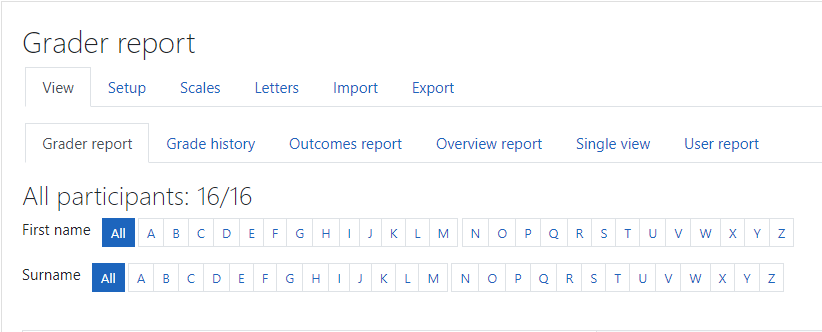

# Introduction

If you area moodle user, and teacher, you probably need to make the avaliation of the outcomes. The Gradebook can be a valuable tool that will help you to track the students' progress through assessment and required activities. You wi'll need

- An access to the gradebook.
- Leran how the Gradebook is presented.
- Know about the information provided by the gradebook.
- Key features and activities  of the gradebook.

If you are not very used to gradebook terms, please take a llok before to the [glossary section](##Gradebook Glossary of Terms)

## Accessing the Gradebook

All courses in Moodle have a grading area, known as the **Gradebook**. A lot of activities provided by Moodle can be graded. All of these results go to the Gradebook.

Depending on the configuration ant the appearance decided by your moodle administrator, the **Gradebook** can appear or not as a direct acces on the dashboard or the left menu of your moodle course. An example can be seen in the [figure 1]. In thsi case tht gradebook has a direc acces from the left menu.

<small>
        Figure 1. Accesing the <bold>GradeBook</bold>.
</small>

Selecting the grades from the menu, we access to the main gradebook as we can see  in figure 2.

<figure>
    
    <figcaption><small>Figure 2. Starting the gradebook from the menu</small>.<figcaption>
<figure>

You can see two rows in the menu:

- Top row: **View**, **Setup**, **Scales**, **Letters**, **Import** and **Export** options.

- Bottom row: **Grade report**, **Grade history**, **Outcomes report**, **Overview report**, **Single view** and **User report**.
  
- Graded activities automatically appear in the grades area when they are added into the main course.
- Left-hand side contains the students' names and some data.
  
- On the far right-hand side of the table is the **Course total** , which is calculated
  based on the grades activities. By default, you can see averages but the it is configurable.
  
- At the bottom you can see a row with **Overall average** as a column, containing the average of all the grades within each assessment type.

The Gradebook captures all the assessment information on one screen. But the overall view can be be overwhelming. Fortunately, moodle is highly configurable to show what uyou need.

Dependeing of your role (teacher, non-editing teacher, or manager, etc.) you can see or not some features. Students will only be able to see their own grades and feedback.

Adventages of storing the grades this way are:

*  information can be easily shared between teachers.
* if a course manager want to know how students were progressing it fast.
* students can see all their progress in one place and can start to manage their own learning.

## Activities that work with the Gradebook

There are a number of Moodle activities that can be graded and, therefore, work with the Gradebook. The activities that will automatically appear in the Gradebook are:

- Assignments
- Quizzes
- Lessons
- The SCORM package
- Workshops

A number of other Moodle activities can also have grades and ratings assigned to
them so that they also appear in the Gradebook. These include:

- Forums
- Glossaries

It is also possible to manually set up a *graded item* within the Gradebook, which is not linked with an activity but allows a grade to be recorded, but this, in some cases, require administration privileges. For further information, read the [moodle docs](https://docs.moodle.org/310/en/Main_page).

## Gradebook Key features

Gradebook contains the score for each graded activity that can be presented in various ways:

- **Numerical grade** : ( by default scored to 100 ).
- **Scale** : Customized grading that can be:
  - letters.
  - words.
  - statements.
  - numbers.
- **Letter grade** : linked to percentages (e. g. 100% = A+).

### Organizing grades

With lots of activities that use grades within a course, the Gradebook will have a lot of data on one page. Categories can be created for group activities, and the Gradebook view can be customized according to the user for them to see all or some categories on the screen.

