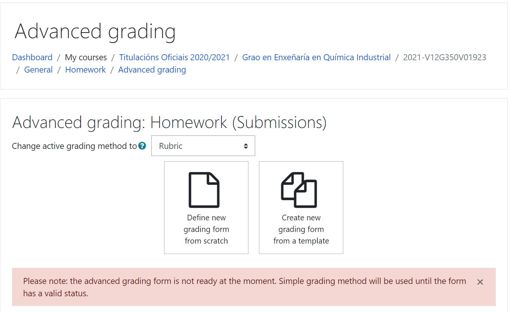
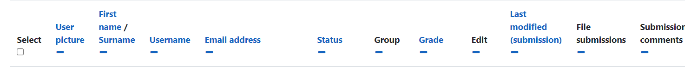

# Grades assignations

Some of the activities are graded by Moodle, such as quizzes, or written assignments content need to be reviewed and graded by the teacher.

## Assignment grading

Let's take a look to the grading screen:

<figure>
    
    <figcaption><small>Grade screen.</small><figcaption>
<figure>

we need to click on the name of the assignment that we want to grade.

We can see the _name_ as well as the details. Beneath the assignment details, there is a _Grading summary_ section. 

The grading summary:

- Says how many students (_Participants_) are in the course.
- Shows whether any drafts of work have been submitted (_Drafts_).
- In _Submitted_ we can see how many students have submitted their assignment.
- In _Needs grading_,  how many of the submitted pieces of assignments need to be graded.

In th grading summary, there is the _View/grade all submissions_ which is a link to the assignment grading screen. Click on it we go to go into the assignment grading area.

Sections on this page:

- _Grading action_ to choose to download assignments or select alternative ways of grading.
- The _main grading table_ provides information related to the assessments of each student.
- _Options_ to change how we view the assignment grading screen.

- _Select_ column to choose to select student:

<figure>
    
    <figcaption><small>Grade screen.</small><figcaption>
<figure>

- There are five options to choose from within the list, all the options show a `-` or `+`symbol to hide or shot the item :
  - Lock submissions
  - Unlock submissions
  - Download selected submissions
  - Grant extension
  - _Go_ button to execute.
-  _User picture_ is obvious.
- _First name/surname_ permits change order and select order criterion.
- _Email address_ student information.
- _Status_ shows you the submission and grading status of the assignment.
- _Grade_ is a command button to access the grading page.

- _Edit_ enables to prevent or grant submission changes.
- _Last modified (submission)_ show the date and time when the student submitted their work for grading.

- _File submissions_ and _Online text_ show a link to the file/files that students uploaded.
- _Submission comments_ student comments.
- _Last modified (grade)_ show you the date and time when the assignment was graded by a teacher.
- _Feedback comments_,  start of any comments given by the teacher after the assignment has been graded.
- _View annotated PDF_ and _Annotate PDF_ are tools to work with 'pdf`format.
- _Feedback files_ links to files uploaded by the teacher (if this option was selected when creating the assignment).

- _Final grade_ shows you the grade that was awarded to the student.
- _Outcomes_ show you which outcomes are being met by the assignment (if were added to an assignment).

There is a lot of information in this table and it provides a good overview of the current status of the assignment for each student.

### The Submission Status section

The _Submission status_ section provides a summary of the assignment for this student, including:

- which attempt this piece of work is
- the current submission and grading status
- the date the work was submitted
- The submitted work (link).

### The Grade section

The _Grade_ section enables the assignation to a grade and provides feedback to students.

The grade depends on the type of grade we selected when creating the assignment. If _Task 1_ was set to _scale grade_ so we select from a drop-down list from which grade. 

- _Marking workflow state_ only appear if the marking workflow is turned on when initially setting up the assignment. Options are:
  - _Not marked_ (prior to grading).
  - _In marking_ if the teacher has started grading (but hasn't completed it).
  - _Marking completed_ when the grading is complete, but it should be kept hidden from students.
  - _In review_ it has graded but needs second grading process or moderated inline.
  - _Ready for release_ graded and reviewed.
  - _Released_ grade and feedback are visible within ther Gradebook.

The final in the _Grade_ provides feedback:

- _Feedback comments_ to edit feedback for students based on their work.
- _Feedback files_ uploaded files (`+` icon) .

## Attempt settings

There are the following options at the bottom of the individual grading screen:

- _Save changes_ enables to save the grade and feedback and go back to the assignment grading table.
- _Save and show next_  save the grade and feedback and move to the next individual grading page.
  
- _Cancel_ this will cancels any work completed.
- _Previous_ goes to the assignment grading screen of the previous student.
- _Next_  moves to the next individual grading page (not saves any work).

All the information regarding the work of a user is explained as follows:

- _Status_ shows the text, _Submitted for grading_ and _Released_ ( the work have been submitted and also been released after grading).
- A grade is now shown in the _Grade_ as well as in the _Final grade_.
- _Last modified (grade)_ shows you the date and time when the grade was last updated.
- In the _Feedback comments_ you can view all the feedback.

## Grading options

At the top of the assignment grading table page, there is a drop-down list that provides you with a range of grading options, which are:

- _Download all submissions_ to download all the files of this assignment (`.zip` file).
- _Download grading worksheet_ only available if offline grading has been enabled ( a `.csv` file) containing the assignment information.

A teacher can add grades and feedback into a `.csv` file while they are offline, and this can be uploaded to populate the grading table with the relevant grades and feedback.

- _Upload grading worksheet_ if we want to upload the amended grading worksheet.
- _Upload multiple feedback files in a zip_ allows students' work to be annotated and re-uploaded as feedback.
- _Download all submissions_ (zipped).

- _View gradebook_ take us straight to the Gradebook.

## Options

This option enables us to customize how the grading table is viewed as well as provide some quick grading options. You can customize how you view the assignment grading area.Options are:

-  _ Assignments per page_ how many rows are shown per page.
- _Filter_ drop-down list on the grading table that only shows you the assignments that we need to consider:
  ° _Not submitted_ 
  ° _Submitted_ 
  ° _Requires grading_ 

- _Workflow filter_ allows you to choose to view only students within a specific part of the workflow.

- _Quick grading_ an alternative way to grade a student's work.

  

### Quick grading within the assignment grading screen

Turning on, _Quick grading_ turns the assignment grading area into an editable table that will enable us to add a grade and some written feedback. Quick grading is very useful for offline activities or assignments that have already been viewed offline. 

Options are.

- _Status_ drop-down list that changes the workflow phase for the student.
- _Grade_ drop-down list next to each student in order to choose the grade to award.
- _Feedback comments_ entry box to type in some feedback for the assignment.

### Grading a number grade

We are initially provided with a _Grading summary_ clicking on _View/grade all assignments_ an assignment
grading table appears. This has an _Online text_ _File submissions_ like the standard.  

Much of this information about _Submission status_ is the same as previous, but the _Online text_ information shown on this page. You can read the assignment submitted by the student. In _Submission status_, we have the _Grade_ section and the option to assign a grade: 

- The _Feedback comments_ box already has some text in it. This text is the assignment submitted by the student.
- This information appears in the box _Comment inline_ when we created the assignment. It is editable. 
- We will need to make our feedback stand out from the student's original text, using the text editor available at _Feedback comments_ box.
- Click on _Save changes_ to submit the feedback and grade to the Gradebook and inform the student.

### Grading an with outcomes

After viewing the assignment and clicking on **View/grade all assignments** , we will
see the assignment grading table. As this assignment has enabled **File submissions**
and **Online text** submissions, both of these columns appear in the table. As we have
added outcomes to this assignment, there is an additional column at the end of the
grading table, which shows you the outcomes that are used.

Note that currently, the text **No outcome** appears with each outcome. This shows
you that the assignments haven't been graded yet.

*Assigning Grades*

We will use the individual grading screen to grade the outcomes, so we need to
click on the **grade** icon in the **Grade** column next to the student whose work we
want to mark.

Once we're on the individual grading screen, the **Submission status** area enables us
to access the file and online text submitted by the student. The **Grade** section is very
similar to the one used previously. A final grade will be awarded and we can enter a
numerical value in the **Grade out of 100** option in the **Grade** box.

However, there are additional items to grade now: **Evidence provided** and **Criteria 1
met**. Next to the name of each outcome is a drop-down list that provides us with the
scale chosen when setting up the outcomes. To grade each outcome, we need to click
on the drop-down list in order to choose the grade we want to provide.

The other option we turned on for this assignment, which we haven't seen in practice
yet, is the option to manually reopen an assignment in order to enable resubmission.
This option is within the **Attempt settings** section.

If we want to enable the student to resubmit their work again, we need to change
the **Allow another attempt** option to **Yes** using the drop-down list.

When grading all assignments, we need to ensure that we click on **Save changes**
when we have added the grades and feedback.

We have now looked at all the key options when grading assignments with the
simple direct grading method, and we have also created assignments using the
advanced grading methods that utilize the marking guide and rubric grading
tools. Let's take a look at how to grade these assignments.

## Grading with a marking guides

The biggest difference between the grading pages we have seen previously and
using the marking guide is the way in which we grade the assignment.

- When grading with a scale, appears a drop-down list in order to add the grade. For a numerical grade, we there is a textbox to type the grade.
- For a marking guide assignment, there is no single grade entry point. We have to provide the grade criteriato Moodle for the assignment.
- Select the criteria titled _Planning_. The _Grade_ is explained as follows:
  - We can see the full details of the criteria that aids us by providing us with
    the correct grade.
  - We have a textbox where we can add feedback in relation to this criteria. 
  - When add _Frequently used comments_.

- The final column provides a grade entry box. We can see the maximum number of points that
  are available for this criteria. We have to add a number grade up to the given maximum grade.
- Click _Save changes_.

Following the grading, each score assigned to each piece of criteria is added together in order to provide the final grade for the student, and this can be seen in the _Grade_, in the assignment grading table. Sudents will see the final grade and each individual criteria grade and feedback when reviewing the feedback for their assignment.

## Grading with rubrics

The rubric table enables us to easily grade work even though there is a lot of information on the screen:

- When grading assignments, the teacher reviews the work and clicks on the box that contains the statement and points that they want to award. 
- You can also add written feedback in the textbox on each row.
- The shaded boxes show you the grade awarded for each criterion, and some comments
  have been added to the feedback column as well.
- The final grade for is calculated by Moodle by adding together each of the points awarded within the rubric, and this is shown in the assignment grading table within the _Grade_ column.
- As with the _marking guide_, the student will see the full rubric table and comments when they receive their assignment feedback.

## Grading a graded item in the Gradebook

We also can add a graded activity directly into the Gradebook:

1. From the main course go to _Grades_ (_Administration_ then _Grades_ ).
2. Click on _Turn editing on_ button.
3. Ypu are able to add a grade directly into the graded item.

You can see the _Attendance grade_ option. This item was set up as a value grade. To add the grade, type a number into the empty textbox. There is an _Update_ button that saves any grades added. This grading method applies to any other type of graded activity within the Gradebook.

## Quick grading 

Turning editing on allow us to grade any graded activity. 

In the previous screenshot, we can see different types of grades. **Task 1** is an example
of an assignment that is graded with a scale and, therefore, quick grading provides
a drop-down list that enables us to choose the grade we would like to award. **Task
2** and **Task 3** , however, have been set as numerical grades, so we need to type the
number into the grade box. Also, as part of **Task 3** , there are two columns that show
you outcomes that are graded using a drop-down list that chooses a scale item.

After we have amended grades on this screen, we need to click on the **Update** button
0to save the grades.

There are a few things to consider when using quick grading:

- We cannot see the maximum grade when adding number grades.
- The marking guide and rubric-graded assignments cannot be marked
  via the quick grading option.

When using the quick grading option, we can choose to add quick feedback, but this
option is not shown on the current screen. However, we can change some settings to
enable this:

1. Click on the **My preferences** tab, or click on **Grader report** under the
   **My preferences** heading.
2. Scroll to the **General** section at the bottom of the page.
3. Next to the **Show quick feedback** text, change the drop-down list to **Yes**.
4. Click on the **Save changes** button at the bottom of the page.

The quick feedback option is limited to adding text, so if a lot of text is required,
it is recommended that the individual grading screen be used.