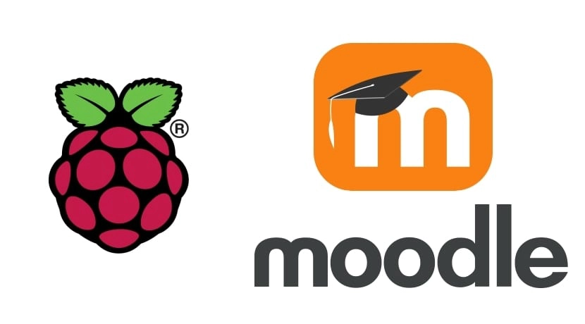
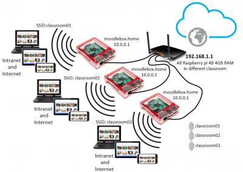

# Moodle in a Raspberry Pi <!-- fit -->
## A. Sánchez 
---
# Wear Your Moodle Server 



---
<!-- _class: invert -->

# Take it to the Classsroom



# What hardware do i need?

- Raspberry Pi 4 Model B, 3 Model B+, 3 Model B or 3 Model A+.
- Power supply (depends on the model)
- microSD card of right size (recommended at least 32 GB or more)
- Optional:
  - Raspberry Pi case with refrigetarion

Total hardware amount is about 50-80 €

---

# What software?

  - Moodlebox is a good choice:
    - [download from here](https://moodlebox.net/en/help/download-the-disk-image/) 

or:
```
wget -c https://github.com/moodlebox/moodlebox/releases/download/v3.10.0/moodlebox-3.10.0.img.bz2
```
or:
```
curl -C - https://github.com/moodlebox/moodlebox/releases/download/v3.10.0/moodlebox-3.10.0.img.bz2
```

---
# Installing Moodle in a USB stick

1. Buy the hardware

2. Download the MoodleBox disk image

3. Copy the disk image on your microSD card with [balenaEtcher](https://www.balena.io/etcher/), available for Windows, Linux and OS X.

4. Startup your MoodleBox

---

# Starting Up!

- Insert your microSD card into the Raspberry Pi slot and power it up.
-  The red LED lights up, and after a few seconds the green LED lights up intermittently.
-  If you want, connect the Raspberry PI to the network or to an Internet.
-  After the boot, your Moodle is ready and totally functional.

---

# Wifi Connection

- On your device, choose Moodle wireless network. the default password is `moodlebox` (all lowercase).

- You can access to the Moodle environment via browser, using [this address]:(http://moodlebox.home/).

- Your device is offline and can only access resources stored on your device unless it is connected to the internet.

---

# Log in into Moodle

- Connect to Moodle Wi-Fi network (choose MoodleBox wireless network on your network manager)
- When prompted type the password:
  - moodlebox (all lowercase)
- Open http://moodlebox.home/ and log in.
- Credentials are:
  - username: moodlebox
  - password: Moodlebox4$

---

# NOTES on installation

- Once logged, you’re Moodle administrator.
- For daily usa it’s strongly recommended that you change the default password of the Moodle admin account at the first login.
- The initial Moodle installation has only one account (administrator) and no course is created.
- Moodle environment should be configured by yourself, as well as the management of its contents (resources, activities, etc.).

---

# Some specific conf

- As an administrator, you may change several settings of the access point Wi-Fi settings of the MoodleBox. To do this, visit the MoodleBox dashboard at `Site administration` > `Server` > `MoodleBox` in the administration interface.
- As a normal user, you may access it if necessary via `SSH`, using the address moodlebox.home, using its default credentials:
  - username: moodlebox
  - password: Moodlebox4$
